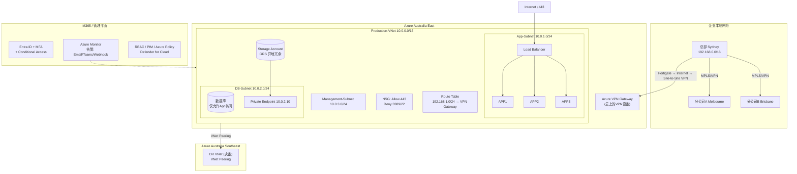

# 总部与数据中心的 Azure 架构（AZ-104 知识地图）

## 架构图



## 摘要

- 以"总部（Sydney）+ 分公司 A（Melbourne）+ 分公司 B（Brisbane）MPLS/VPN 互联 + Azure Australia East"的企业场景为主线，逐一讲解 AZ-104 的核心组件：VNet、Subnet、NSG、Route Table、VPN Gateway、Private Endpoint、Private DNS、Load Balancer、Storage Account、Azure Monitor 及零信任安全策略。
- **VNet**（Production-VNet 10.0.0.0/16）相当于云上的企业网络（类比总部网络 192.168.0.0/16），承载 VM、Storage、Database、Private Endpoint、Load Balancer 全部资源。
- **Subnet** 实现隔离（App 10.0.1.0/24、DB 10.0.2.0/24、Management 10.0.3.0/24），类比总部的服务器区/办公区/无线区/DMZ 区划分；**NSG** 充当防火墙规则（App Server 只允许 HTTPS 443，Deny 3389/22 防互联网远程登录，数据库仅允许 App 访问）。
- **VPN Gateway** 是云上的 VPN 设备，建立总部（经 Fortigate → Internet → VPN）到 Azure 的 Site-to-Site VPN，使总部 192.168.1.x 可直接访问 Azure VM 10.0.1.x；**Route Table**（UDR）控制"去哪走"，如 Destination 192.168.1.0/24 → Next Hop VPN Gateway，让 Azure VM 访问总部 ERP。
- **Private Endpoint + Private DNS** 把 PaaS（Storage/SQL/Key Vault）私网化（如 Storage Account 获得 10.0.2.10 内网 IP），Private DNS 使 `companystorage.blob.core.windows.net` 解析为 10.0.2.10，员工访问只能走企业网络。
- **双数据中心设计**：主站 Australia East（Production）+ 灾备站 Australia Southeast（DR），VNet Peering 互联；存储用 GRS（Geo-Redundant Storage）同步到第二数据中心；配合 Load Balancer 高可用/横向扩容、Azure Monitor 监控告警（类比 PRTG/Zabbix/SolarWinds）、Entra ID/RBAC/Defender 零信任治理，覆盖 AZ-104 大部分考点。

## 技术要点

1. **VNet 定义与作用**：相当于 Azure 里的企业网络（类似总部网络），Production-VNet 地址空间 10.0.0.0/16，承载 VM、Storage、Database、Private Endpoint、Load Balancer 全部资源，连接总部、分公司与 Azure 云。
2. **Subnet 隔离**：就像总部网络划分服务器区/办公区/无线区/DMZ 区，VNet 拆分为 App-Subnet（10.0.1.x 应用）、DB-Subnet（10.0.2.x 数据库）、Management-Subnet（10.0.3.x 监控），实现隔离。
3. **NSG 规则设计**：类似 Windows Firewall / Cisco ACL / Fortigate Policy；App Server 只允许 Internet → 443 (HTTPS) Allow，Deny 3389 与 22（互联网不能远程登录）；互联网 ↓443 → Web App，数据库仅允许 App 访问。
4. **Route Table (UDR)**：告诉数据包"去哪走"；例如 Destination 192.168.1.0/24 → Next Hop: VPN Gateway，含义是到总部网络走 VPN，使 Azure VM 能访问总部 ERP。
5. **VPN Gateway 与 Hub-Spoke**：相当于云上的 VPN 设备，总部 → Fortigate → Internet → VPN → Azure VPN Gateway 建立 Site-to-Site VPN，总部 192.168.1.x 可访问 Azure VM 10.0.1.x；三个城市（Sydney/Melbourne/Brisbane）全部连接 Azure Hub，形成 Hub-Spoke 架构。
6. **Private Endpoint 私网化**：Azure Storage 默认是 Public Endpoint（任何互联网用户都有可能访问），改为 Private Endpoint（10.0.2.10）后只能走企业网络；建议 Storage、SQL、Key Vault 全部私网化。
7. **Private DNS 配套机制**：专门给 Private Endpoint 配套——Storage 公网域名 `companystorage.blob.core.windows.net` 通过 Private DNS 解析为 10.0.2.10，员工使用 `https://companystorage.blob.core.windows.net` 时自动变成 10.0.2.10 访问。
8. **Load Balancer 高可用与扩展**：1000 人同时访问时经 Load Balancer 自动分流到 APP1/APP2/APP3；APP1 宕机由 APP2/APP3 继续提供服务（高可用）；增加 APP4/APP5 即可横向扩容。
9. **存储与双数据中心**：企业文档（项目资料、审计日志、影像文件、备份文件）统一存放 Azure Blob Storage，建议用 GRS 同步到第二数据中心；主站 Australia East（Production）+ 灾备站 Australia Southeast（DR），使用 VNet Peering 连接。
10. **监控与零信任**：Azure Monitor 监控 CPU/Memory/Storage/Network/Security Event/Application Log，告警条件如 CPU>80%、Storage>90%、VPN Down、VM Stopped，通过 Email/Teams/Webhook 发送（类比 PRTG/Zabbix/SolarWinds）；零信任策略覆盖身份（Entra ID/MFA）、网络（VNet/Subnet/NSG/Private Endpoint）、数据（Storage Encryption/Key Vault/Backup）、运维（RBAC/PIM/Azure Policy/Defender for Cloud）。

## 原文内容

这是一个非常好的 AZ-104 学习场景。实际上，如果把你描述的企业环境画出来，你会发现 AZ-104 的核心知识几乎全部都在里面。

### 一、企业场景架构

假设：

```
总部（Sydney）
    |
    | MPLS/VPN
    |
分公司A（Melbourne）
    |
    | MPLS/VPN
    |
分公司B（Brisbane）

            |
     Azure Australia East
            |
 ┌──────────────────────────┐
 │      Production VNet     │
 └──────────────────────────┘

            |
        VNet Peering
            |
 ┌──────────────────────────┐
 │      DR VNet             │
 │ (Australia Southeast)    │
 └──────────────────────────┘

            |
       Azure Storage
            |
       Load Balancer
            |
      Application
            |
        Monitor
            |
         M365
```

### 二、VNet（Virtual Network）

**定义**：相当于 Azure 里的企业网络，类似总部网络（192.168.0.0/16）。在 Azure 中，Production-VNet（10.0.0.0/16）就是企业云上的网络。

**作用**：承载全部资源。你的企业 Azure 部分就需要 Production-VNet（Address Space: 10.0.0.0/16）作为核心云网络，承载 VM、Storage、Database、Private Endpoint、Load Balancer，连接总部、分公司与 Azure 云。

### 三、Subnet（子网）

**定义**：VNet 里的区域划分。就像总部网络划分服务器区、办公区、无线区、DMZ 区一样，Azure 把 VNet（10.0.0.0/16）拆分为 App-Subnet（10.0.1.0/24）、DB-Subnet（10.0.2.0/24）、Management-Subnet（10.0.3.0/24）。

企业场景：App 服务器 10.0.1.x、数据库 10.0.2.x、监控服务器 10.0.3.x，实现隔离。

### 四、NSG（Network Security Group）

**定义**：Azure 防火墙规则。类似 Windows Firewall、Cisco ACL、Fortigate Policy。

例子：你的应用服务器（App Server）只允许 HTTPS（443）访问。NSG 规则：

- Allow —— Source: Internet，Port: 443
- Deny —— 3389、Deny 22（互联网不能远程登录）

这样：互联网 ↓443 → Web App，数据库 ↓ 仅允许 App 访问，非常符合安全要求。企业场景的网络安全依靠 NSG 实现。

### 五、Route Table（路由表）

**定义**：告诉数据包"去哪走"。比如总部是 192.168.0.0/16，Azure 是 10.0.0.0/16。

Route Table：Destination 192.168.1.0/24，Next Hop: VPN Gateway —— 意思是到总部网络走 VPN。

**使用场景**：你的应用（Azure VM）需要访问总部 ERP，就需要路由。

### 六、VPN Gateway

**定义**：Azure 与企业网络连接器，相当于云上的 VPN 设备。

架构：

```
总部
 |
Fortigate
 |
Internet
 |
VPN
 |
Azure VPN Gateway
```

企业形成 Site-to-Site VPN 后的效果：总部（192.168.1.x）可以访问 Azure VM（10.0.1.x）。三个分公司（Sydney、Melbourne、Brisbane）全部连接 Azure Hub，形成 Hub-Spoke 架构。

### 七、Private Endpoint

**定义**：让 Azure 服务拥有内网 IP。

例如 Azure Storage 默认是 Public Endpoint，任何互联网用户都有可能访问。改为 Private Endpoint（10.0.2.10）后，Storage Account 的访问方式变成只能走企业网络。

你的企业建议：Storage、SQL、Key Vault 全部 Private Endpoint 私网化。

### 八、Private DNS

**定义**：专门给 Private Endpoint 配套。

例如 Storage 公网域名是 `companystorage.blob.core.windows.net`，Private Endpoint 化之后如何解析？Private DNS 让 `companystorage.blob.core.windows.net = 10.0.2.10`，员工使用 `https://companystorage.blob.core.windows.net` 时自动变成 10.0.2.10 访问。

### 九、Load Balancer

**定义**：负载均衡器。

假设部署 APP1、APP2、APP3，1000 人同时访问。Load Balancer 自动分流：

```
用户
 |
Load Balancer
 |
├── APP1
├── APP2
└── APP3
```

**优点**

- 高可用：APP1 宕机，APP2、APP3 继续提供服务。
- 扩展能力：增加 APP4、APP5 即可横向扩容。

### 十、云存储（Storage Account）

企业文档（项目资料、审计日志、影像文件、备份文件）统一存放 Azure Blob Storage，建议使用 GRS（Geo-Redundant Storage）同步到第二数据中心。

### 十一、双数据中心设计

你的需求：两个数据中心、业务互通。推荐：主站 Australia East（Production），灾备站 Australia Southeast（DR），使用 VNet Peering 连接。

```
Australia East
    |
    | VNet Peering
    |
Australia Southeast
```

### 十二、Azure Monitor（云监控）

**定义**：Azure 的监控平台。

- 监控：CPU、Memory、Storage、Network、Security Event、Application Log
- 告警：CPU > 80%、Storage > 90%、VPN Down、VM Stopped
- 发送：Email、Teams、Webhook

企业中相当于 PRTG、Zabbix、SolarWinds 的功能。

### 十三、一般安全策略

推荐零信任策略（Zero Trust）：

- **身份**：M365（Entra ID、MFA、Conditional Access）
- **网络**：VNet、Subnet、NSG、Private Endpoint
- **数据**：Storage Encryption、Key Vault、Backup
- **运维**：RBAC、PIM、Azure Policy、Defender for Cloud

### 十四、对应到 AZ-104 的知识地图

你这个企业场景其实对应了 AZ-104 大部分考点：

```
总部/分公司互联 → VPN Gateway、Route Table
云网络         → VNet、Subnet
网络安全       → NSG
云存储         → Storage Account、Private Endpoint、Private DNS
应用高可用     → Load Balancer
双数据中心     → VNet Peering
系统监控       → Azure Monitor
身份管理       → Entra ID、RBAC、MFA
安全治理       → Policy、Defender、Backup
```

核心知识清单：VNet、Subnet、NSG、Route Table、VPN Gateway、Private Endpoint、Load Balancer、Azure Storage、Azure Monitor。

对于你目前做 M365 和基础架构的背景来说，真正需要重点补课的就是这几个模块。把这几个模块学透，基本就具备了 AZ-104 的核心基础设施能力。
