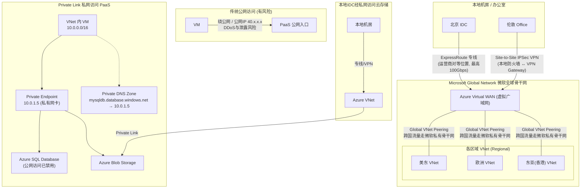

# Azure 网络接入与全球分布（VNet 接入方式 / Private Link）

## 架构图



## 摘要

- 本地网络对接 Azure VNet 有两种官方方式：**Site-to-Site VPN**（公网 IPSec/IKE 加密隧道，本地部署 FortiGate/Palo Alto/Cisco 对接 Azure VPN Gateway，部署快、成本低）和 **Azure ExpressRoute**（经运营商的物理专线，不走向公网，最高 100 Gbps，超低延迟、安全性最高）。
- 单个 VNet 具有**区域性**（创建在具体 Region，如 East US、Southeast Asia），子网和 IP 池只存在于该区域机房；全球打通靠 **Global VNet Peering**，跨国流量完全走微软全球高速私有骨干网（Microsoft Global Network），不走互联网。
- 全球多分支企业典型架构是 **Azure Virtual WAN**：各办公室就近接入 Azure 节点（北京接北京/香港节点、伦敦接伦敦节点），跨国通信直接跨越微软骨干网，无需自建全球 Mesh VPN；配合 Private Link，任何分支可私密访问全球任何区域的数据库/存储服务。
- **Azure Private Link** 的核心作用：把公网上的 Azure PaaS 服务（SQL、存储等）"插"进自己的 VNet，生成 Private Endpoint 私有网卡并分配内网 IP（如 10.0.1.5），配合 Private DNS Zone 让域名解析直接返回内网 IP，可彻底禁用 PaaS 的公网访问。
- 两大典型场景：企业 VM 访问 Azure SQL 彻底关闭公网入口；本地 IDC 通过普通 VPN/ExpressRoute 连到 VNet 后，用内网 IP 直接访问云上存储，避免配置复杂的 Microsoft Peering 路由。

## 技术要点

1. **Site-to-Site VPN 原理与定位**：利用公网建立 IPSec/IKE 加密隧道；本地部署支持 IPSec 的防火墙/路由器（FortiGate、Palo Alto、Cisco）对接 Azure VPN Gateway；适合中小流量或对延迟要求不极其苛刻的场景。
2. **ExpressRoute 原理与定位**：本地路由器通过专线接入运营商 ExpressRoute Location（对等位置，如中国电信/联通、Equinix、AT&T），再接入微软骨干网；高带宽（最高 100 Gbps）、超低延迟、高可靠、不走公网。
3. **VNet 区域性 vs 全球连通**：区分"概念分布"与"物理连通"——单个 VNet 的子网/IP 池只存在于其所在 Region；多个区域 VNet 通过 Global VNet Peering 直接打通（如美东 ↔ 欧洲）。
4. **微软骨干网优势**：微软拥有全球最大的私有骨干网络之一（Microsoft Global Network）；跨国 VNet 间数据传输延迟低且极度稳定，完全不经互联网。
5. **Azure Virtual WAN 三大能力**：就近接入（北京接北京/香港节点、伦敦接伦敦节点）；骨干网传输（跨国通信直接走微软骨干网）；统一路由（配合 Private Link 私密访问全球任意区域的 PaaS）。
6. **Private Endpoint 机制**：在 VNet 子网中生成私有网卡并分配内网 IP（如 10.0.1.5）；所有访问走微软内部高速骨干网，完全绝缘于互联网。
7. **Private DNS Zone 联动**：VM 解析 `mysqldb.database.windows.net` 时直接返回 10.0.1.5（而非公网 40.x.x.x），使访问体验如同局域网内服务器。
8. **安全闭环**：启用 Private Link 后可直接 Disable public network access，彻底关闭数据库公网入口，防 DDoS 与数据泄露。
9. **IDC 访问存储的简化**：不用 Private Link 时本地访问 Azure 存储要走公网或配置复杂的 ExpressRoute Microsoft Peering 路由；使用后只需普通专线/VPN 连到 VNet，即可用内网 IP 访问存储桶，降低网络运维和安全合规成本。
10. **公网访问 vs Private Link 对比**：访问路径（互联网/公网节点 vs 微软内部骨干网）、IP 类型（公网 IP vs 10.x.x.x 私有 IP）、安全级别（较弱需强防火墙 vs 极高完全关闭公网入口）、跨地域/跨租户（均支持，Private Link 还支持安全的 B2B 私网共享）。

## 原文内容

本地机房/办公室要对接到 Azure VNet（虚拟网络），主要有两种官方接入方式，且 Azure 的网络基础设施是完全全球分布的。下面为你拆解接入方式以及它的全球分布特性：

### 一、本地对接到 Azure VNet 的 2 种主要方式

将本地网络与 Azure VNet 连通，主要有以下两种方案：

**1. Site-to-Site VPN（站点到站点 IPSec VPN）**

- 原理：利用公网建立一条安全的加密隧道（IPSec/IKE）。
- 方式：在本地部署一台支持 IPSec 的防火墙/路由器（如 FortiGate、Palo Alto、Cisco），对接 Azure 端的 VPN Gateway（VPN 网关）。
- 特点：部署快、成本低，适合中小流量或对延迟要求不极其苛刻的场景。

**2. Azure ExpressRoute（企业级专线）**

- 原理：不经过公网，通过电信运营商（如中国电信/联通、Equinix、AT&T 等）建立一条从本地 IDC 到 Azure 机房的物理专线连接。
- 方式：本地路由器通过专线接入到运营商的 ExpressRoute Location（对等位置），再接入微软骨干网。
- 特点：高带宽（最高可达 100 Gbps）、超低延迟、高可靠性，且不走公网，安全性最高。

### 二、Azure VNet 是全球分布的吗？

是的，微软拥有全球最大的私有骨干网络之一（Microsoft Global Network）。但需要区分"概念分布"与"物理连通"：

**1. 单个 VNet 具有区域性（Regional）**

一个特定的 Azure VNet 始终创建在某一个具体的 Azure 区域（Region）（例如：East US、Southeast Asia、China North 3 等）。如果你在"东亚（香港）"建了一个 VNet，它的子网和 IP 地址池只存在于香港机房。

**2. 通过"VNet 全球对等互连"实现全球打通（Global VNet Peering）**

虽然单个 VNet 属于特定区域，但你可以将分布在全球不同区域的多个 VNet 连在一起：

- Global VNet Peering：可以将"美东"的 VNet 和"欧洲"的 VNet 直接打通。
- 跨国流量不走互联网：两个跨国 VNet 之间的数据传输，完全走微软全球高速私有骨干网，延迟低且极度稳定。

### 三、全球分布企业的典型架构（Azure Virtual WAN）

如果你的公司在全球有多个分支机构（如中国、美国、欧洲）：

```
[ 北京 IDC ] ----(专线)-----\
        +---> [ Azure Virtual WAN ] <---> 全球各区域的 VNet
[ 伦敦 Office ] --(VPN)-----/
```

微软提供了 Azure Virtual WAN（虚拟广域网）服务：

- **就近接入**：北京办公室连接 Azure 北京/香港节点，伦敦办公室连接 Azure 伦敦节点。
- **骨干网传输**：接入后，北京与伦敦之间的跨国通信直接跨越微软全球骨干网，无需自己搭建复杂的全球 Mesh VPN。
- **统一路由**：配合前述的 Private Link，任何一个分支机构都可以通过这个全球网络，私密地访问位于全球任何 Azure 区域的数据库或存储服务。

---

### Azure Private Link 允许通过私网访问 Azure 服务（这是什么意思，具体实例）

简单来说，Azure Private Link（私有链接）的核心作用是：把公网上的 Azure 云服务（如数据库、存储桶等），直接"插"进你自己的私有虚拟网络（VNet）里，给它分配一个内部私有 IP。

**这句话代表什么意思？**

在默认情况下，Azure 的 PaaS 服务（如 Azure SQL Database、Azure Blob Storage）都是带有公网 IP 接口的。

- 没有 Private Link 时：你的虚拟机（VM）访问数据库时，数据包需要绕到公网入口，尽管传输过程加密，但数据的网络流量暴露在公网络线上，甚至容易面临 DDoS 攻击或数据泄露风险。
- 有了 Private Link 之后：Azure 会在你自己的虚拟网络（VNet）内创建一个网卡（称为 Private Endpoint / 私有终端节点），并给它赋予一个内网 IP（如 10.0.1.5）。之后所有的访问都走微软内部的高速骨干网，完全绝缘于互联网。

**典型应用场景与具体实例**

**场景一：企业内部 VM 访问 Azure SQL 数据库（彻底关闭公网访问）**

传统做法（不使用 Private Link）：

1. 建立一个 Azure SQL 数据库，获得域名：mysqldb.database.windows.net。
2. 该域名解析后对应一个公网 IP（如 40.x.x.x）。
3. 你的应用程序 VM 必须配置允许访问互联网，SQL 数据库上也必须开启"允许 Azure 服务访问"防火墙规则。
4. 安全隐患：数据库对外暴露了公网入口。

Private Link 方案：

1. 在你的虚拟网络（如 10.0.0.0/16）中为该 SQL 数据库启用 Private Link。
2. Azure 在你的子网中生成一个私有网卡，分配内网 IP：10.0.1.5。
3. 配合 Private DNS Zone（私有 DNS），当 VM 解析 mysqldb.database.windows.net 时，直接返回 10.0.1.5。
4. 你可以直接彻底禁用该数据库的公网访问开关（Disable public network access）。
5. 最终效果：应用程序访问数据库就像访问局域网内的某台内网服务器一样，数据绝对安全，不会经过互联网。

**场景二：本地 IDC 机房通过 VPN / ExpressRoute 访问云上存储**

架构实现：

```
本地机房 ----(专线/VPN)----> Azure 虚拟网络 (VNet) ----(Private Link)----> Azure Blob Storage
```

优势与区别：如果不用 Private Link，本地机房要访问 Azure 存储，要么走公网，要么需要配置非常复杂的 ExpressRoute Microsoft 附加对等（Microsoft Peering）路由。使用 Private Link 后，本地机房只需通过普通的专线/VPN 连到 Azure VNet，就能直接利用内网 IP 访问云上存储桶，大大降低了网络运维和安全合规成本。

**总结对比**

| 维度 | 普通公网访问 (Default) | 使用 Private Link |
|------|------------------------|-------------------|
| 访问路径 | 走互联网 / 公网节点 | 完全在微软内部骨干网传输 |
| IP 地址类型 | 公网 IP (Public IP) | 局域网私有 IP (如 10.x.x.x) |
| 安全级别 | 较弱，暴露在公网，需依赖强防火墙规则 | 极高，完全关闭公网入口，防数据外泄 |
| 跨地域/跨租户 | 支持 | 支持（支持安全的 B2B 私网共享） |
