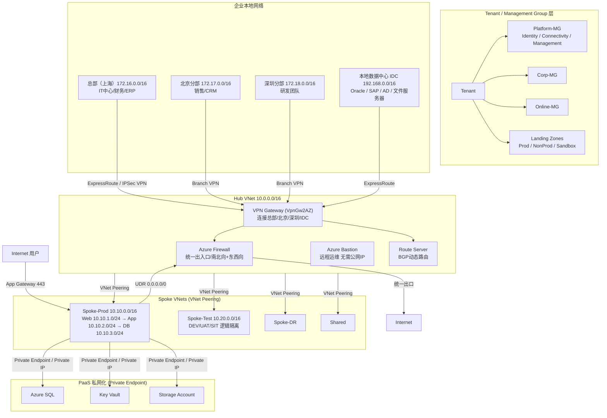

# Azure Landing Zone 与企业级网络架构

## 架构图



## 摘要

- 文档前半部分系统介绍 Azure Portal「Network foundation」的 16 个核心网络组件（VNet、NAT Gateway、Public IP、NIC、NSG、ASG、Bastion、Route Table、Route Server、Private Link 系列、Network Security Perimeter、Active Connections 等）及其实际使用场景。
- 后半部分以"总部（上海）+ 北京/深圳分部 + 本地 IDC + Azure 云（Production/Test/DR）"的真实企业案例，讲解微软 CAF（Cloud Adoption Framework）Landing Zone 与 Hub-Spoke 网络标准架构。
- 管理层面采用 Management Group 分层（Platform-MG / Corp-MG / Online-MG），Hub VNet（10.0.0.0/16）集中部署 Azure Firewall、VPN Gateway（VpnGw2AZ）、Bastion、Route Server 四大共享资源。
- 接入策略：总部优先 ExpressRoute 企业专线（更稳定、SLA 更高、延迟更低、不走公网），分部通过 Branch VPN 接入 Azure Hub，实现总部 ↔ Azure、总部 ↔ 分部、分部 ↔ Azure 全互通。
- 生产 Spoke（10.10.0.0/16）按 Web/App/DB 三层划分子网并用 NSG 控制端口（443/8443/1433），测试 Spoke（10.20.0.0/16）与生产逻辑隔离；PaaS 服务（Storage/Key Vault/SQL/OpenAI/AI Search）全部通过 Private Endpoint 私网化。
- 关键技术组合：VNet Peering（低延迟高带宽走微软骨干网）+ UDR（0.0.0.0/0 → Azure Firewall 强制审计）+ BGP 动态路由（Route Server + ExpressRoute + SD-WAN 应对新增分支/网段）+ Zero Trust（Never Trust, Always Verify）+ NSG/ASG 微隔离 + 全组件 Availability Zone 高可用。

## 技术要点

1. **VNet（虚拟网络）**：Azure 网络的基础，相当于企业数据中心的 LAN；为资源提供私有 IP 通信、子网划分、VPN/专线连接、安全与路由控制。三层应用典型划分：VNet 10.0.0.0/16，Web 10.0.1.0/24、App 10.0.2.0/24、DB 10.0.3.0/24。
2. **生产/测试隔离与 VNet Peering**：VNet-Prod（10.0.0.0/16）与 VNet-Test（10.1.0.0/16）互不影响，需要通信时建立 Peering 即可。
3. **NAT Gateway**：为无公网 IP 的私有子网资源提供固定公网出口 IP（如 52.180.20.10），方便第三方白名单管理，并避免 SNAT 端口耗尽。
4. **NSG + ASG 组合**：NSG 类似防火墙/ACL 控制出入站（如 Priority 100 Internet:443 Allow / 200 Internet:* Deny）；ASG 按业务逻辑（ASG-Web/App/DB）而非 IP 分组，服务器扩容（Web01→Web03）时规则无需修改，实现 Web→App(443)、App→DB(1433) 的最小化放通。
5. **Azure Bastion**：通过 Azure Portal 经 Bastion 安全登录 Windows/Linux VM，无需暴露公网 IP、不开 3389/22 端口，替代 Internet→RDP 直连的高风险方式。
6. **Route Table (UDR) 与 Route Server**：默认走 Azure System Route，可用 UDR 强制 0.0.0.0/0 下一跳指向 Azure Firewall 实现统一审计；Route Server 基于 BGP 与 SD-WAN 设备动态交换路由，新增网络自动学习，无需手工改 UDR。
7. **Private Link 三件套**：Private Endpoint 为 PaaS（Storage/SQL/Key Vault/Cosmos DB/App Service）分配私有 IP（如 10.0.1.5），VM 经内网访问而非绕公网；Pending Connections 用于服务提供方审批连接；Private Link Service 用于把自己的内部服务（如 API Gateway + Internal Load Balancer）通过私网发布给外部客户 VNet。
8. **Network Security Perimeter**：较新的安全能力，为 Storage/Key Vault/SQL/AI 服务定义可信网络边界（VNet-A/VNet-B），拒绝 Internet 和其它订阅的未授权访问，实现更细粒度数据边界保护。
9. **Hub-Spoke 资源规划**：Hub VNet 10.0.0.0/16 含 AzureFirewallSubnet(10.0.1.0/24)、GatewaySubnet(10.0.2.0/24)、AzureBastionSubnet(10.0.3.0/24)、RouteServerSubnet(10.0.4.0/24)；VPN Gateway 用 VpnGw2AZ SKU，关键组件全部跨 Availability Zone 部署避免区域故障。
10. **统一出口与 DNS**：所有互联网流量经 Spoke → UDR → Azure Firewall → NAT Gateway → Internet，实现统一日志/审计/威胁检测；部署 Azure DNS Private Resolver 打通总部 DNS 与 Azure DNS，使 sql-prod.company.com、storage-prod.company.com 两边都能解析。

## 原文内容

从截图来看，这是 Azure Portal → Network foundation（网络基础）的导航菜单，包含 Azure 网络服务的核心组件。下面我按照菜单顺序，对每个功能进行介绍，并结合实际场景举例。

### 1. Virtual Network Overview（虚拟网络概览）

**功能介绍**：Virtual Network（VNet）是 Azure 网络的基础，相当于企业数据中心中的局域网（LAN）。它可以：

- 为 Azure 资源提供私有 IP 通信
- 划分子网（Subnet）
- 与本地机房建立 VPN/专线连接
- 控制网络安全和路由

**实例**：假设部署一个三层应用（Internet → Web 服务器子网 → 应用服务器子网 → 数据库子网），创建 VNet：

```
VNet: 10.0.0.0/16
  Web Subnet:  10.0.1.0/24
  App Subnet:  10.0.2.0/24
  DB Subnet:   10.0.3.0/24
```

这样应用内部通信走私网，更安全。

### 2. Virtual Networks（虚拟网络）

**功能介绍**：管理所有 VNet：创建 VNet、配置地址空间、创建子网、VNet Peering、DNS 配置。

**实例 —— 场景：生产与测试环境隔离**

```
VNet-Prod: 10.0.0.0/16
VNet-Test: 10.1.0.0/16
```

两个环境互不影响。如果需要通信：建立 VNet Peering 连接即可。

### 3. NAT Gateways（NAT 网关）

**功能介绍**：为私有子网中的资源提供固定公网出口。主要解决：VM 无公网 IP、所有服务器共享固定出口 IP、避免 SNAT 端口耗尽。

**实例 —— 企业访问第三方系统**

第三方安全策略：只允许 `52.180.20.10`。配置 NAT Gateway（Public IP: 52.180.20.10）后，所有 VM 出网都显示该 IP，方便白名单管理。

### 4. Public IP Addresses（公网 IP）

**功能介绍**：给 Azure 资源分配公网地址。支持：VM、Load Balancer、NAT Gateway、Firewall、Application Gateway。

**实例 —— 发布网站**：VM 绑定 Public IP（20.10.100.1）后，用户可访问 `http://20.10.100.1`。

### 5. Network Interfaces（网卡 NIC）

**功能介绍**：Azure VM 的网络接口。配置内容：私有 IP、公网 IP、NSG、子网关联。

**实例**：一个 Web 服务器 VM-Web01 的 NIC 私有 IP 为 10.0.1.4；如果需要公网访问，给 NIC 绑定 Public IP（20.10.100.1）。

### 6. Network Security Groups（NSG）

**功能介绍**：Azure 最常用的网络安全控制组件。类似防火墙 / ACL / Security Policy。控制入站流量、出站流量。

**实例 —— 只开放 HTTPS**

规则：

| Priority | Source | Port | Action |
|----------|--------|------|--------|
| 100 | Internet | 443 | Allow |
| 200 | Internet | * | Deny |

效果：HTTPS ✅，HTTP ❌，RDP ❌。

### 7. Application Security Groups（ASG）

**功能介绍**：应用安全组。用于将多个 VM 按业务逻辑分组，而不是按 IP 管理安全规则。

**实例**：创建 ASG-Web、ASG-App、ASG-DB；NSG 规则：ASG-Web →↓443 ASG-App，ASG-App →↓1433 ASG-DB。即使服务器增加（Web01、Web02、Web03），规则无需修改。

### 8. Bastions（Azure Bastion）

**功能介绍**：提供安全远程登录。无需公网 IP、不开 3389/22 端口，即可访问 Windows VM、Linux VM。

**实例**：传统方式 Internet → RDP 3389 → VM 存在暴露风险。使用 Bastion：Browser → Azure Portal → Bastion → VM，更安全。

### 9. Route Tables（路由表）

**功能介绍**：控制流量走向。默认使用 Azure System Route，也可自定义 User Defined Route (UDR)。

**实例 —— 强制流量经过防火墙**

路由：VM → Route Table → Azure Firewall → Internet。配置 `0.0.0.0/0 → Next Hop: Firewall`，实现统一审计。

### 10. Route Servers（路由服务器）

**功能介绍**：Azure Route Server 用于动态路由交换。基于 BGP（Border Gateway Protocol），避免手工维护路由。

**实例 —— SD-WAN 集成**：Azure ↔ Route Server ↔ SD-WAN Appliance，新网络出现时自动学习路由，无需修改 UDR。

### 11. Private Link Overview（专用链接概览）

**功能介绍**：Azure Private Link 允许通过私网访问 Azure 服务。访问路径：VNet → Private Endpoint → PaaS Service，而不是公网。

### 12. Private Endpoints（私有终结点）

**功能介绍**：为 Azure PaaS 服务分配私有 IP。支持：Storage Account、SQL Database、Key Vault、Cosmos DB、App Service。

**实例**：传统方式 VM → Internet → Storage Account；使用 Private Endpoint 后 VM → 10.0.1.5 → Storage Account，完全内网访问。

### 13. Pending Connections（待批准连接）

**功能介绍**：显示等待审批的 Private Link 连接请求。适用于服务提供方需要审批的场景。

**实例**：供应商 SaaS 的连接请求处于 Pending 状态，审批（Approved）后才能通信。

### 14. Private Link Services（私有链接服务）

**功能介绍**：向外部客户发布自己的私有服务。本质是：你的负载均衡器 → Private Link Service → 客户 VNet。

**实例**：企业提供内部 API（API Gateway → Internal Load Balancer → Private Link Service），客户通过私网直接访问。

### 15. Network Security Perimeters（网络安全边界）

**功能介绍**：较新的 Azure 网络安全能力。用于保护 Storage Account、Key Vault、SQL、AI 服务。通过定义可信网络边界（VNet-A、VNet-B），阻止未授权访问。

**实例**：允许 VNet-A/VNet-B 访问 Key Vault，拒绝 Internet 和其它订阅，实现更细粒度的数据边界保护。

### 16. Active Connections（活动连接）

**功能介绍**：查看当前已建立的网络连接。常用于监控 VPN、ExpressRoute、Private Link 的网络连接状态。

**实例**：运维检查状态显示 Connected ✅、Bandwidth: 200 Mbps、Latency: 20 ms，可快速判断链路是否正常。

### 企业级架构示例

一个典型生产环境会同时使用这些组件：

```
Internet
    |
Application Gateway
    |
Web Subnet (NSG)
    |
App Subnet (NSG + ASG)
    |
DB Subnet
    |
Private Endpoint
    |
Azure SQL
    |
Key Vault (Private Link)

出口流量 → NAT Gateway
远程运维 → Azure Bastion
安全审计 → Route Table → Azure Firewall
```

这也是目前大多数企业 Landing Zone 和企业级 Azure 网络架构的标准模式。

这是一个非常典型的企业级 Azure 网络规划问题。对于大型企业（总部 + 多分支 + 本地数据中心）来说，Azure 官方推荐采用 Cloud Adoption Framework (CAF) Landing Zone 架构，并结合 Hub-Spoke Network Topology 建设企业网络。我以一个真实企业案例来说明。

### 一、企业组织架构

假设企业如下：

- 总部（上海）：IT 中心、财务系统、ERP 系统
- 分部 A（北京）：销售团队、CRM 系统
- 分部 B（深圳）：研发团队
- 本地数据中心（IDC）：Oracle 数据库、VMware 集群、AD 域控、文件服务器
- Azure 云：Production、Test、DR

### 二、Landing Zone 总体架构

Azure 官方推荐的企业 Landing Zone：

```
Tenant
 ├─ Management Group
 ├─ Platform
 │   ├─ Identity
 │   ├─ Connectivity
 │   └─ Management
 └─ Landing Zones
     ├─ Prod
     ├─ NonProd
     └─ Sandbox
```

对应订阅规划：Management Group 下分 Platform-MG、Corp-MG、Online-MG。

### 三、网络架构标准模式

采用 Hub-Spoke 架构：

```
            Azure
              │
         ┌────Hub────┐
         │           │
   Azure Firewall  VPN Gateway
         │           │
         └─Route Server─┘
               │
     ┌─────────┼─────────┐
     │         │         │
 Spoke-Prod Spoke-Test Spoke-DR
```

### 四、资源规划与部署实例

**Hub 网络（共享网络中心）**

- 规划创建：VNet-Hub，Address: 10.0.0.0/16
- 子网：AzureFirewallSubnet 10.0.1.0/24、GatewaySubnet 10.0.2.0/24、AzureBastionSubnet 10.0.3.0/24、RouteServerSubnet 10.0.4.0/24

**部署资源**

- **Azure Firewall**（Firewall-PROD）：统一出入口，管控南北向流量与东西向流量。
- **VPN Gateway**（VPNGW-HUB）：SKU VpnGw2AZ，连接总部、北京分部、深圳分部、IDC。
- **Azure Bastion**（Bastion-HUB）：远程运维，无需公网 IP。
- **Route Server**（RouteServer-HUB）：BGP 动态路由。

### 五、总部接入方案

- 总部网络：172.16.0.0/16
- 总部部署：SD-WAN 设备（Cisco、Fortinet、Palo Alto）
- 连接方式：总部 → IPSec VPN → VPN Gateway → Azure Hub；或者 ExpressRoute 企业专线接入。

### 六、分部接入方案

- 北京（172.17.0.0/16）、深圳（172.18.0.0/16）
- 通过 Branch VPN 连接到 Azure Hub，实现：总部 ↔ Azure、总部 ↔ 分部、分部 ↔ Azure 互通。

### 七、数据中心接入方案

- IDC：192.168.0.0/16，关键系统：Oracle、SAP、AD、文件服务器
- 连接：IDC → ExpressRoute → Azure Hub
- 企业一般优先推荐 ExpressRoute，原因：更稳定、SLA 更高、延迟更低、不走公网。

### 八、生产环境部署

**VNet 规划**：Spoke-Prod，10.10.0.0/16

- Web 子网：10.10.1.0/24（VMSS、App Service、AKS）
- App 子网：10.10.2.0/24（App Servers、AKS、Container Apps）
- DB 子网：10.10.3.0/24（Azure SQL、SQL MI、Oracle）

**网络安全（NSG）**：

- Internet ↓443 → Web
- Web ↓8443 → App
- App ↓1433 → DB

### 九、测试环境部署

- 资源：Spoke-Test，10.20.0.0/16（DEV、UAT、SIT）
- 与生产：逻辑隔离，避免误操作。

### 十、Private Link 规划

很多企业目前要求 PaaS 不允许公网访问（Storage、Key Vault、SQL、OpenAI、AI Search 等）。采用 Private Endpoint 架构：VM → Private Endpoint → Storage Account，访问全程 Private IP（例如 10.10.3.8），而不是公网。

### 十一、统一互联网出口

大型企业通常要求所有访问互联网的流量必须经过审计。架构：

```
Spoke → UDR → Azure Firewall → NAT Gateway → Internet
```

好处：统一日志、统一审计、统一威胁检测。

### 十二、企业 DNS 规划

推荐部署 Azure DNS Private Resolver，实现总部 DNS ⇄ Azure DNS 互通。例如 sql-prod.company.com、storage-prod.company.com，总部能解析，Azure 也能解析。

### 十三、关键技术与解决要点

1. **VNet Peering**：解决 Hub ↔ Spoke 互通问题。特点：低延迟、高带宽、走微软骨干网。
2. **UDR 路由**：解决业务流量绕过防火墙问题。配置：0.0.0.0/0 → Azure Firewall。
3. **BGP 动态路由**：解决新增分支、新增网段时频繁修改路由问题。架构：Route Server + ExpressRoute + SD-WAN。
4. **Zero Trust**：零信任网络。原则：Never Trust, Always Verify。实现：Private Link、MFA、Conditional Access、Firewall。
5. **网络微隔离**：使用 NSG、ASG 实现 Web 只能访问 App、App 只能访问 DB、禁止横向移动。
6. **高可用设计**：关键资源（VPN Gateway AZ、Firewall AZ、Bastion、Route Server）全部启用 Availability Zone，避免区域故障。

### 十四、最终企业级参考架构

```
              Headquarters 172.16.0.0
                     │
               ExpressRoute
                     │
              Hub Network 10.0.0.0/16
                     │
    ┌────────────────┼────────────────┐
    │                │                │
Azure Firewall   Route Server    Bastion
    │
    ├── Prod ── Web / App / DB
    │        ├─ Private Endpoint
    │        ├─ Key Vault
    │        ├─ Storage
    │        └─ Azure SQL
    ├── Test
    ├── DR
    └── Shared
```

这套架构基本就是微软 CAF Landing Zone、Enterprise Scale Landing Zone 以及大多数金融、制造、零售和跨国企业在 Azure 上落地时采用的标准企业网络架构模型。它能够同时满足总部、分部、IDC、云端业务、混合云、私网访问、统一安全管控、高可用和未来扩展的要求。
