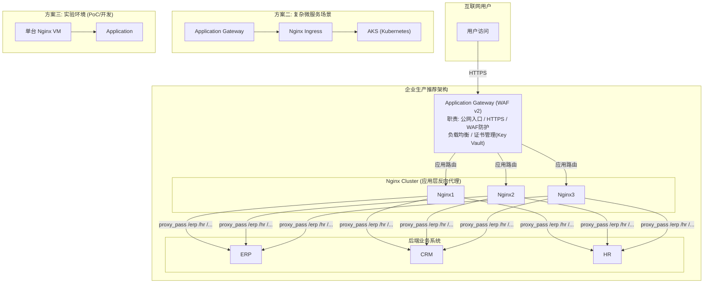

# Application Gateway 与 Nginx 的选型与组合

## 架构图



## 摘要

- 核心结论：Application Gateway 是企业级**云入口网关**（云网络架构），Nginx 是**应用层反向代理**（应用架构），两者是协同关系而非替代关系。
- 功能定位不同：Nginx 是部署在 Linux VM（Ubuntu/RHEL/Rocky）上的应用层软件（Web Server + Reverse Proxy + Load Balancer）；Application Gateway 是 Azure 托管 PaaS 服务（Reverse Proxy + Load Balancer + WAF），无需安装服务器。
- 运维责任划分：Nginx 需要自己维护 Linux 补丁、Nginx 升级、日志、证书和安全加固；Application Gateway 的系统补丁、高可用、伸缩全部由微软负责，用户只负责配置。
- WAF 是最大区别之一：Nginx 原生无 WAF，需额外安装 ModSecurity 或 F5 Nginx App Protect 且配置复杂；Application Gateway 直接开启 WAF v2 即可，防护 OWASP Top 10（SQL 注入、XSS、RCE 等）。
- 成本并非"PaaS 一定便宜"：小规模（如 100 用户、2 台业务服务器 + 1 台 Nginx VM）每月几十澳元即可，而 Application Gateway WAF 通常几百澳元/月起；中大型企业考虑高可用、WAF、扩容、运维成本后 Application Gateway 更划算。
- 推荐架构：Internet → Application Gateway(WAF) → Nginx Cluster → ERP/CRM/HR，AppGW 负责公网入口、HTTPS、WAF、负载均衡、证书管理，Nginx 负责应用路由、URL 重写、Header 处理、缓存、应用代理。

## 技术要点

1. **架构责任模型**：Nginx 架构需维护 Linux + Nginx + Patch + Security + HA；Application Gateway 架构微软负责系统补丁、高可用、伸缩，用户只负责配置。
2. **URL 转发能力**：两者都支持。Nginx 使用 `location /erp { proxy_pass http://erp01; }` 这类配置；Application Gateway 通过路径规则实现 `/erp/* → ERP Pool`、`/hr/* → HR Pool`，效果一样。
3. **SSL 证书管理差异**：Nginx 需要自己申请证书、导入 `ssl_certificate` / `ssl_certificate_key`、续期、更新配置；Application Gateway 直接上传 PFX 即可，支持从 Azure Key Vault 自动管理证书。
4. **扩展能力对比**：Nginx 从 1 台 VM 扩展到 10000 用户需要 Nginx Cluster（Nginx1/2/3）甚至前置负载均衡；Application Gateway 支持自动扩展（Minimum: 2, Maximum: 20），流量增加自动扩容。
5. **高可用实现差异**：Nginx 单机 VM 故障即服务中断，需自行设计 Keepalived / Pacemaker / HAProxy / Cluster；Application Gateway 提供平台级 HA（Zone Redundant），单节点故障自动切换，用户无感知。
6. **WAF 能力**：Application Gateway WAF v2 开箱即用，防护 OWASP Top 10（SQL Injection、XSS、RCE）；Nginx 需组合 ModSecurity 或 F5 Nginx App Protect。
7. **成本决策模型**：小规模系统选 Nginx 更划算；Azure 原生云架构与企业生产环境选 Application Gateway 更合适；决策维度为高可用、WAF、扩容、运维成本。
8. **场景化方案**：方案一（推荐生产）Internet → Application Gateway WAF → Application Servers（ERP/CRM/门户网站）；方案二（复杂微服务）Internet → Application Gateway → Nginx Ingress → AKS；方案三（实验环境）Internet → Nginx → Application。
9. **职责划分原则**：AppGW 管"云边界"（公网入口、HTTPS、WAF、负载均衡、证书），Nginx 管"应用内部"（应用路由、URL 重写、Header 处理、缓存、应用代理）。
10. **针对 M365 + 企业基础架构 + Azure 混合云场景**的推荐优先级：企业生产环境 Application Gateway > Nginx；应用内部转发 Nginx > Application Gateway；Azure 容器平台用 Application Gateway + Nginx Ingress 组合。

## 原文内容

这是企业架构中经常争论的问题：到底用 Azure Application Gateway 还是 Nginx Reverse Proxy？

先给结论：

- **小规模系统**：Nginx 更划算
- **Azure 原生云架构 / 企业生产环境**：Application Gateway 更合适
- 很多公司实际上是：Internet → Application Gateway(WAF) → Nginx → Application，两者并不是替代关系，而是经常组合使用。

### 一、功能定位差异

**Nginx**

- 本质是：Web Server + Reverse Proxy + Load Balancer
- 属于：应用层软件
- 你需要自己安装：Linux VM（Ubuntu / RHEL / Rocky Linux）
- 然后部署：`apt install nginx`

**Application Gateway**

- 本质是：Azure 托管服务 (PaaS)，Reverse Proxy + Load Balancer + WAF
- 属于：Azure 原生网络服务
- 不需要安装服务器。

### 二、架构区别

**Nginx 架构**

```
Internet
   │
Public IP
   │
Linux VM
Nginx
   │
Backend Servers
```

需要维护：Linux、Nginx、Patch、Security、HA。

**Application Gateway 架构**

```
Internet
   │
Public IP
   │
Application Gateway
   │
Backend Pool
```

微软负责：系统补丁、高可用、伸缩；你只负责配置。

### 三、URL 转发能力

两者都支持。

**Nginx：**

```nginx
location /erp {
   proxy_pass http://erp01;
}

location /hr {
   proxy_pass http://hr01;
}
```

**Application Gateway：**

```
/erp/* → ERP Pool
/hr/*  → HR Pool
```

结果一样。

### 四、SSL 证书管理

**Nginx**：需要自己申请证书 → 导入证书（`ssl_certificate`、`ssl_certificate_key`）→ 续期证书 → 更新配置。

**Application Gateway**：直接上传 PFX 即可；支持 Azure Key Vault 自动管理证书。对于企业来说非常方便。

### 五、扩展能力

**Nginx**：假设 100 用户时一台 VM 足够；变成 10000 用户时可能需要 Nginx Cluster（Nginx1 / Nginx2 / Nginx3），例如再加前置负载均衡。

**Application Gateway**：支持自动扩展（Minimum: 2, Maximum: 20），流量增加自动扩容。

### 六、高可用能力

**Nginx**：如果 VM 故障，服务中断。需要自己设计 Keepalived / Pacemaker / HAProxy / Cluster。

**Application Gateway**：微软平台级 HA（Zone Redundant），一个节点故障自动切换，用户无感知。

### 七、WAF 能力（最大区别之一）

**Nginx**：原生无 WAF；需要额外安装 ModSecurity 或者 F5 Nginx App Protect，配置复杂。

**Application Gateway**：直接开启 WAF v2 即可，支持 OWASP Top 10（SQL Injection、XSS、RCE）防护。

### 八、运维复杂度

**Nginx**：Linux 补丁、Nginx 升级、日志管理、证书维护、安全加固，全部自己负责。

**Application Gateway**：OS、HA、Scaling、Patch 由微软负责，运维成本低很多。

### 九、成本比较

很多人误解 PaaS 一定便宜，实际不是。

**小企业**：例如 100 用户、2 台业务服务器，部署 1 台 Nginx VM，一个月可能几十澳元即可。

**Application Gateway WAF**：通常几百澳元/月起步。

所以：

- 小规模：Nginx 更省钱
- 中大型企业：考虑高可用、WAF、扩容、运维成本之后，Application Gateway 更划算

### 十、结合你的场景

你的环境：总部、分公司、M365、Azure、VPN Gateway、ERP、CRM、HR。

推荐架构：

```
Internet
   │
Application Gateway (WAF)
   │
Nginx Cluster
   │
ERP / CRM / HR
```

职责划分：

**Application Gateway** 负责：公网入口、HTTPS、WAF、负载均衡、证书管理。

**Nginx** 负责：应用路由、URL 重写、Header 处理、缓存、应用代理。

### 十一、作为架构师怎么选

如果你未来设计企业级 Azure 平台，建议：

**方案一（推荐生产）**：适用于 ERP、CRM、门户网站 —— Internet → Application Gateway WAF → Application Servers。

**方案二（复杂微服务）**：适用于 Kubernetes、容器平台、微服务 —— Internet → Application Gateway → Nginx Ingress → AKS。

**方案三（实验环境）**：适用于 PoC、实验、开发环境 —— Internet → Nginx → Application。

对于你目前的 M365 + 企业基础架构 + Azure 混合云场景，推荐优先级是：

| 场景 | 选择 |
|------|------|
| 企业生产环境 | Application Gateway > Nginx |
| 应用内部转发 | Nginx > Application Gateway |
| Azure 容器平台 | Application Gateway + Nginx Ingress |

一句话总结：Application Gateway 是企业级云入口网关，Nginx 是应用层反向代理。前者偏"云网络架构"，后者偏"应用架构"，在 Azure 企业生产环境中，两者通常是协同而不是竞争关系。
