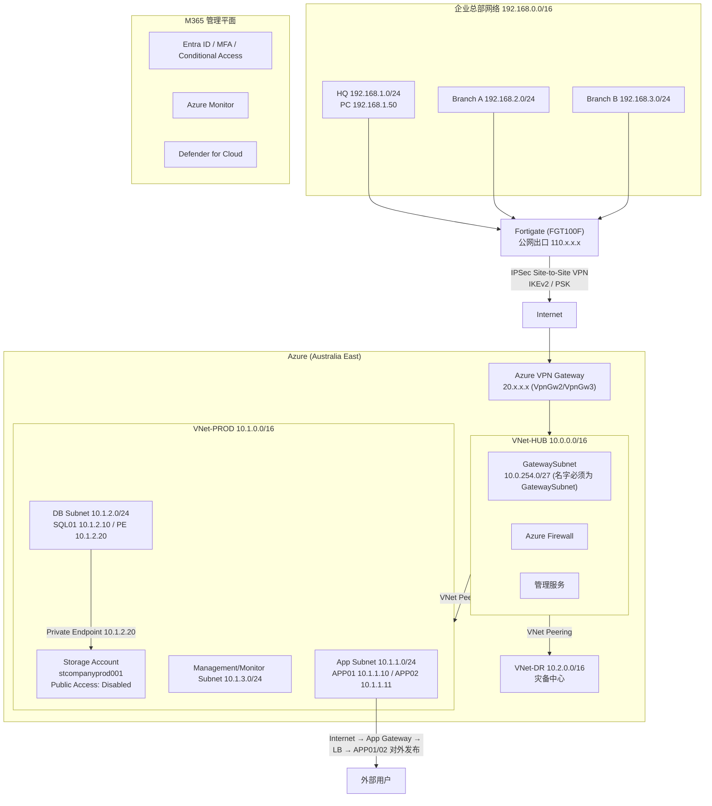

# 企业网络与 Azure 混合云网络（Hub-Spoke + VPN Gateway + Private Endpoint）

## 架构图



## 摘要

- 核心结论：**Azure 生产网段不需要配置公网 IP**——生产 VNet 完全可以是私网（10.x.x.x），通过 Site-to-Site VPN 建立后，与企业内网（192.168.x.x）即可直接互访，业务服务器无需公网 IP。
- 整体架构：企业总部（192.168.0.0/16，含 HQ/Branch A/Branch B）以 Fortigate（FGT100F，公网出口 110.x.x.x）为边界，经 IPSec VPN 连接 Azure VPN Gateway（Australia East，20.x.x.x），采用微软推荐的 Hub-Spoke 拓扑。
- 三 VNet 分工：VNet-HUB（10.0.0.0/16）承载 VPN Gateway、Azure Firewall 和管理服务；VNet-PROD（10.1.0.0/16）承载应用/数据库/Storage；VNet-DR（10.2.0.0/16）作为灾备中心，通过 VNet Peering互联。
- VPN 三组件：Virtual Network Gateway（生产推荐 VpnGw2 或 VpnGw3，Azure 自动分配公网 IP）、Local Network Gateway（代表企业侧 Fortigate 及其身后 192.168.0.0/16 网段）、Connection（配置预共享密钥 PSK）。
- Fortigate 侧配置 Phase1（IKEv2 认证）与 Phase2（本地 192.168.0.0/16 ↔ 远程 10.0.0.0/8），企业侧新增静态路由 Destination 10.0.0.0/8 → Interface Azure VPN；Azure 侧由 VPN Gateway 自动生成路由。
- 安全闭环：生产 VM 全部私网（外部用户经 Application Gateway → Load Balancer 发布）、Storage 关闭公网访问并用 Private Endpoint（10.1.2.20）内网直访、Entra ID + MFA + Conditional Access、RBAC、Defender for Cloud、Azure Bastion 替代 3389/22 暴露。这是 M365 + 企业基础架构 + Azure 云平台的中大型企业 Hybrid Cloud 标准架构，覆盖 AZ-104 核心知识点。

## 技术要点

1. **生产网段无私网公网 IP 原则**：生产 VM（APP01 10.1.1.10、APP02 10.1.1.11、SQL01 10.1.2.10）全部私网；外部用户访问通过 Internet → Application Gateway → Load Balancer → APP01/APP02 的路径发布。
2. **GatewaySubnet 命名硬性要求**：Hub VNet（10.0.0.0/16）中创建 VPN 专用子网 10.0.254.0/27，名字必须是 `GatewaySubnet`，否则 VPN Gateway 无法部署。
3. **Azure VPN Gateway 本质**：相当于 Azure 上的 VPN 设备（类似 Fortigate/Cisco/Palo Alto），基于 Route-based VPN；SKU 生产推荐 VpnGw2 或 VpnGw3；公网 IP 由 Azure 自动分配（如 20.70.100.10）。
4. **Local Network Gateway 作用**：代表企业侧 Fortigate 设备，配置其 Public IP（110.x.x.x）与地址空间 192.168.0.0/16，含义是"192 网段在这个设备后面"。
5. **Connection 与预共享密钥**：创建 Site-to-Site Connection 连接 Virtual Network Gateway 与 Local Network Gateway，两端配置一致的 PSK（如 Azure@2026VPN!）。
6. **Fortigate IPSec 配置**：Phase1 配置 Authentication（推荐 IKEv2）与对端 Remote Gateway 20.x.x.x；Phase2 配置本地网段 192.168.0.0/16 与远程网段 10.0.0.0/8（覆盖 10.0.0.0/16、10.1.0.0/16、10.2.0.0/16）。
7. **双端路由配置**：企业侧新增静态路由 Destination 10.0.0.0/8 → Interface Azure VPN；Azure 侧由 VPN Gateway 自动生成到 192.168.0.0/16 的路由，下一跳为 VPN Gateway，最终实现 PC（192.168.1.50）→ Fortigate → VPN Tunnel → Azure（10.1.1.10）的互通。
8. **云存储私网化**：Storage Account（stcompanyprod001）将 Public Access 设为 Disabled，创建 Private Endpoint（10.1.2.20），总部 192.168.x.x 经 VPN 直接通过内网 IP 访问。
9. **分层安全策略**：网络层（VPN Gateway、NSG、Private Endpoint）；身份层（Entra ID、MFA、Conditional Access）；权限层（RBAC 的 Owner/Contributor/Reader）；云安全（Defender for Cloud）；运维层（Azure Bastion 代替 3389/22 端口开放到互联网）。
10. **知识点覆盖**：该架构覆盖 AZ-104 中 VPN Gateway、VNet、Subnet、NSG、Route、Private Endpoint、Storage、Monitor 等绝大多数核心知识点。

## 原文内容

你的场景实际上是一个非常标准的 Azure Hybrid Network Architecture（企业网络与Azure混合云网络）。

对于你的问题，先给结论：

**是否需要给 Azure 生产网段配置公网 IP？**

答案：不需要。

- Azure 生产网段：完全可以是私网（10.x.x.x）。
- 通过建立 Site-to-Site VPN 后，与企业网络（192.168.x.x）即可直接互访。
- 业务服务器不需要公网 IP。

### 一、整体系统架构

假设：

- 公网出口：110.x.x.x
- Fortigate：FGT100F
- Azure：Australia East
- 生产环境：10.0.0.0/16

架构：

```
                Internet
                    │
            Azure VPN Gateway
                20.x.x.x
                    │
    ────────────────────────────────
    Azure VNet 10.0.0.0/16
    │
    ├─App Subnet       10.0.1.0/24
    ├─DB Subnet        10.0.2.0/24
    ├─Monitor Subnet   10.0.3.0/24
    └─GatewaySubnet    10.0.254.0/27
    ────────────────────────────────
                    │
                IPSec
                    │
                Fortigate
                110.x.x.x
                    │
    ────────────────────────────────
    Corporate Network 192.168.0.0/16
    ├─HQ        192.168.1.0/24
    ├─Branch A  192.168.2.0/24
    └─Branch B  192.168.3.0/24
```

（Fortigate ↔ Internet ↔ Azure VPN Gateway）

### 二、网络架构设计

建议采用 Hub-Spoke 思路。

**Azure Hub**（VNet-HUB 10.0.0.0/16）：作用——VPN Gateway、Azure Firewall、管理服务。

**Azure Production**（VNet-PROD 10.1.0.0/16）：作用——应用、数据库、Storage。

**Azure DR**（VNet-DR 10.2.0.0/16）：作用——灾备中心。

拓扑：

```
Enterprise
    │
   VPN
    │
Hub VNet 10.0.0.0/16
    │
VNet Peering
    │
─────────────
│             │
PROD          DR
10.1.0.0     10.2.0.0
```

这是微软推荐架构。

### 三、Azure 网络配置

**创建生产 VNet**

- VNet Name: VNet-PROD
- 地址空间：10.1.0.0/16
- 子网：App 10.1.1.0/24、DB 10.1.2.0/24、Management 10.1.3.0/24

**创建 Hub VNet**

- VNet-HUB，地址：10.0.0.0/16
- VPN 专用子网：必须叫 `GatewaySubnet`，例如 10.0.254.0/27
- 注意：名字必须是 GatewaySubnet，否则 VPN Gateway 无法部署。

### 四、VPN Gateway 方案

Azure VPN Gateway 实际上是 Azure 上的 VPN 设备，类似 Fortigate、Cisco、Palo Alto。VPN 类型为 Route-based。

**组件 1：Virtual Network Gateway**

- 创建于：VNet-HUB
- SKU：生产推荐 VpnGw2 或 VpnGw3
- 公网 IP：Azure 自动分配，例如 20.70.100.10 —— 这就是 Azure VPN Gateway 公网地址。

**组件 2：Local Network Gateway**

- 代表：企业侧 Fortigate
- 配置：Public IP 110.x.x.x
- 地址空间：192.168.0.0/16
- 意思：192 网段在这个设备后面。

**组件 3：Connection**

- 创建：Site-to-Site VPN（Azure VPN Gateway + Local Network Gateway）
- 参数：配置预共享密钥（PSK，如 Azure@2026VPN!）

### 五、Fortigate 配置

假设：

- WAN：110.x.x.x
- Azure：20.x.x.x

需要配置：

**Phase1（Authentication / IKE，推荐 IKEv2）**

- Remote Gateway: 20.x.x.x
- PSK: Azure@2026VPN!

**Phase2**

- 本地网段：192.168.0.0/16
- 远程：10.0.0.0/8（或者精确列出 10.0.0.0/16、10.1.0.0/16、10.2.0.0/16）

### 六、路由配置

- 企业侧：新增静态路由——Destination 10.0.0.0/8，Interface: Azure VPN。
- Azure 侧：自动生成到 192.168.0.0/16 的路由，下一跳为 VPN Gateway。
- 最终通信：PC 192.168.1.50 ↓ Fortigate ↓ VPN Tunnel ↓ Azure 10.1.1.10，实现互通。

### 七、生产服务器是否配置公网 IP

推荐：不要配置。

- 生产 VM：全部私网（APP01 10.1.1.10、APP02 10.1.1.11、SQL01 10.1.2.10）。
- 外部用户访问：Internet ↓ Application Gateway ↓ Load Balancer ↓ APP01 / APP02。

### 八、云存储配置

Storage Account：

- 名称如 stcompanyprod001
- 关闭公网访问：Public Access = Disabled
- 创建 Private Endpoint，IP：10.1.2.20

这样：总部 192.168.x.x ↓ VPN ↓ Storage 10.1.2.20，直接访问。

### 九、安全策略

建议：

- **网络**：VPN Gateway、NSG、Private Endpoint
- **身份**：Entra ID、MFA、Conditional Access
- **权限**：RBAC（Owner、Contributor、Reader）
- **云安全**：Defender for Cloud
- **运维**：Azure Bastion 代替 3389 / 22 端口开放到互联网

### 十、最终推荐生产架构

```
HQ + Branches 192.168.0.0/16
        │
    Fortigate 110.x.x.x
        │
    IPSec VPN
        │
Azure VPN Gateway
        │
    Hub VNet 10.0.0.0/16
        │
    VNet Peering
        │
  ┌────┴─────┐
  │          │
Prod VNet   DR VNet
10.1.0.0/16 10.2.0.0/16
  │
  ├─APP
  ├─DB
  ├─Storage (Private Endpoint)
  └─Monitor

M365: Entra ID、Azure Monitor、Defender for Cloud
```

对于你这种 M365 + 企业基础架构 + Azure 云平台的场景，这已经是中大型企业常见的 Hybrid Cloud 标准架构，同时也覆盖了 AZ-104 中 VPN Gateway、VNet、Subnet、NSG、Route、Private Endpoint、Storage、Monitor 等绝大多数核心知识点。
