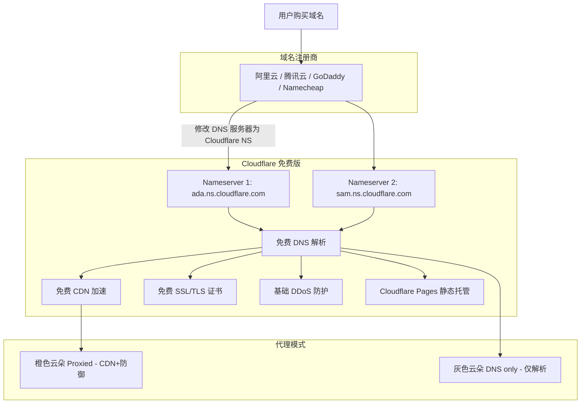

# Cloudflare 免费发布域名托管

## 架构图



## 摘要

- 使用 Cloudflare 托管（解析）现有域名是完全免费的，包含 DNS 解析、CDN 加速、SSL 证书、DDoS 防护和 Pages 静态托管。
- 托管流程为四步：添加域名到 Cloudflare → 扫描确认 DNS 记录 → 修改域名 NS 服务器 → 等待生效。
- 修改 NS 地址后通常需要 5 分钟至几小时全球 DNS 生效，Cloudflare 显示 "Active" 即代表托管成功。
- 国内已备案域名需注意：服务器在大陆境内时改 DNS 可能影响备案接入；服务器在香港或海外则无限制。
- 橙色云朵（Proxied）表示流量经 Cloudflare 代理提供 CDN 和防御；灰色云朵（DNS only）仅做普通 DNS 解析。

## 技术要点

1. **免费 DNS 解析**：全球顶级权威 DNS 解析服务，修改记录实时生效，毫秒级解析响应。
2. **免费 CDN 加速**：自动缓存静态资源，提升网站访问速度并节省服务器流量。
3. **免费 SSL/TLS 证书**：自动为域名签发和续期 SSL 证书，一键开启全站 HTTPS。
4. **Cloudflare Pages**：静态网站（Hexo、Hugo、Vue/React 前端）可直接免费部署，省去服务器费用。
5. **NS 服务器修改**：需在域名注册商控制台将默认 DNS 服务器替换为 Cloudflare 提供的两条 Nameservers 地址。
6. **Proxied vs DNS only**：橙色云朵开启 Cloudflare 代理（CDN + 防御），灰色云朵仅做 DNS 解析不经过 Cloudflare 服务器。
7. **国内备案注意**：大陆境内服务器 + 国内 CDN 场景下，改用 Cloudflare DNS 可能导致访问走海外节点或影响备案接入。

## 原文内容

是的，使用 Cloudflare 来"托管（解析）现有的域名"是完全免费的。

许多开发者和企业都在使用 Cloudflare 的免费版（Free Plan）来托管域名的 DNS、加速网站以及开启免费的 HTTPS 保护。

以下是具体的托管机制和操作流程：

## 1. 免费托管包含哪些功能？

把域名托管到 Cloudflare 的免费版，你可以获得：

- **免费 DNS 解析**：全球顶级且极速的权威 DNS 解析服务（修改记录实时生效）。
- **免费 CDN 加速**：自动缓存静态资源，提升网站访问速度并节省服务器流量。
- **免费 SSL/TLS 证书**：自动为你的域名签发和续期 SSL 证书，一键开启全站 HTTPS。
- **基础 DDoS 防护**：自动拦截常见的网络攻击、恶意爬虫和流量冲击。
- **免费网页服务 (Cloudflare Pages)**：如果你是静态网站（如 Hexo、Hugo、Vue/React 前端），可以直接免费部署在 Cloudflare Pages 上，连服务器费用都省了。

## 2. 域名托管到 Cloudflare 的标准步骤

> ⚠️ **前提条件**：你需要在任意域名注册商（如阿里云、腾讯云、GoDaddy、Namecheap 等）处已经拥有一个域名。

### 步骤一：添加域名到 Cloudflare

1. 注册并登录 Cloudflare 官网。
2. 点击右上角 "添加站点" (Add a site)。
3. 输入你的根域名（例如 `example.com`），点击继续。
4. 选择 Free (免费版) 计划并确认。

### 步骤二：扫描与确认 DNS 记录

1. Cloudflare 会自动扫描你域名现有的 DNS 记录（如 A 记录、CNAME 记录等）。
2. 检查列表无误后，点击继续。

### 步骤三：修改域名的 DNS 服务器（NS 地址）

Cloudflare 会提供两条专属于你的 Nameservers（NS 地址），形如：

```
ada.ns.cloudflare.com
sam.ns.cloudflare.com
```

1. 登录你购买域名的平台（如阿里云/腾讯云的域名控制台）。
2. 找到该域名的 "修改 DNS 服务器 / 修改 DNS/NS" 选项。
3. 将原本默认的 DNS 服务器清空，替换为 Cloudflare 给你的这两条 NS 地址并保存。

### 步骤四：等待生效

修改 NS 地址后，通常需要 5 分钟至几小时不等（全球 DNS 生效时间）。

待 Cloudflare 后台显示 "Active"（已激活），即代表域名托管成功！

## 3. 注意事项与常见坑点

### 国内已备案域名的注意点

- 如果你的网站托管在中国大陆境内的服务器上且使用了国内 CDN，将 DNS 改为 Cloudflare 可能会导致访问走海外节点或影响国内备案接入。
- 如果服务器在中国香港或海外地区，接入 Cloudflare 则完全没有限制。

### 小黄橘云（Proxy）开关

- 在 Cloudflare 解析记录中，**橙色云朵（Proxied）** 表示流量通过 Cloudflare 代理并提供免费 CDN 和防御；
- **灰色云朵（DNS only）** 则仅作为普通 DNS 解析，不经过 Cloudflare 服务器。
