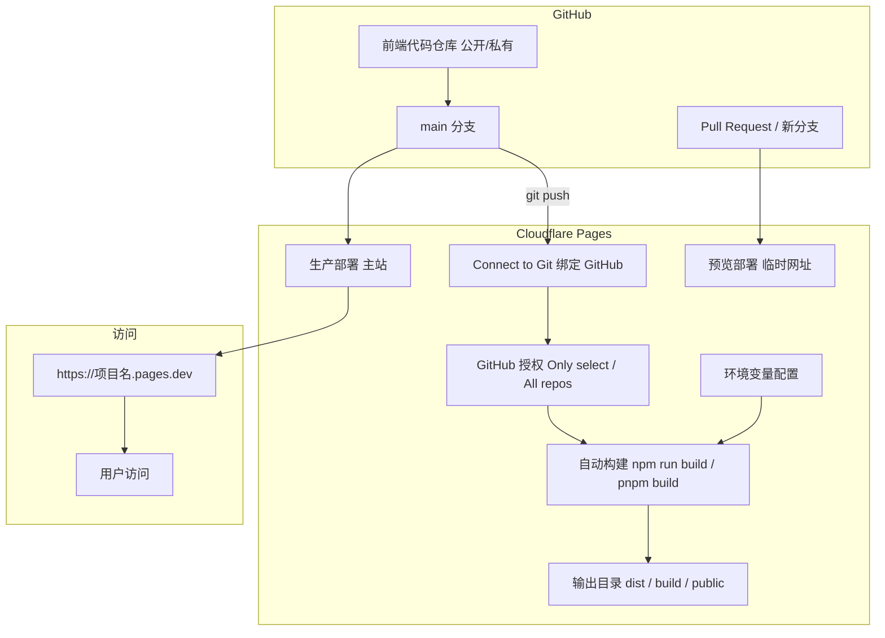

# 免费静态网站托管 (Cloudflare Pages)：直接连接 GitHub，自动构建部署你的前端

## 架构图



## 摘要

- Cloudflare Pages 支持直接连接 GitHub 仓库，实现前端项目的自动构建与部署，完全免费。
- 操作流程四步：创建 Pages 项目 → 授权绑定 GitHub → 配置构建设置 → 等待首次构建完成。
- Cloudflare 自动识别主流框架（Vue、React、Next.js、Vite、Hugo、Hexo 等），自动填入构建命令和输出目录。
- 每次 push 到 main 分支自动触发构建，几十秒内更新线上网站；新建分支或 PR 会生成临时预览网址。
- 部署完成后获得免费的 `https://<项目名>.pages.dev` 域名。

## 技术要点

1. **GitHub 授权选择**：推荐选择 "Only select repositories" 仅授权特定仓库，安全性更高；也可选择 "All repositories" 授权所有仓库。
2. **框架自动识别**：Cloudflare Pages 会自动识别 Vue、React、Next.js、Vite、Hugo、Hexo 等主流框架，自动填入对应的构建命令和输出目录。
3. **生产分支配置**：通常设为 main 或 master，每次该分支有新的 git push 时自动触发构建。
4. **构建命令与输出目录**：若未自动识别，需手动填写构建命令（如 `npm run build` 或 `pnpm build`）和输出目录（如 `dist`、`build` 或 `public`）。
5. **环境变量**：如有 .env 中的变量（如 API 接口地址），可在构建设置中展开添加。
6. **自动 CI/CD 体验**：push 到 main 分支自动部署主站；新建分支或提交 PR 自动生成独有的临时预览网址，不影响线上主站。
7. **免费域名**：构建成功后自动生成 `https://<项目名>.pages.dev` 格式的免费访问域名。

## 原文内容

在 Cloudflare Pages 上直接连接 GitHub 实现前端项目自动构建与部署，过程非常简单且完全免费。

以下是具体的完整操作步骤：

## 前置准备

- 一个 GitHub 账号，且你的前端代码已上传到一个 GitHub 仓库（公开或私有仓库均可）。
- 一个 Cloudflare 账号。

## 详细步骤

### 步骤一：在 Cloudflare 中创建 Pages 项目

1. 登录 Cloudflare 控制台。
2. 在左侧导航栏中点击 **Workers 和 Pages** (Workers & Pages)。
3. 点击 **创建** (Create) 按钮。
4. 选择 **Pages** 标签页，然后点击 **连接到 Git** (Connect to Git)。

### 步骤二：授权并绑定 GitHub

1. 页面会提示你登录并授权 GitHub 账号。
2. 在 GitHub 授权弹窗中，你可以选择：
   - **Only select repositories**：仅允许 Cloudflare 访问特定的某个仓库（更安全，推荐）。
   - **All repositories**：允许访问所有仓库。
3. 授权完成后，返回 Cloudflare 页面，在列表中选择你要部署的 GitHub 仓库，然后点击 **开始设置** (Begin setup)。

### 步骤三：配置构建设置 (Build Settings)

Cloudflare Pages 会自动识别大部分主流框架，你只需要确认或微调以下参数：

- **项目名称 (Project name)**：默认使用仓库名，也是你未来免费二级的子域名前缀（如 `your-project.pages.dev`）。
- **生产分支 (Production branch)**：通常填 `main` 或 `master`。每当这个分支有新的 git push 时，Cloudflare 就会自动触发构建。
- **框架预设 (Framework preset)**：选择你使用的前端框架（如 Vue, React, Next.js, Vite, Hugo, Hexo 等）。选定后，Cloudflare 会自动填入对应的构建命令和输出目录！
- **手动核对构建命令与输出目录（若未自动识别）**：
  - 构建命令 (Build command)：例如 `npm run build` 或 `pnpm build`。
  - 构建输出目录 (Build output directory)：例如 `dist`、`build` 或 `public`。
- **(可选) 环境变量 (Environment variables)**：如果有 `.env` 中的变量（如 API 接口地址），展开此项添加即可。

最后，点击 **保存并部署** (Save and Deploy)。

### 步骤四：等待首次构建完成

1. Cloudflare 会自动拉取你的 GitHub 代码并运行构建脚本。
2. 大约 1~2 分钟后，构建成功会显示绿色勾号。
3. 此时 Cloudflare 会为你生成一个免费的访问域名，形式如：

```
https://<项目名>.pages.dev
```

## 4. 后续自动化体验 (CI/CD)

配置完成后，你就拥有了全自动的发布体验：

- **自动部署主站**：每次在本地执行 `git push` 推送到 main 分支，Cloudflare 就会在后台自动构建，几十秒内更新你的线上网站。
- **预览分支 (Preview Deployments)**：如果你新建了一个分支或提交了 Pull Request (PR)，Cloudflare 会自动为这个分支生成一个独有的临时预览网址，方便你测试新功能，且完全不影响线上主站！
