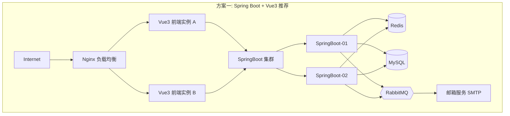

# 水果电商订购平台设计方案（Markdown）

## 架构图



## 摘要

- 建设支持用户注册（邮箱验证码）、登录（JWT）、商品浏览、购物车、订单管理的水果商城系统。
- 推荐方案一：Spring Boot 3 + Vue3 + MySQL + Redis + RabbitMQ + Docker 部署，适合企业生产环境。
- 方案二：React + Node.js（NestJS）+ Kubernetes，适合快速迭代和统一 JavaScript 技术栈。
- 邮件验证码流程：用户输入邮箱 → Redis 缓存验证码（TTL 300秒）→ SMTP 发送邮件 → 用户输入验证码 → Redis 校验 → 注册成功。
- 安全设计涵盖 JWT 认证、Refresh Token、HTTPS、BCrypt/Argon2 密码加密、Redis 限流和 IP 黑名单。
- 容量规划：100 活跃用户、5000+ 商品、3000+ 日订单，8C16G 服务器可稳定支撑 30~50 QPS 和秒级响应。

## 技术要点

1. **方案一前端技术栈**：Vue3 + TypeScript + Pinia + Axios + Element Plus + Vite，企业级管理界面首选组合。
2. **方案一后端技术栈**：Spring Boot 3 + Spring Security + JWT + MyBatis Plus + Redis + MySQL，成熟的 Java 企业级方案。
3. **方案二前端技术栈**：React18 + TypeScript + Redux Toolkit + Ant Design + Vite + Axios，适合快速迭代互联网项目。
4. **方案二后端技术栈**：Node.js + NestJS + Prisma + JWT + Redis + MySQL，前后端统一 JavaScript 技术栈，Kubernetes 部署。
5. **数据库设计**：四张核心表 — user（用户）、email_code（验证码，含 expire_time）、product（商品，含 price/stock/image_url）、orders（订单，含 total_amount/status）。
6. **邮件验证码设计**：验证码存储在 Redis 中（`email:demo@qq.com → code:123456, ttl:300秒`），通过 SMTP 发送，验证时从 Redis 校验。
7. **API 接口设计**：认证接口（sendCode/register/login）、商品接口（list/detail）、购物车接口（add/delete/list）、订单接口（create/list/detail）。
8. **部署方案**：2 台应用服务器（4C8G）+ 1 台数据库服务器（8C16G）+ 1 台 Redis（2C4G）+ 1 台 Nginx（2C4G），Docker 容器化部署。
9. **安全防刷**：Redis 限流、验证码频率限制、IP 黑名单三重防护机制。
10. **订单状态流转**：待支付 → 待发货 → 配送中 → 已完成 / 已取消，支持创建、支付、取消、查询和历史记录。

## 原文内容

## 1. 项目概述

建设一个支持用户注册、邮箱验证码验证、登录、商品浏览、购物车、订单管理的水果商城系统。

### 用户流程

```
用户访问网站
    │
    ▼
邮箱注册
    │
    ├──发送邮箱验证码
    │
    ├──验证码校验
    │
    └──设置密码完成注册
    │
    ▼
用户登录
    │
    ▼
水果商城首页
    │
    ├──商品浏览
    ├──商品搜索
    ├──购物车
    ├──提交订单
    └──订单查询
```

## 2. 功能模块设计

### 2.1 用户中心

#### 注册功能

支持：

- 邮箱账号注册
- 邮箱验证码发送
- 验证码校验
- 密码加密存储
- 用户激活

#### 登录功能

支持：

- 邮箱+密码登录
- JWT 认证
- Token 刷新
- 自动退出

### 2.2 商品中心

水果信息维护：苹果、香蕉、橙子、榴莲、葡萄、草莓、西瓜

商品信息：

- 商品名称
- 商品图片
- 库存
- 价格
- 产地
- 规格
- 商品描述

### 2.3 购物车

支持：

- 加入购物车
- 修改数量
- 删除商品
- 实时计算金额

### 2.4 订单中心

支持：

- 创建订单
- 支付订单
- 取消订单
- 订单查询
- 订单历史

订单状态：

- 待支付
- 待发货
- 配送中
- 已完成
- 已取消

## 3. 前后端方案一（推荐）

### Spring Boot + Vue3

适用于：

- 企业生产环境
- 中大型项目
- 后期扩展微服务

### 技术栈

#### 前端

- Vue3
- TypeScript
- Pinia
- Axios
- Element Plus
- Vite

#### 后端

- Spring Boot 3
- Spring Security
- JWT
- MyBatis Plus
- Redis
- MySQL

#### 中间件

- Nginx
- Redis
- RabbitMQ
- MySQL

### 系统架构图

```
                    Internet
                        │
                        ▼
                  Nginx负载均衡
                        │
            ┌───────────┴───────────┐
            │                       │
            ▼                       ▼
       Vue3前端                Vue3前端
            │
            ▼
       SpringBoot集群
            │
    ┌───────┼────────┐
    │       │        │
    ▼       ▼        ▼
 Redis    MySQL   RabbitMQ
    │
    ▼
邮箱服务SMTP
```

### 部署方案

#### 服务器规格

支持 100 活跃用户：

- 2 台应用服务器：4C8G
- 1 台数据库服务器：8C16G
- 1 台 Redis 服务器：2C4G
- 1 台 Nginx 服务器：2C4G

#### Docker 部署

- Nginx
- Vue3 Frontend
- SpringBoot-01
- SpringBoot-02
- MySQL
- Redis
- RabbitMQ

## 4. 前后端方案二

### React + Node.js

适用于：

- 快速迭代
- 互联网项目
- 前后端统一 JavaScript 技术栈

### 技术栈

#### 前端

- React18
- TypeScript
- Redux Toolkit
- Ant Design
- Vite
- Axios

#### 后端

- Node.js
- NestJS
- Prisma
- JWT
- Redis
- MySQL

### 系统架构图

```
                   Internet
                        │
                        ▼
                Kubernetes Ingress
                        │
           ┌────────────┼─────────────┐
           ▼            ▼             ▼
     React Pod1   React Pod2   React Pod3
                        │
                        ▼
                   NestJS集群
                        │
          ┌────────┬────────┬────────┐
          ▼        ▼        ▼
        Redis    MySQL   SMTP邮箱服务
```

## 5. 数据库设计

### 用户表

```sql
CREATE TABLE user (
    id BIGINT PRIMARY KEY,
    email VARCHAR(100) UNIQUE,
    password VARCHAR(255),
    status TINYINT,
    create_time DATETIME
);
```

### 验证码表

```sql
CREATE TABLE email_code (
    id BIGINT PRIMARY KEY,
    email VARCHAR(100),
    code VARCHAR(10),
    expire_time DATETIME
);
```

### 商品表

```sql
CREATE TABLE product (
    id BIGINT PRIMARY KEY,
    product_name VARCHAR(100),
    price DECIMAL(10,2),
    stock INT,
    image_url VARCHAR(255),
    description TEXT
);
```

### 订单表

```sql
CREATE TABLE orders (
    id BIGINT PRIMARY KEY,
    user_id BIGINT,
    total_amount DECIMAL(10,2),
    status VARCHAR(20),
    create_time DATETIME
);
```

## 6. 前端页面框架

### 登录页面

```
+------------------------------------------------+
|                 Fruit Mall                     |
+------------------------------------------------+
|                                                |
|  邮箱地址                                      |
|  [________________________]                    |
|                                                |
|  密码                                          |
|  [________________________]                    |
|                                                |
|  [登录]                                        |
|                                                |
|  没有账号？立即注册                            |
+------------------------------------------------+
```

### 注册页面

```
+------------------------------------------------+
|                  用户注册                      |
+------------------------------------------------+
| 邮箱                                           |
| [_____________________]                        |
|                                                |
| 验证码                                         |
| [______] [发送验证码]                          |
|                                                |
| 密码                                           |
| [_____________________]                        |
|                                                |
| 确认密码                                       |
| [_____________________]                        |
|                                                |
| [立即注册]                                     |
+------------------------------------------------+
```

### 商品首页

```
+--------------------------------------------------------+
| Logo       搜索框                    购物车(3)         |
+--------------------------------------------------------+
| 分类菜单                                               |
+--------------------------------------------------------+
| 苹果   香蕉   草莓   橙子   西瓜                        |
+--------------------------------------------------------+

+---------------+ +---------------+ +---------------+
| 图片          | | 图片          | | 图片          |
| 苹果          | | 香蕉          | | 草莓          |
| ¥12.8/kg      | | ¥8.0/kg       | | ¥18.8/kg      |
| 加入购物车     | | 加入购物车     | | 加入购物车     |
+---------------+ +---------------+ +---------------+
```

## 7. 后端接口框架

### 用户模块

#### 发送验证码

请求：

```
POST /api/auth/sendCode
```

```json
{
  "email": "demo@qq.com"
}
```

#### 注册

```
POST /api/auth/register
```

```json
{
  "email": "demo@qq.com",
  "code": "123456",
  "password": "123456"
}
```

#### 登录

```
POST /api/auth/login
```

```json
{
  "email": "demo@qq.com",
  "password": "123456"
}
```

### 商品接口

```
GET /api/product/list
GET /api/product/detail/{id}
```

### 购物车接口

```
POST /api/cart/add
POST /api/cart/delete
GET  /api/cart/list
```

### 订单接口

```
POST /api/order/create
GET  /api/order/list
GET  /api/order/detail/{id}
```

## 8. 邮件验证码设计

流程：

```
用户输入邮箱
      │
      ▼
发送验证码
      │
      ▼
Redis缓存验证码
      │
      ▼
SMTP邮件发送
      │
      ▼
用户输入验证码
      │
      ▼
Redis校验
      │
      ▼
注册成功
```

Redis 存储：

```
email:demo@qq.com
code:123456
ttl:300秒
```

## 9. 安全设计

### 认证

- JWT
- Refresh Token
- HTTPS

### 密码

- BCrypt
- Argon2

### 防刷

- Redis 限流
- 验证码频率限制
- IP 黑名单

## 10. 100 并发活跃用户容量规划

### 指标

- 活跃用户：100
- 同时在线：100
- 商品数量：5000+
- 日订单：3000+

### 性能设计

- Nginx 负载均衡
- Redis 缓存热点数据
- MySQL 索引优化
- SpringBoot 双实例
- RabbitMQ 异步订单
- Docker 部署

预计资源：

- CPU：8 核
- 内存：16GB
- SSD：200GB
- 带宽：20Mbps

能够稳定支撑：

- 100+ 活跃用户
- 30~50 QPS
- 订单实时处理
- 秒级响应

## 最终推荐

生产环境优先推荐：

- 前端：Vue3 + TypeScript + Element Plus
- 后端：Spring Boot 3 + Spring Security + JWT
- 数据库：MySQL 8
- 缓存：Redis
- 消息队列：RabbitMQ
- 部署：Docker + Nginx

该方案最适合企业级水果商城，可平滑扩展到 1000+ 活跃用户及后续微服务架构升级。
