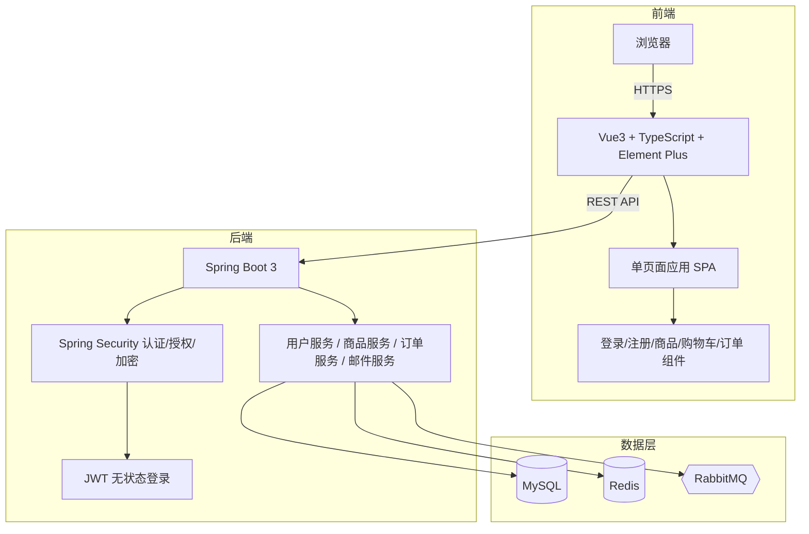

# 水果摊技术栈

## 架构图



## 摘要

- 技术栈选型为 Vue3 + TypeScript + Element Plus（前端）和 Spring Boot 3 + Spring Security + JWT（后端），是国内企业级电商系统最成熟的组合之一。
- Vue3 核心能力包括页面组件化、数据响应式、单页面应用（SPA）和 Composition API，适合大型项目开发。
- TypeScript 提供类型检查和自动提示，在开发时即可发现错误，是企业级开发必备。
- Spring Security 提供用户认证、权限管理（ROLE_ADMIN/ROLE_USER）和密码加密（BCrypt/PBKDF2/Argon2）。
- JWT 实现无状态登录，服务器不保存 Session，支持集群和微服务扩展。
- 单台 4C8G 服务器即可支撑 100 活跃用户；采用 Nginx + SpringBoot 双实例可达 100~300 并发用户和 50~100 QPS。

## 技术要点

1. **Vue3 组件化开发**：将页面拆分为 Login.vue、Register.vue、Product.vue、Cart.vue、Order.vue 等独立组件，便于管理和复用。
2. **数据响应式**：Vue3 最大特色，data 变化时页面自动刷新，无需手动更新 DOM。
3. **Composition API**：Vue3 官方推荐的 setup()、ref()、reactive()、computed()、watch() 等 API，代码逻辑集中、复用性高、维护方便。
4. **TypeScript 类型检查**：在开发时即可发现类型错误（如 `price = "abc"` 赋值给 number 类型），减少运行时 Bug。
5. **Element Plus UI 组件库**：提供登录框、表单（校验/错误提示/提交）、表格、分页等封装组件，特别适合快速开发后台管理系统、ERP、CRM、商城、OA。
6. **Spring Boot 3 自动配置**：通过 `@SpringBootApplication` 注解即可启动项目，自动完成数据库连接、Redis 连接、JSON 转换、日志、事务管理等配置。
7. **Spring Security 安全框架**：自动实现认证、授权、权限控制、登录校验、登录失效、防攻击；支持 BCrypt、PBKDF2、Argon2 密码加密。
8. **JWT 无状态登录**：JSON Web Token 包含用户信息、签名和过期时间，前端存储在 LocalStorage，请求时通过 `Authorization: Bearer Token` 传递，服务器无状态、支持集群和微服务。
9. **框架协作流程**：注册（Vue→Spring Boot→SMTP→Redis 缓存验证码）→ 登录（Vue→Spring Security 认证→生成 JWT→返回 Token）→ 浏览商品（Vue→Axios→SpringBoot→MySQL）→ 下单（Vue→SpringBoot→库存校验→生成订单→写入 MySQL）。
10. **容量评估**：100 活跃用户 + 5000 商品 + 3000 单/天的场景，单台 4C8G 足够；采用 Nginx + SpringBoot 双实例 + Redis + MySQL 可达 100~300 并发、50~100 QPS、10000+ 订单/天、响应时间 100ms~500ms。

## 原文内容

对于你这个水果商城项目（注册→邮箱验证→登录→商品浏览→下单），选择：

- **前端**：Vue3 + TypeScript + Element Plus
- **后端**：Spring Boot 3 + Spring Security + JWT

实际上是目前国内企业级管理系统、电商系统、SaaS 平台最成熟的技术组合之一。

这套技术栈最大的优势是：

- 学习成本相对较低
- 开发效率高
- 企业使用广泛
- 社区活跃
- 招聘容易
- 部署成熟
- 后续扩展微服务方便

## 一、整体技术架构

```
┌─────────────────────────────┐
│          浏览器              │
└──────────────┬──────────────┘
               │ HTTPS
               ▼
┌─────────────────────────────┐
│      Vue3 + TS 前端         │
│                             │
│ 登录                         │
│ 注册                         │
│ 商品浏览                     │
│ 购物车                       │
│ 订单管理                     │
└──────────────┬──────────────┘
               │ REST API
               ▼
┌─────────────────────────────┐
│ Spring Boot 3               │
│                             │
│ 用户服务                     │
│ 商品服务                     │
│ 订单服务                     │
│ 邮件服务                     │
└──────────────┬──────────────┘
               │
      ┌────────┼────────┐
      ▼        ▼        ▼
    MySQL    Redis   RabbitMQ
```

## 二、Vue3 详解

### 什么是 Vue3

Vue3 是前端开发框架。

简单说：如果 HTML 是房子骨架，Vue 就是帮助开发人员快速构建页面。

### Vue3 核心能力

#### 1. 页面组件化

传统开发：一个页面几千行代码，难维护。

Vue：拆分管理。例如：

- 登录组件
- 注册组件
- 商品组件
- 订单组件
- 购物车组件

对应文件：`Login.vue`、`Register.vue`、`Product.vue`、`Cart.vue`、`Order.vue`

#### 2. 数据响应式

Vue 最大特色：data 变化 → 页面自动刷新，无需手动更新 DOM。

例如：

```
cartCount = 5
```

页面立即显示：

```
购物车（5）
```

#### 3. 单页面应用 SPA

页面跳转不刷新整个网站，用户体验极佳。类似：淘宝、京东、美团。

```
商品页面
    ↓
订单页面
    ↓
购物车
```

#### 4. Composition API

Vue3 官方推荐。例如：

- `setup()`
- `ref()`
- `reactive()`
- `computed()`
- `watch()`

优点：代码逻辑集中、复用性高、维护方便，适合大型项目。

## 三、TypeScript 详解

### 为什么需要 TypeScript

JavaScript 缺少类型检查。例如：

```
price = "abc"
```

系统不会报错，运行时才发现问题。

TypeScript：

```typescript
let price: number = 100;
```

错误：`price = "abc"` → IDE 立即提示。

### TypeScript 核心能力

#### 类型检查

开发时发现问题，减少 Bug。

#### 自动提示

```typescript
interface Product {
    id: number
    name: string
    price: number
}
```

输入 `product.` → IDE 立即显示：`id`、`name`、`price`、`stock`。

#### 企业级开发必备

目前 Vue3、Angular、React、NestJS 全部默认推荐 TypeScript。

## 四、Element Plus 详解

### 什么是 Element Plus

Vue3 官方生态中最流行 UI 组件库之一。类似乐高积木，直接拖来使用。

### 能提供什么

#### 登录框

已封装完成。只需：用户名、密码、登录按钮，即可使用。支持：校验、错误提示、提交。

#### 表单

商品列表：商品名称、价格、库存、销量。直接使用即可。

#### 表格

支持：上一页、下一页、页码，自动实现。

#### 分页

自动实现分页功能。

### Element Plus 适合什么

特别适合：后台管理系统、ERP、CRM、商城、OA。开发效率极高，快速开发企业级后台。

## 五、Spring Boot 3 详解

### 什么是 Spring Boot

Java 领域第一框架。

以前：大量配置文件、XML、Servlet。

Spring Boot：`@SpringBootApplication` 即可启动项目。

### Spring Boot 能力

#### REST 接口开发

例如：`@PostMapping("/login")` → 即可生成 `/api/login` 接口，前端调用实现登录。

#### 自动配置

自动完成：数据库连接、Redis 连接、JSON 转换、日志、事务管理。开发人员无需手工配置。

#### 模块化开发

- 订单模块：`order`
- 商品模块：`product`
- 用户模块：`user`

结构清晰。

## 六、Spring Security 详解

这是 Spring 官方安全框架。

### 没有 Spring Security

登录后：任何接口都能访问，存在风险。

### 有 Spring Security

自动实现：认证、授权、权限控制、登录校验、登录失效、防攻击。

#### 用户认证

验证：用户名、密码是否正确。

#### 权限管理

例如：

- 管理员：添加商品、删除商品、审核订单
- 普通用户：浏览商品、下单

通过角色控制：`ROLE_ADMIN`、`ROLE_USER`。

#### 密码加密

Spring Security 默认支持：BCrypt、PBKDF2、Argon2。

例如：`new BCryptPasswordEncoder()`

数据库中存储：`$2a$10$xxxxx...`，不是明文密码。

## 七、JWT 详解

### 什么是 JWT

全称：JSON Web Token，用于无状态登录。

传统登录：Session，服务器保存用户状态，并发大时压力增加。

JWT：服务器不保存，都在 Token 里。

包含：用户信息、签名、过期时间。

例如：`eyJhbGciOiJIUzI1Ni...`

#### 登录过程

```
用户登录
    │
    ▼
验证密码
    │
    ▼
生成JWT
    │
    ▼
返回前端
```

前端保存：LocalStorage

后续请求：`Authorization: Bearer Token`

后端验证：Token 是否合法、是否过期。

### JWT 优势

服务器无状态、支持集群、支持微服务、扩展方便。

特别适合：商城系统、SaaS 系统、APP、小程序。

## 八、整个项目中各框架如何协作

### 注册

```
Vue页面
    │
    ▼
输入邮箱
    │
    ▼
Spring Boot
    │
    ▼
SMTP发送邮件
    │
    ▼
Redis缓存验证码
```

### 登录

```
Vue3
    │
    ▼
输入密码
    │
    ▼
Spring Security认证
    │
    ▼
生成JWT
    │
    ▼
返回Token
```

### 浏览商品

```
Vue
    │
    ▼
Axios请求
    │
    ▼
SpringBoot
    │
    ▼
MySQL
    │
    ▼
返回商品数据
```

### 下单

```
Vue
    │
    ▼
创建订单
    │
    ▼
SpringBoot
    │
    ▼
库存校验
    │
    ▼
生成订单
    │
    ▼
写入MySQL
```

## 九、生态成熟度评估

### Vue3 生态

非常成熟。核心配套：Vue Router、Pinia、Axios、Element Plus、Vite。基本覆盖所有业务开发需求。

### Spring 生态

Java 全球最大生态。扩展组件：Spring Cloud、Spring Security、Spring Data、Spring Batch、Spring AI、Spring Gateway。未来扩展能力极强。

## 十、对于 100 活跃用户是否足够

答案：完全足够，而且属于资源富余。

你的商城场景：100 在线用户、商品 5000 个、订单 3000 单/天。

采用：Vue3 + SpringBoot + MySQL + Redis，单台 4C8G 服务器即可支撑。

如果采用：Nginx + SpringBoot 双实例 + Redis + MySQL

整体可达到：100~300 并发用户、50~100 QPS、10000+ 订单/天

响应时间通常控制在：100ms ~ 500ms

完全满足中小型商业水果商城上线运营需求，同时为后续扩容到微服务、Kubernetes、分布式订单系统预留充足空间。
