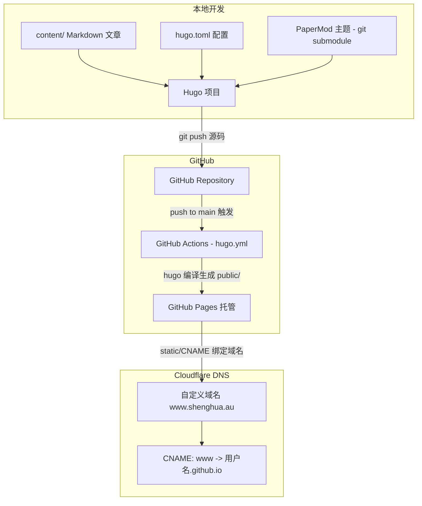

# GitHub Pages 和 Hugo 配置

## 架构图



## 摘要

- 在 GitHub Pages 上部署 Hugo 网站有两种方式：GitHub Actions 自动构建（推荐）和本地生成 public 后上传。
- 完整流程包括创建 Hugo 项目、配置 PaperMod 主题、创建 GitHub 仓库、配置 Actions 工作流、启用 GitHub Pages。
- GitHub Actions 工作流使用 `peaceiris/actions-hugo@v3` 安装 Hugo，编译后通过 `actions/deploy-pages@v4` 部署到 Pages。
- 自定义域名需在 `static/CNAME` 中写入域名，GitHub Pages 设置中绑定，Cloudflare DNS 配置 CNAME 指向 `用户名.github.io`。
- Hugo 常见配置包括 baseURL、菜单、中文配置（`hasCJKLanguage = true`）和 PaperMod 搜索功能。

## 技术要点

1. **Hugo 主题以 git submodule 引入**：使用 `git submodule add` 添加 PaperMod 主题，GitHub Actions 中需设置 `submodules: recursive` 确保主题被正确拉取。
2. **GitHub Actions 工作流**：触发条件为 push 到 main 分支，需要 `pages: write` 和 `id-token: write` 权限，使用 `concurrency` 控制部署队列。
3. **Pages Source 设置**：必须选择 "GitHub Actions" 而非 "Deploy from a branch"，否则会因仓库中没有 public 目录而导致 404。
4. **CNAME 文件**：放在 `static/CNAME` 中，Hugo 编译后会自动输出到 `public/CNAME`，GitHub Pages 据此绑定自定义域名。
5. **Cloudflare DNS 配置**：子域名用 CNAME 记录指向 `用户名.github.io`；根域名需配置 GitHub Pages 官方的 4 个 A 记录。
6. **中文配置**：设置 `languageCode = "zh-cn"`、`defaultContentLanguage = "zh-cn"`、`hasCJKLanguage = true` 确保中文正常处理。
7. **PaperMod 搜索**：配置 `[outputs] home = ["HTML","RSS","JSON"]` 启用搜索功能。
8. **推荐目录结构**：content/ 存文章，static/ 存 CNAME 和图片，themes/ 存主题，.github/workflows/ 存 CI 配置。

## 原文内容

如果你想在 GitHub Pages 上部署 Hugo 网站，通常有两种方式：

1. GitHub Actions 自动构建 Hugo（推荐）
2. 本地生成 public 后上传到 GitHub Pages

目前 Hugo 官方更推荐第一种。

## 1. 创建 Hugo 项目

本地安装 Hugo：

```bash
hugo version
```

创建站点：

```bash
hugo new site myblog
cd myblog
```

添加主题，例如 PaperMod：

```bash
git init

git submodule add https://github.com/adityatelange/hugo-PaperMod.git themes/PaperMod
```

配置 `hugo.toml`：

```toml
baseURL = 'https://yourdomain.com/'
languageCode = 'zh-cn'
title = 'Shenghua Blog'

theme = 'PaperMod'
```

## 2. 创建 GitHub Repository

例如创建：

```
shenghuaxia-blog
```

上传代码：

```bash
git add .
git commit -m "initial"
git remote add origin https://github.com/用户名/shenghuaxia-blog.git
git push -u origin main
```

## 3. 配置 GitHub Actions

创建目录：

```
.github/workflows/
```

创建文件：

```
.github/workflows/hugo.yml
```

内容：

```yaml
name: Deploy Hugo

on:
  push:
    branches:
      - main

permissions:
  contents: read
  pages: write
  id-token: write

concurrency:
  group: pages
  cancel-in-progress: true

jobs:
  build:
    runs-on: ubuntu-latest

    steps:
      - uses: actions/checkout@v4
        with:
          submodules: recursive
          fetch-depth: 0

      - name: Setup Hugo
        uses: peaceiris/actions-hugo@v3
        with:
          hugo-version: 'latest'
          extended: true

      - name: Build
        run: hugo

      - name: Upload
        uses: actions/upload-pages-artifact@v3
        with:
          path: ./public

  deploy:
    environment:
      name: github-pages
      url: ${{ steps.deployment.outputs.page_url }}

    runs-on: ubuntu-latest
    needs: build

    steps:
      - id: deployment
        uses: actions/deploy-pages@v4
```

## 4. 启用 GitHub Pages

进入：

```
Repository → Settings → Pages
```

选择：

```
Build and deployment
```

Source：

```
GitHub Actions
```

保存。

## 5. 测试部署

新增文章：

```bash
hugo new posts/hello.md
```

编辑：

```markdown
---
title: "Hello Hugo"
date: 2026-08-17
draft: false
---

My first post.
```

提交：

```bash
git add .
git commit -m "new post"
git push
```

GitHub Actions 会自动构建。

访问：

```
https://用户名.github.io/仓库名/
```

## 6. 使用自定义域名（Cloudflare）

如果域名：

```
shenghua.au
```

在仓库根目录创建：

```
static/CNAME
```

内容：

```
www.shenghua.au
```

构建后会自动出现在：

```
public/CNAME
```

GitHub Pages 设置：

```
Settings → Pages → Custom Domain
```

填写：

```
www.shenghua.au
```

Cloudflare DNS：

```
Type: CNAME
Name: www
Target: 用户名.github.io
```

例如：

```
www -> shenghuaxia.github.io
```

如果是根域：

```
shenghua.au
```

则配置 GitHub Pages 官方的 4 个 A 记录。

## 7. Hugo 常见配置

### URL

生产环境必须改成自己的域名。

```toml
baseURL = 'https://www.shenghua.au/'
```

### 菜单

```toml
[menu]

[[menu.main]]
name = "Home"
url = "/"
weight = 1

[[menu.main]]
name = "Posts"
url = "/posts/"
weight = 2

[[menu.main]]
name = "About"
url = "/about/"
weight = 3
```

### 中文配置

```toml
languageCode = "zh-cn"
defaultContentLanguage = "zh-cn"
hasCJKLanguage = true
```

### 启用搜索（PaperMod）

```toml
[outputs]
home = ["HTML","RSS","JSON"]
```

## 推荐目录结构

```
myblog/
├── content/
│   ├── posts/
│   └── about.md
├── static/
│   ├── images/
│   └── CNAME
├── themes/
│   └── PaperMod
├── hugo.toml
└── .github/
    └── workflows/
        └── hugo.yml
```

> 如果你已经准备好 GitHub Repository 名称和 Cloudflare 域名，我可以直接给你生成一份适用于 GitHub Pages + Cloudflare + Hugo(PaperMod) 的完整 `hugo.toml` 和 DNS 配置。
