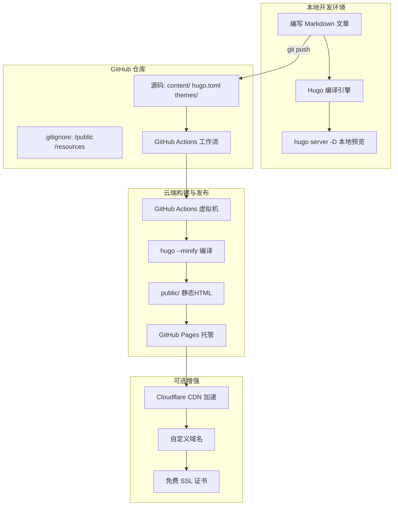

# 免费个人网站发布方案

## 架构图



## 摘要

- Hugo 是最受欢迎的静态网站生成器之一，基于 Go 语言开发，生成速度极快，支持 Markdown、SEO 友好、主题丰富。
- 推荐架构：Hugo + PaperMod + GitHub Pages + Cloudflare CDN + 自定义域名，除域名外全部免费。
- Git 只负责源码版本控制，Hugo 负责 Markdown → HTML 的编译渲染，两者分工明确。
- 推荐使用 GitHub Actions 自动构建方案：只 push 源码，云端自动编译并发布到 GitHub Pages。
- Hugo 通过严格的目录结构规范（content/、static/、assets/、layouts/）自动识别文件角色并进行编译或直接复制。

## 技术要点

1. **Hugo 编译原理**：Hugo 是声明式静态网站生成器，扫描 hugo.toml 配置、content/ 中的 Markdown、layouts/themes/ 中的模板，将 Markdown 转 HTML 填入模板，输出到 public/。
2. **static/ vs assets/**：static/ 中的文件原封不动直接复制到 public/；assets/ 中的文件需要 Hugo Pipes 处理（压缩、编译 SCSS、图片优化等）后再输出。
3. **Page Bundles**：目录型文章结构（content/posts/my-post/index.md + cover.jpg），Hugo 自动将同级资源文件一起搬运到输出目录。
4. **.gitignore 配置**：必须包含 `/public`、`/resources`、`.hugo_build.lock`，防止本地编译产物上传到 GitHub。
5. **GitHub Actions Source 设置**：Settings → Pages → Source 必须选 "GitHub Actions" 而非 "Deploy from a branch"，否则因仓库无 public 目录会 404。
6. **两种部署方案对比**：方案一（GitHub Actions）仓库干净、换电脑即写即推；方案二（gh-pages 分支）无需 CI 配置但每次需手动编译推送。
7. **URL 映射规则**：`content/about.md` → `public/about/index.html` → `/about/`；`content/posts/first-post.md` → `/posts/first-post/`。
8. **成本分析**：GitHub Pages 免费、Hugo 免费、Cloudflare 免费、SSL 免费，仅域名可选 ¥10-80/年。
9. **PaperMod 主题**：极简、响应式、SEO 优秀，技术博客首选；其他推荐主题包括 Blowfish（个人主页）和 Stack（中文技术博客）。
10. **IT 基础设施工程师推荐组合**：Hugo + PaperMod + GitHub Pages + Cloudflare CDN + 自定义域名，适合长期维护个人技术品牌。

## 原文内容

Hugo 是目前最受欢迎的静态网站生成器之一，非常适合个人博客和技术主页。

### 为什么推荐 Hugo

优点：

- ✅ 完全免费、开源
- ✅ 生成速度极快（Go 语言开发）
- ✅ 不需要数据库
- ✅ 可以直接部署到 GitHub Pages
- ✅ 支持 Markdown 写文章
- ✅ 主题丰富
- ✅ SEO 友好

网站：https://gohugo.io

## 推荐架构

对于个人技术博客，我推荐：

```
Hugo + PaperMod
      +
GitHub Pages
      +
Cloudflare CDN
      +
自定义域名
```

效果：

```
文章.md
    ↓
Hugo生成静态HTML
    ↓
自动发布
    ↓
https://你的用户名.github.io
```

以后写博客只需要：

```
新建 Markdown
git push
```

网站自动更新。

## 安装 Hugo

### Windows

使用 Chocolatey：

```bash
choco install hugo-extended
```

或者 Winget：

```bash
winget install Hugo.Hugo.Extended
```

验证：

```bash
hugo version
```

## 创建网站

```bash
hugo new site myblog
cd myblog
```

目录结构：

```
myblog
├── content
├── layouts
├── static
├── themes
└── hugo.toml
```

## 安装主题

推荐几个热门主题：

### PaperMod（最推荐）

```bash
git submodule add \
https://github.com/adityatelange/hugo-PaperMod.git \
themes/PaperMod
```

配置：

```toml
theme = "PaperMod"
```

特点：

- 极简
- 响应式
- SEO 优秀
- 技术博客首选

演示：https://adityatelange.github.io/hugo-PaperMod/

### Blowfish

适合个人主页 + 博客：https://blowfish.page

特点：

- 现代化
- 支持头像
- 支持项目展示

### Stack

适合中文技术博客：https://github.com/CaiJimmy/hugo-theme-stack

特点：

- 类似知乎专栏
- 阅读体验很好

## 创建第一篇文章

```bash
hugo new posts/hello-world.md
```

编辑：

```markdown
---
title: "Hello World"
date: 2026-08-17
draft: false
---

这是我的第一篇 Hugo 博客。
```

## 本地预览

```bash
hugo server -D
```

浏览器访问：http://localhost:1313

修改文件后自动刷新。

## 部署到 GitHub Pages

创建仓库：

```
shenghuaxia.github.io
```

然后：

```bash
git init
git add .
git commit -m "first commit"
git remote add origin \
https://github.com/shenghuaxia/shenghuaxia.github.io.git

git push -u origin main
```

配置 GitHub Actions 自动构建后，网站就会发布到：

```
https://shenghuaxia.github.io
```

## 如果你是 IT Infrastructure Engineer

我会推荐这个组合：

```
Hugo + PaperMod
      +
GitHub Pages
      +
Cloudflare CDN
      +
自定义域名
```

成本：

| 项目 | 费用 |
|---|---|
| Github Pages | 免费 |
| Hugo | 免费 |
| Cloudflare | 免费 |
| SSL 证书 | 免费 |
| 域名（可选） | ¥10-80/年 |

最终效果类似：https://www.shenghuaxia.com

你可以放：

- 个人简历
- Azure/AWS 项目经验
- Infrastructure Architecture 文章
- PowerShell 脚本分享
- Kubernetes 实践
- M365 经验总结
- 技术笔记库

这种组合十分适合长期维护个人技术品牌。

---

### Hugo 安装之后会产生一个根目录吗？

不会。

Hugo 是一个单文件可执行程序（例如在 Windows 上就是一个 `hugo.exe` 文件，在 Linux/macOS 上就是一个二进制可执行文件 `hugo`）。安装 Hugo 只是将这个二进制文件放到了系统的可执行路径（如 `/usr/local/bin` 或手动指定的目录）中，它本身不会自动在你的电脑上创建一个特定的"Hugo根目录"或项目文件夹。

### 如何产生项目根目录？

当你需要使用 Hugo 建站时，需要通过命令行手动运行命令来新建一个站点：

```bash
hugo new site my-blog
```

运行该命令后，Hugo 会在你当前的路径下创建一个名为 `my-blog` 的文件夹，这个文件夹才是你的 Hugo 站点根目录。

站点根目录生成后，里面通常会包含以下结构：

- `archetypes/`：内容模板
- `assets/`：需要被 Hugo 处理的资源（如 Sass/CSS、JS、图片等）
- `content/`：存放你写的 Markdown 博客/文章内容
- `data/`：存放自定义数据文件（JSON/YAML/TOML）
- `i18n/`：多语言翻译文件
- `layouts/`：自定义 HTML 布局模板
- `static/`：存放静态资源（如无需处理的图片、Favicon 等）
- `themes/`：存放下载的第三方主题
- `hugo.toml`（或 `hugo.yaml`/`hugo.json`）：站点的核心配置文件

---

### Git 是否会把这个 my-blog 的所有数据全部传送到 Git 仓库中，才能产生静态的网页？

不会，Git 并不负责"生成"静态网页，它只负责"保存和管理代码"。

实际上，把 Markdown 文章和主题变成静态 HTML 网页的是 Hugo 本身（或托管平台上的构建服务），而不是 Git。

关于 Git 和 Hugo 协作的工作原理，有以下几个核心概念：

### 1. Git 到底上传了什么？

当你把 `my-blog` 文件夹提交到 Git 仓库（如 GitHub、GitLab、Gitee）时：

- **上传的内容**：Git 会把 `my-blog` 目录下的所有源码文件上传上去。这包括你的 Markdown 文章（`content/`）、配置文件（`hugo.toml`）、主题配置（`themes/`）以及你放在 `static/` 里的资源。
- **不会上传的内容**：Git 默认不需要上传 Hugo 编译生成的最终静态网页（通常生成在 `public/` 目录下）。

### 2. 静态网页是怎么产生的？

要产生静态网页，必须运行 Hugo 的编译命令：

```bash
hugo
```

这个命令会读取你的 Markdown 和模板，在本地生成一个 `public/` 目录，这里面才是纯粹的 HTML、CSS 和 JS 静态网页文件。

产生静态网页并发布通常有两种常见模式：

#### 模式 A：在本地生成，只上传 public/（手动模式）

1. 你在本地运行 `hugo` 生成 `public/` 文件夹。
2. 你只把 `public/` 文件夹里的静态 HTML 内容 push 到 Git 仓库（例如 GitHub Pages 的 main 或 gh-pages 分支）。
3. 服务器直接读取这些静态 HTML 显示网页。

#### 模式 B：只上传源码，由云端自动生成（主流推荐模式）

1. 你只把 Hugo 的源码（`content/`、`hugo.toml` 等）push 到 GitHub 仓库。
2. 通过 GitHub Actions 或 Cloudflare Pages / Vercel 等平台，云端服务器会自动帮你运行 `hugo` 命令。
3. 云端生成静态 HTML 后，自动发布为网站。

### 总结

- **Git 的角色**：只管代码和文章源码的版本控制与传输。
- **Hugo 的角色**：负责把 Markdown 源码"翻译/渲染"成 HTML 静态网页。
- **网页生成条件**：必须经过 Hugo 的编译阶段（无论是在你电脑本地编译，还是在 GitHub Actions/Vercel 等云端服务器上编译），才能得到真正的静态网站。
- **不会上传的内容**：Git 默认不需要上传 Hugo 编译生成的最终静态网页（通常生成在 `public/` 目录下）。

---

### 如果不上传默认的静态网页，如何在 GitHub Pages 上发布静态网页呢？

虽然 Git 仓库里不需要手动提交和上传 `public/` 目录，但要在 GitHub Pages 上正常显示静态网页，目前行业内最推荐且最优雅的做法是：只把源码推送到 GitHub，由 GitHub 在云端自动编译并发布。

具体有以下两种主流方案：

### 方案一：GitHub Actions 自动构建发布（主流推荐 ⭐⭐⭐⭐⭐）

这种方案的逻辑是：你只负责写 Markdown 和写代码，编译（`hugo`）和发布的工作全部交给 GitHub 的免费服务器处理。

#### 操作步骤

**1. 设置忽略规则**

在你的站点根目录下创建一个 `.gitignore` 文件（如果还没有的话），写入以下内容，防止把本地生成的 `public` 文件夹提交上去：

```plaintext
/public
/resources
```

**2. 添加 GitHub Actions 自动化工作流文件**

在项目根目录下创建目录和文件：`.github/workflows/hugo.yaml`，填入以下官方推荐的标准配置：

```yaml
name: Deploy Hugo site to Pages

on:
  push:
    branches: ["main"] # 当你向 main 分支提交代码时触发

permissions:
  contents: read
  pages: write
  id-token: write

concurrency:
  group: "pages"
  cancel-in-progress: false

jobs:
  build:
    runs-on: ubuntu-latest
    steps:
      - name: Checkout
        uses: actions/checkout@v4
        with:
          submodules: recursive # 如果你的主题是以 git submodule 形式引入的

      - name: Setup Hugo
        uses: peaceiris/actions-hugo@v3
        with:
          hugo-version: 'latest'
          extended: true

      - name: Build
        run: hugo --minify

      - name: Upload artifact
        uses: actions/upload-pages-artifact@v3
        with:
          path: ./public

  deploy:
    environment:
      name: github-pages
      url: ${{ steps.deployment.outputs.page_url }}
    runs-on: ubuntu-latest
    needs: build
    steps:
      - name: Deploy to GitHub Pages
        id: deployment
        uses: actions/deploy-pages@v4
```

**3. 配置 GitHub 仓库设置**

1. 将你的项目 push 到 GitHub 仓库。
2. 打开该 GitHub 仓库，点击 Settings -> Pages。
3. 在 Build and deployment 下的 Source 选项中，选择 GitHub Actions。

效果：以后你每次修改文章或配置，只需 `git push` 上传源码，GitHub 会自动启动虚拟机帮你运行 `hugo` 命令，并将编译好的 public 部署到你的 GitHub Pages 网址上！

### 方案二：本地编译，发布到独立分支（经典/传统方案）

如果你不想写 GitHub Actions，也可以在本地编译，但把源码和编译后的静态网页分离开：

- **源码存在 main 分支**：日常写博客、改配置都在 main 分支下。
- **静态文件存在 gh-pages 分支**：
  1. 在本地运行 `hugo` 命令生成 `public/` 文件夹。
  2. 将 `public/` 目录单独提交并推送到 GitHub 仓库的 `gh-pages` 分支（可以使用自动化工具如 `gh-pages` npm 包或编写简单 Bash 脚本）。
  3. 设置 GitHub Pages：在仓库 Settings -> Pages 中，将 Source 设置为 Deploy from a branch，分支选择 `gh-pages`，目录选择 `/ (root)`。

### 两种方案对比

| 方案 | 优势 | 劣势 |
|---|---|---|
| 方案一（GitHub Actions） | 仓库极度干净，本地无需手动编译；换电脑写文章只需 git push 即可 | 第一次需要配置一个 .yaml 脚本文件 |
| 方案二（gh-pages 分支） | 无需了解 CI/CD 自动化配置 | 每次更新网站都要在本地手动编译并多推一次分支，容易漏步骤 |

强烈建议使用"方案一"，这也是现代 Hugo 与 GitHub Pages 结合的标准工作流！

---

### 以下步骤是否正确

如果你的目标是通过 GitHub Actions 自动编译并发布 Hugo 网站到 GitHub Pages，那么上面列出的步骤思路方向是正确的，但有两个关键细节需要修正，否则在实际操作时很容易踩坑失败。

以下是详细的矫正与完整流程说明：

### 需要修正的两个关键细节

**修正点 1：.gitignore 的作用位置**

- `.gitignore` 确实需要写入 `/public`。
- 作用：它的作用是告诉 Git 不要把本地编译出来的 `public` 文件夹提交到 GitHub 仓库。
- 注意：GitHub Actions 在云端编译时，会依据你提交的项目源码临时生成 public 目录并自动发布，因此云端不需要你提交本地的 public。

**修正点 2：GitHub Pages 设置中的 Source 选项**

- 原理解析：在步骤 3 中，仓库 Settings -> Pages -> Source 一定要选择 **GitHub Actions**（而不是默认的 Deploy from a branch）。
- 如果选择了分支部署，GitHub 会去找你仓库里的静态文件，而你仓库里又没有提交 public，就会导致 404 或构建失败。

### 完整的正确操作流程（推荐核对表）

#### 第一步：配置忽略文件 .gitignore

在项目根目录下，确保 `.gitignore` 文件包含以下内容：

```plaintext
/public
/resources
.hugo_build.lock
```

#### 第二步：创建 GitHub Actions 工作流文件

在项目根目录下创建路径及文件：`.github/workflows/hugo.yaml`，填入官方推荐的 YAML 自动化脚本（注意其中的分支名要与你仓库的主分支一致，通常是 main 或 master）：

```yaml
name: Deploy Hugo site to Pages

on:
  push:
    branches: ["main"] # 如果你的默认分支叫 master，这里改成 "master"

permissions:
  contents: read
  pages: write
  id-token: write

concurrency:
  group: "pages"
  cancel-in-progress: false

jobs:
  build:
    runs-on: ubuntu-latest
    steps:
      - name: Checkout
        uses: actions/checkout@v4
        with:
          submodules: recursive # 如果你的主题是以 git submodule 引入的

      - name: Setup Hugo
        uses: peaceiris/actions-hugo@v3
        with:
          hugo-version: 'latest'
          extended: true

      - name: Build
        run: hugo --minify

      - name: Upload artifact
        uses: actions/upload-pages-artifact@v3
        with:
          path: ./public

  deploy:
    environment:
      name: github-pages
      url: ${{ steps.deployment.outputs.page_url }}
    runs-on: ubuntu-latest
    needs: build
    steps:
      - name: Deploy to GitHub Pages
        id: deployment
        uses: actions/deploy-pages@v4
```

#### 第三步：修改 GitHub 仓库设置

1. 将源码 `git push` 上传到 GitHub。
2. 打开 GitHub 仓库页面，点击顶部 Settings -> 左侧 Pages。
3. 在 Build and deployment 下的 Source 下拉菜单中，必须选择 **GitHub Actions**。

只要保证 Source 选了 GitHub Actions 且 `.gitignore` 过滤了 public，每次你推送到 main 分支时，GitHub 就会自动帮你生成并发布静态网站了！

---

### Hugo 如何知道是将根目录中的源码发布成静态网站呢，如何编译的

这个问题问到了 Hugo 的底层机制。

简单来说：Hugo "知道"如何把根目录编译成静态网站，是因为它有一套强约束的"目录结构规范"和内置的"模板渲染引擎"。

#### 一、Hugo 如何知道怎么编译？（核心原理）

Hugo 是一个声明式（Declarative）的静态网站生成器。你不需要告诉它"怎么编译"，你只需要把文件放在特定的文件夹里，Hugo 在运行 `hugo` 命令时就会按照固定逻辑进行处理：

1. **扫描目录结构（识别角色）**：当你在根目录下运行 `hugo` 命令时，它会自动扫描根目录：
   - `hugo.toml`（或 `config.toml`）：读取全局配置（如网站 BaseURL、语言、主题设置等）。
   - `content/` 文件夹：Hugo 知道这里面全部是文章内容（Markdown 文件）。
   - `layouts/` 或 `themes/` 文件夹：Hugo 知道这里面全部是页面骨架/模板（HTML + Go Template 语法）。

2. **数据与模板结合（渲染过程）**：
   - Hugo 遍历 `content/` 中的每一个 Markdown 文件（解析 Front Matter 元数据，如标题、日期、标签）。
   - 找到对应的 HTML 模板（例如：文章解析完后套用 `single.html` 模板；首页套用 `index.html` 模板）。
   - 将 Markdown 转化为 HTML，填入模板中，生成完整的 `.html` 文件。

3. **输出结果**：
   - 全部渲染完成后，Hugo 会在根目录下自动创建并填满 `public/` 目录。这个 `public/` 就是最终生成的纯静态网站。

#### 二、如果有一些"其他文件"放在 Hugo 里面怎么办？

在实际建站中，你一定会有各种非 Markdown 文件（比如图片、PDF、Robots.txt、下载包、CSS/JS 等）。Hugo 对这些文件的处理机制分为两类：

##### 1. 静态文件（放在 static/ 目录下）—— 原封不动直接复制

- **机制**：放在 `static/` 文件夹里的任何文件，Hugo 完全不进行任何编译或改动，在构建时直接原样复制到 `public/` 根目录下。
- **举例**：
  - 如果文件放在：`my-blog/static/resume.pdf`
  - 编译后路径：`my-blog/public/resume.pdf`
  - 访问网址：https://yourdomain.com/resume.pdf
  - 如果文件放在：`my-blog/static/images/avatar.jpg`
  - 访问网址：https://yourdomain.com/images/avatar.jpg

##### 2. 需要编译处理的资源（放在 assets/ 目录下）—— 打包与加工

- **机制**：如果你的文件需要被 Hugo 压缩、打包、转换（比如把 `.scss` 编译成 `.css`，或者对图片进行自动裁剪/压缩/转 WebP），就放在 `assets/` 目录下。
- **处理**：Hugo 会通过内置的管道（Hugo Pipes）对它们进行处理后再输出到 `public/`。

##### 3. 文章专属的资源文件（页面资源文件夹 Page Bundles）

如果你想把图片和 Markdown 文章放在同一个文件夹里方便管理，可以采用目录型的文章结构：

```
content/
└── posts/
    └── my-first-post/
        ├── index.md       <-- 文章内容
        ├── cover.jpg      <-- 该文章配图
        └── demo.zip       <-- 随文附件
```

- **机制**：Hugo 识别到 `index.md` 后，会自动把同级目录下的 `cover.jpg` 和 `demo.zip` 一起搬运到该文章对应的 HTML 输出目录下。

#### 文件处理方式总结

| 文件/目录类型 | 存放位置 | Hugo 处理方式 | 最终输出位置 |
|---|---|---|---|
| 博客文章/页面 | content/.../xxx.md | 提取内容，套用 HTML 模板渲染 | public/.../xxx/index.html |
| 网页模板 | layouts/ 或 themes/ | 编译逻辑，控制页面结构 | （转化为 HTML，不直接输出模板本身） |
| 普通文件/PDF/图标 | static/ | 不做处理，直接复制 | public/ 的对应相对路径 |
| 样式/脚本/待处理图片 | assets/ | 压缩、编译、优化后输出 | public/ 的对应相对路径 |

---

### 实例：Hugo 目录、GitHub 仓库与访问网址的映射关系

#### 1. 本地 Hugo 项目目录结构

假设你的 Hugo 项目叫做 `my-blog`，本地文件目录如下：

```
my-blog/                     <-- 站点根目录
├── .github/
│   └── workflows/
│       └── hugo.yaml        <-- GitHub Actions 部署脚本
├── .gitignore               <-- 里面写了 /public
├── hugo.toml                <-- Hugo 配置文件
├── content/                 <-- 存放你的文章/页面
│   ├── _index.md            <-- 首页自定义内容（可选）
│   ├── about.md             <-- 关于页面
│   └── posts/               <-- 博客文章分类
│       ├── first-post.md    <-- 文章 1
│       └── second-post.md   <-- 文章 2
├── static/                  <-- 静态资源（直接复制）
│   ├── favicon.ico          <-- 网站图标
│   └── images/
│       └── avatar.jpg       <-- 头像图片
├── themes/                  <-- 主题文件夹
│   └── my-theme/
└── public/                  <-- 本地执行 hugo 命令后自动生成的文件夹（勿推送到 Git）
```

#### 2. 与 GitHub 仓库的对应关系

当你执行 `git push` 把项目推送到 GitHub 时，因为 `.gitignore` 过滤掉了 `public/` 目录，GitHub 仓库中保存的内容与本地几乎一模一样（唯独没有 public）：

| 本地路径 | 上传到 GitHub 仓库 | 最终发布到 GitHub Pages（云端编译后） | 说明 |
|---|---|---|---|
| my-blog/ | 仓库根目录 | 网站根目录 (https://username.github.io/) | 项目源代码 |
| my-blog/content/ | 存在 | 映射为 HTML 网页 | Markdown 源码变身网页 |
| my-blog/static/ | 存在 | 原封不动放置到网站根路径 | 静态资源直达 |
| my-blog/public/ | 被 .gitignore 忽略 | 不直接上传 | 云端 GitHub Actions 会自动生成它并发布 |

#### 3. Hugo 源码目录、编译后的文件与最终访问网址（URL）的映射关系

Hugo 会严格按照 `content/` 目录下的层级结构和文件名，来自动生成对应的 HTML 文件和网站 URL。

假设你的域名是 https://username.github.io：

**示例 A：普通页面（content/about.md）**
- 源码位置：`content/about.md`
- Hugo 编译后产物：`public/about/index.html`
- 最终访问网址：https://username.github.io/about/

**示例 B：博客文章（content/posts/first-post.md）**
- 源码位置：`content/posts/first-post.md`
- Hugo 编译后产物：`public/posts/first-post/index.html`
- 最终访问网址：https://username.github.io/posts/first-post/

**示例 C：静态资源文件（static/images/avatar.jpg）**
- 源码位置：`static/images/avatar.jpg`
- Hugo 编译后产物：`public/images/avatar.jpg`（直接脱掉 static/ 前缀）
- 最终访问网址：https://username.github.io/images/avatar.jpg

**示例 D：分类/列表页（自动生成）**
- 源码位置：Hugo 发现 content/posts/ 目录下有多篇文章
- Hugo 编译后产物：`public/posts/index.html`（把所有文章组合成一个列表）
- 最终访问网址：https://username.github.io/posts/（查看文章列表页）

### 一句话总结映射逻辑

- `content/` 里的 .md 文件 → 套用主题模板 → 变成 `public/` 里的 index.html → 映射为 网址路径。
- `static/` 里的资源 → 不经过模板过滤 → 原样搬运到 `public/` 根目录 → 映射为 资源链接。
