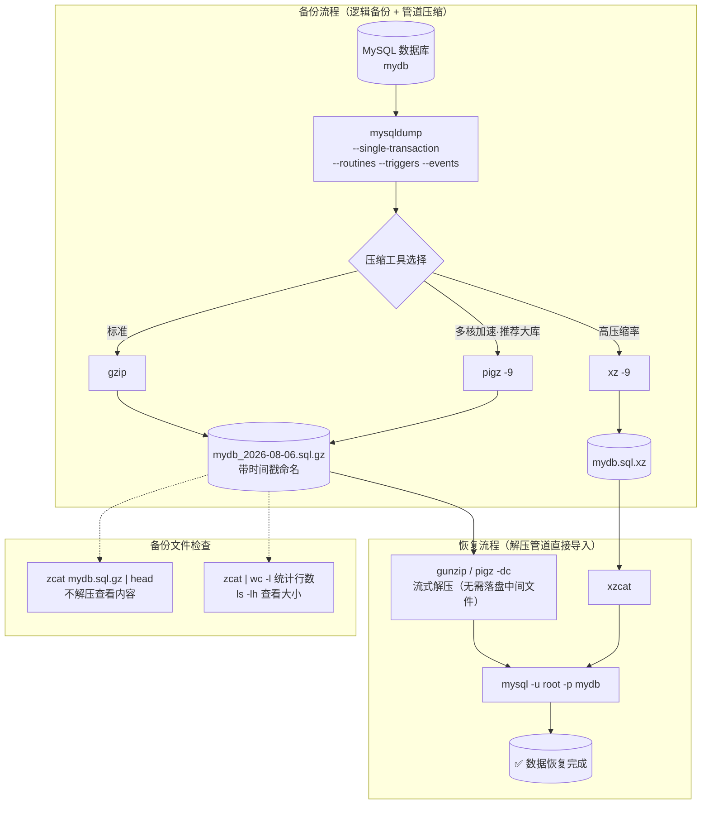

# 带压缩的 MySQL 备份与恢复

## 架构图



## 摘要

- mysqldump 通过 Unix 管道与压缩工具组合，实现边导出边压缩，无需中间未压缩文件
- 支持 gzip（标准）、xz -9（更高压缩率）、pigz（多核并行，大库推荐，速度明显快于 gzip）
- 恢复时用 `gunzip <`、`xzcat`、`pigz -dc` 流式解压直接管道给 mysql，同样不产生中间文件
- 生产环境推荐参数组合：`--single-transaction --routines --triggers --events`
- 备份文件建议带时间戳命名（`$(date +%Y%m%d_%H%M%S)`），便于管理和追溯
- 可用 `zcat | head`、`zcat | wc -l`、`ls -lh` 不解压检查压缩包内容和大小

## 技术要点

1. **单库 gzip 备份**：`mysqldump -u root -p mydb | gzip > mydb_$(date +%F).sql.gz`，导出流直接进 gzip
2. **对应恢复**：`gunzip < mydb_2026-08-06.sql.gz | mysql -u root -p mydb`，解压流直接进 mysql
3. **全库备份**：`--all-databases` 备份所有数据库，恢复时不需要指定库名
4. **xz -9 高压缩率**：适合存储空间紧张的归档场景，恢复用 `xzcat mydb.sql.xz | mysql`
5. **pigz 多核压缩**：`yum install pigz` 或 `apt install pigz` 安装，`pigz -9` 备份、`pigz -dc` 恢复；相比 gzip，CPU 多核时速度明显更快，推荐大库使用
6. **`--single-transaction`**：InnoDB 热备份，不锁表
7. **`--routines / --triggers / --events`**：确保存储过程、函数、触发器、事件完整备份
8. **时间戳命名**：`$(date +%Y%m%d_%H%M%S)` 生成如 `mydb_20260806_164500.sql.gz` 的文件名
9. **不解压检查**：`zcat mydb.sql.gz | head` 查看内容，`zcat | wc -l` 统计行数，`ls -lh` 查看文件大小
10. **标准做法**：`mysqldump -u root -p --single-transaction --routines --triggers --events mydb | gzip > mydb.sql.gz` 是生产环境逻辑备份的标准做法

## 原文内容

常用的 mysqldump 备份并压缩命令如下。

### 1. 备份单个数据库并 gzip 压缩

```bash
mysqldump -u root -p mydb | gzip > mydb_$(date +%F).sql.gz
```

恢复：

```bash
gunzip < mydb_2026-08-06.sql.gz | mysql -u root -p mydb
```

### 2. 备份所有数据库并压缩

```bash
mysqldump -u root -p --all-databases | gzip > all_$(date +%F).sql.gz
```

恢复：

```bash
gunzip < all_2026-08-06.sql.gz | mysql -u root -p
```

### 3. 使用 xz 压缩（压缩率更高）

备份：

```bash
mysqldump -u root -p mydb | xz -9 > mydb.sql.xz
```

恢复：

```bash
xzcat mydb.sql.xz | mysql -u root -p mydb
```

### 4. 使用 pigz 多核压缩（推荐大库）

安装：

```bash
yum install pigz
# 或
apt install pigz
```

备份：

```bash
mysqldump -u root -p mydb | pigz -9 > mydb.sql.gz
```

恢复：

```bash
pigz -dc mydb.sql.gz | mysql -u root -p mydb
```

相比 gzip，CPU 多核时速度明显更快。

### 5. 生产环境推荐参数

```bash
mysqldump \
  -u root -p \
  --single-transaction \
  --routines \
  --triggers \
  --events \
  mydb | gzip > mydb_$(date +%F).sql.gz
```

参数说明：

- `--single-transaction`：InnoDB 热备份，不锁表
- `--routines`：备份存储过程和函数
- `--triggers`：备份触发器
- `--events`：备份事件

### 6. 带时间戳备份

```bash
mysqldump -u root -p mydb | gzip > /backup/mydb_$(date +%Y%m%d_%H%M%S).sql.gz
```

例如：

```
mydb_20260806_164500.sql.gz
```

### 7. 查看压缩包内容

不解压查看：

```bash
zcat mydb.sql.gz | head
```

统计行数：

```bash
zcat mydb.sql.gz | wc -l
```

查看文件大小：

```bash
ls -lh mydb.sql.gz
```

生产环境最常用的是：

```bash
mysqldump -u root -p --single-transaction --routines --triggers --events mydb | gzip > mydb.sql.gz
```

这是逻辑备份的标准做法。
