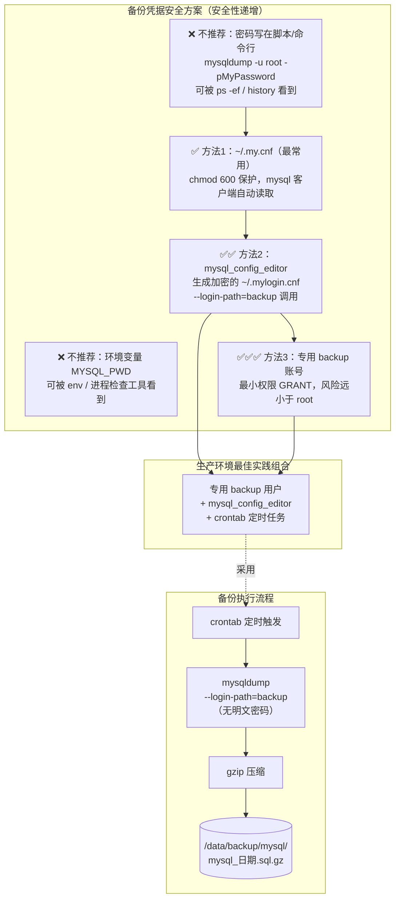

# 密文 MySQL 备份（备份脚本中密码的安全管理）

## 架构图



## 摘要

- 不要把密码直接写在备份脚本或命令行里（`mysqldump -u root -pMyPassword`），执行时可被 `ps -ef` 或 `history` 看到密码
- 推荐方法1：使用 `~/.my.cnf` 配置文件保存凭据，设置 `chmod 600` 权限，mysql/mysqldump 自动读取，无需输入密码
- 推荐方法2：`mysql_config_editor`（MySQL 5.6+）将密码加密存储在 `~/.mylogin.cnf` 中，安全性高于 `.my.cnf`
- 推荐方法3：专门创建最小权限的 backup 备份账号，不用 root，即使凭据泄露风险也小很多
- 不推荐：环境变量 `MYSQL_PWD`（可被 `env` 或进程检查工具看到，官方也不推荐）和直接写在脚本里（最不安全）
- Linux + 定时 crontab + mysqldump 场景推荐 `~/.my.cnf` 或 `mysql_config_editor`；生产环境最佳组合是"专用 backup 用户 + mysql_config_editor + crontab"

## 技术要点

1. **明文密码的风险**：`mysqldump -u root -pMyPassword` 的密码会出现在进程列表（`ps -ef`）和 shell 历史（`history`）中
2. **`~/.my.cnf` 方案**：在 `[client]` 段写入 user/password，`chmod 600 /root/.my.cnf` 限制仅属主可读，之后 `mysql -e "show databases;"` 无需密码
3. **`mysql_config_editor` 方案**：`mysql_config_editor set --login-path=backup --password` 生成加密的 `~/.mylogin.cnf`；`print --all` 查看时密码不会显示；调用时用 `--login-path=backup`
4. **专用备份账号**：`CREATE USER 'backup'@'localhost'` 并仅授予 `SELECT, SHOW VIEW, TRIGGER, EVENT, LOCK TABLES`，实现最小权限原则
5. **环境变量的坑**：`export MYSQL_PWD=MyPassword` 虽然使命令行不含密码，但 `env` 和某些进程检查工具仍可能看到
6. **凭据与压缩管道组合**：免密后备份脚本简化为 `mysqldump --single-transaction --all-databases | gzip > 带日期的.sql.gz`
7. **场景化选型**：简单场景用 `.my.cnf`，生产环境用"backup 用户 + mysql_config_editor + crontab"，密码既不出现在脚本里也不出现在进程列表中

## 原文内容

是的，不要把密码直接写在脚本里：

```bash
mysqldump -u root -pMyPassword
```

因为执行时可能被：

```bash
ps -ef
```

看到密码。

## 推荐方法1：使用 ~/.my.cnf（最常用）

创建：

```bash
vi /root/.my.cnf
```

内容：

```ini
[client]
user=root
password=MyPassword
```

设置权限：

```bash
chmod 600 /root/.my.cnf
```

测试：

```bash
mysql -e "show databases;"
```

无需输入密码。

备份脚本变成：

```bash
mysqldump \
  --single-transaction \
  --all-databases \
  | gzip > /data/backup/mysql/mysql_$(date +%F).sql.gz
```

这是最常见的自动备份方式。

## 推荐方法2：mysql_config_editor（更安全）

MySQL 5.6+ 支持加密保存密码。

创建认证信息：

```bash
mysql_config_editor set \
  --login-path=backup \
  --host=localhost \
  --user=root \
  --password
```

输入密码后会生成：

```
~/.mylogin.cnf
```

这是加密存储的。

查看：

```bash
mysql_config_editor print --all
```

密码不会显示。

备份：

```bash
mysqldump \
  --login-path=backup \
  --all-databases \
  > backup.sql
```

安全性高于 .my.cnf。

## 推荐方法3：专门创建备份账号

不要使用 root。

创建用户：

```sql
CREATE USER 'backup'@'localhost'
IDENTIFIED BY 'StrongPassword';
```

授权：

```sql
GRANT SELECT, SHOW VIEW, TRIGGER, EVENT, LOCK TABLES
ON *.* TO 'backup'@'localhost';
```

然后：

```ini
[client]
user=backup
password=StrongPassword
```

即使凭据泄露，风险也比 root 小很多。

## 不推荐的方法

### 环境变量

虽然可以：

```bash
export MYSQL_PWD=MyPassword
```

然后：

```bash
mysqldump -u root
```

但：

```bash
env
```

或某些进程检查工具仍可能看到。

官方也不推荐。

### 直接写在脚本

```bash
mysqldump -u root -pMyPassword
```

最不安全。

容易被：

```bash
history
ps -ef
```

看到。

对于你这种 Linux + 定时 crontab + mysqldump 的场景，我最推荐：

```
方案1：~/.my.cnf（简单）
或
方案2：mysql_config_editor（更安全）
```

如果是生产环境，我会采用：

```
专用 backup 用户
+
mysql_config_editor
+
crontab
```

这样密码既不会出现在脚本里，也不会出现在进程列表中。
