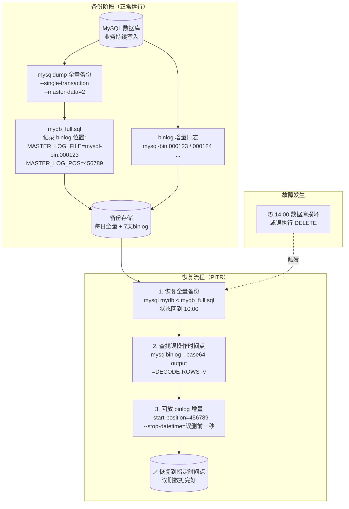

# mysqldump + binlog 恢复（PITR 指定时间点恢复）

## 架构图



## 摘要

- mysqldump + binlog 是 MySQL 最经典的恢复方案：全量备份恢复到某个时间点 + binlog 回放增量数据 = 指定时间恢复（PITR，Point In Time Recovery）
- 前提是 MySQL 开启了 binlog（`log_bin = ON`），并合理配置 binlog 保留期（如 7 天）
- `--master-data=2` 会把备份时刻的 binlog 文件名和位置写入备份 SQL 文件的注释中，这是恢复增量的起点
- 恢复分两步：先恢复全量备份（回到备份时刻），再用 `mysqlbinlog` 从记录的位置回放到目标时间点
- 最常见场景是"恢复到误删前一分钟"：通过 `--stop-datetime` 让误删语句（如 DELETE）不被执行
- 也可以不关心 Position，直接用 `--start-datetime` / `--stop-datetime` 按时间恢复

## 技术要点

1. **前提检查**：`SHOW VARIABLES LIKE 'log_bin'` 确认 binlog 已开启，`SHOW MASTER STATUS` 查看当前 binlog 文件和位置
2. **`--master-data=2`**：在备份 SQL 文件头部写入注释形式的 `CHANGE MASTER TO MASTER_LOG_FILE / MASTER_LOG_POS`，记录备份截止的 binlog 坐标，之后的更新都在 binlog 里
3. **`--single-transaction`**：InnoDB 一致性快照热备份，备份过程不锁表
4. **`--routines --triggers --events`**：确保存储过程、触发器、事件一并备份
5. **恢复前建空库**：`CREATE DATABASE mydb;` 后再 `mysql mydb < mydb_full.sql` 导入
6. **binlog 回放起点**：使用备份文件中记录的 `--start-position`（如 456789），可跨多个 binlog 文件依次回放
7. **查找误删时间**：对 ROW 格式 binlog 用 `mysqlbinlog --base64-output=DECODE-ROWS -v` 解码查看具体 SQL 和时间戳
8. **精确止损**：`--stop-datetime` 设为误删语句前一秒（如 13:55:19），使 DELETE 不被执行，13:55:19 之前的数据全部恢复
9. **binlog 保留策略**：MySQL 5.x 用 `expire_logs_days=7`，MySQL 8 用 `binlog_expire_logs_seconds=604800`（同样 7 天）
10. **生产脚本组合**：每日 `mysqldump --all-databases | gzip > /backup/full_$(date +%F).sql.gz` + binlog 保留，构成完整 PITR 体系

## 原文内容

mysqldump + binlog 是 MySQL 最经典的恢复方案：

全量备份恢复到某个时间点 + binlog 回放增量数据 = 指定时间恢复（PITR，Point In Time Recovery）

## 一、前提条件

确认开启了 binlog：

```bash
SHOW VARIABLES LIKE 'log_bin';
```

结果：

```
+---------------+-------+
| Variable_name | Value |
+---------------+-------+
| log_bin       | ON    |
+---------------+-------+
```

查看当前 binlog：

```bash
SHOW MASTER STATUS;
```

例如：

```
+------------------+----------+
| File             | Position |
+------------------+----------+
| mysql-bin.000123 |   456789 |
+------------------+----------+
```

## 二、执行全量备份

例如：

```bash
mysqldump \
  --single-transaction \
  --routines \
  --triggers \
  --events \
  --master-data=2 \
  mydb > mydb_full.sql
```

关键参数：

```bash
--master-data=2
```

会把当时的 binlog 位置写入 SQL 文件。

查看备份文件：

```bash
head -30 mydb_full.sql
```

可能看到：

```sql
-- CHANGE MASTER TO
-- MASTER_LOG_FILE='mysql-bin.000123',
-- MASTER_LOG_POS=456789;
```

这非常重要。表示：

```
全量备份截至：
mysql-bin.000123
Position=456789
```

之后的更新都在 binlog 里。

## 三、业务继续运行

假设：

```
10:00 做全量备份
```

数据库继续产生数据：

```
10:05 新订单
10:10 修改用户
10:15 删除记录
```

这些变化全部记录在：

```
mysql-bin.000123
mysql-bin.000124
...
```

## 四、发生故障

例如：

```
下午14:00
数据库损坏
```

需要恢复。

## 五、恢复全量备份

先创建空库：

```bash
CREATE DATABASE mydb;
```

恢复：

```bash
mysql mydb < mydb_full.sql
```

恢复后状态：

```
恢复到10:00
```

不是最新状态。

## 六、回放 binlog

查看 binlog 内容：

```bash
mysqlbinlog mysql-bin.000123 | less
```

或者：

```bash
mysqlbinlog mysql-bin.000124 | less
```

### 从指定位置开始恢复

因为备份记录了：

```
MASTER_LOG_FILE='mysql-bin.000123'
MASTER_LOG_POS=456789
```

所以：

```bash
mysqlbinlog \
  --start-position=456789 \
  /var/lib/mysql/mysql-bin.000123 \
  /var/lib/mysql/mysql-bin.000124 \
  | mysql
```

作用：

```
恢复10:00之后的所有操作
```

最终恢复到故障前状态。

## 七、恢复到误删前一分钟

这是最常见场景。

例如：

```
10:00 全量备份
13:50 正常
13:55 误执行 DELETE
14:00 发现事故
```

恢复步骤：

### 恢复全量备份

```bash
mysql mydb < mydb_full.sql
```

### 查找误删时间

查看 binlog：

```bash
mysqlbinlog \
  --base64-output=DECODE-ROWS \
  -v \
  mysql-bin.000123
```

找到：

```
2026-08-06 13:55:20
DELETE FROM orders;
```

### 恢复到误删前

```bash
mysqlbinlog \
  --start-position=456789 \
  --stop-datetime="2026-08-06 13:55:19" \
  mysql-bin.000123 \
  | mysql
```

这样：

```
13:55:19之前的数据全部恢复
DELETE不会执行
```

## 八、按时间恢复

不关心 Position 的情况下：

```bash
mysqlbinlog \
  --start-datetime="2026-08-06 10:00:00" \
  --stop-datetime="2026-08-06 13:55:19" \
  mysql-bin.000123 \
  | mysql
```

## 九、完整生产备份脚本

每天全量：

```bash
mysqldump \
  --single-transaction \
  --routines \
  --triggers \
  --events \
  --master-data=2 \
  --all-databases \
  | gzip \
  > /backup/full_$(date +%F).sql.gz
```

保留 binlog：

```ini
[mysqld]
log-bin=mysql-bin
expire_logs_days=7
```

或 MySQL 8：

```ini
binlog_expire_logs_seconds=604800
```

保存 7 天。

## 十、恢复流程总结

1. 恢复 mysqldump 全量备份
2. 找到备份时记录的 `MASTER_LOG_FILE` / `MASTER_LOG_POS`
3. 使用 mysqlbinlog 从该位置开始回放
4. 恢复到指定时间点

典型命令：

```bash
mysql mydb < mydb_full.sql

mysqlbinlog \
  --start-position=456789 \
  mysql-bin.000123 \
  mysql-bin.000124 \
  | mysql
```

这就是 MySQL 中最经典的 Full Backup + Binlog 增量恢复（PITR）方案。
