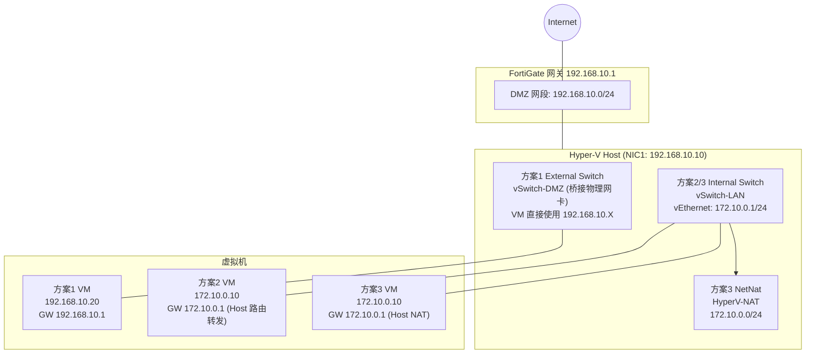

# Hyper-V 的三种虚机网络模式

## 架构图



## 摘要

- Hyper-V 三种常见网络模式：桥接（External）、内部网络（Internal）、NAT 网络；前提假设物理网卡（DMZ）在 192.168.10.0/24 网段，Host 为 192.168.10.10。
- 方案1（External）：虚机直接使用 192.168.10.X，与 Host 同网段直接通信，配置最简单。
- 方案2（Internal + 路由转发）：虚机使用 172.10.0.X，通过 Host 开启 IP Forwarding（或 RRAS）三层路由上网，但上级路由器（如 FortiGate）必须增加静态路由 172.10.0.0/24 → 192.168.10.10。
- 方案3（Internal + NAT，实验环境最常用）：`New-NetNat` 创建 NAT，虚机经 Host NAT 上网，无需在 FortiGate 加路由，配置简单但外部无法主动访问 VM。
- 是否必须 NAT？不必须——有 FortiGate 时可开启 Host 路由 + FortiGate 静态路由 + FortiGate Policy 放行，即 Layer 3 Routing 方式，VM 真实 IP 对网络可见。
- 推荐原则：实验室/测试环境/少量 VM 用 Hyper-V NAT（配置简单）；企业环境/FortiGate 已管理所有网络用路由模式（双向访问、可审计、管理规范）。

## 技术要点

1. 创建 External Switch：Virtual Switch Manager → New Virtual Network Switch → External，绑定 DMZ 物理网卡，命名 vSwitch-DMZ，勾选 "Allow management OS to share this network adapter"。
2. External 模式虚机 IP 配置：192.168.10.20 / 255.255.255.0 / GW 192.168.10.1，与 Host (192.168.10.10) 同网段直接互通。
3. 创建 Internal Switch：Virtual Switch Manager → Internal，命名 vSwitch-LAN；创建后 Host 出现虚拟网卡 vEthernet(vSwitch-LAN)，配置 IP 172.10.0.1 / 255.255.255.0。
4. Internal 模式虚机配置：IP 172.10.0.10 / Mask 255.255.255.0 / GW 172.10.0.1 / DNS 8.8.8.8。
5. 开启 Host 路由转发：`Set-NetIPInterface -Forwarding Enabled`，或启用 RRAS；配合 FortiGate 静态路由 172.10.0.0/24 via 192.168.10.10。
6. 创建 NAT（PowerShell）：`New-NetNat -Name HyperV-NAT -InternalIPInterfaceAddressPrefix 172.10.0.0/24`，用 `Get-NetNat` 验证。
7. NAT 模式流量路径：VM → Host NAT（转换为 192.168.10.10）→ 192.168.10.1 网关 → Internet。
8. 路由模式（Layer 3 Routing）流量路径：VM 172.10.0.10 → vSwitch-LAN 172.10.0.1 → Hyper-V Host 192.168.10.10 → Internet；回程依赖 FortiGate 静态路由。
9. 选型判断：192.168.10.X 与 172.10.0.X 之间需要双向访问、审计和控制时选择路由模式；仅虚机上网需求选 NAT。

## 原文内容

这是 Hyper-V 很常见的三种网络模式：桥接(External)、内部网络(Internal)、NAT 网络。

假设：

- 物理网卡（DMZ）：192.168.10.0/24
- Hyper-V Host：192.168.10.10

## 方案1：虚机直接使用 192.168.10.X

这是最简单的方式。

### 创建 External Virtual Switch

Hyper-V Manager：

```text
Virtual Switch Manager
→ New Virtual Network Switch
→ External
```

绑定到：DMZ 物理网卡

例如：vSwitch-DMZ

勾选：

```text
Allow management OS to share this network adapter
```

### 虚机网卡连接

```text
VM → Network Adapter → vSwitch-DMZ
```

### 配置 IP

虚机：

```text
IP：192.168.10.20
Mask：255.255.255.0
GW：192.168.10.1
```

这样虚机与 Host 在同一网段（Host 192.168.10.10、VM 192.168.10.20），直接通信。

## 方案2：虚机使用 172.10.0.X，通过 Host 转发上网

架构：

```text
Internet
    |
192.168.10.1
    |
Host 192.168.10.10
    |
Internal vSwitch 172.10.0.1
    |
VM 172.10.0.10
```

### 创建 Internal Switch

名称：vSwitch-LAN

创建后 Host 会出现新的虚拟网卡：vEthernet(vSwitch-LAN)

配置：

```text
IP: 172.10.0.1
Mask: 255.255.255.0
```

### 虚机配置

```text
IP: 172.10.0.10
Mask: 255.255.255.0
GW: 172.10.0.1
DNS: 8.8.8.8
```

### 开启 Host 路由转发

仅开启 IP Forwarding：

```powershell
Set-NetIPInterface -Forwarding Enabled
```

或者启用 RRAS。

但这样还需要上级路由器知道 172.10.0.0/24 在哪里。

例如 FortiGate 增加静态路由：

```text
172.10.0.0/24 ↓ 192.168.10.10
```

## 方案3：虚机使用 172.10.0.X，通过 Host NAT 上网

这是实验环境最常用方案。

架构：

```text
VM 172.10.0.10
    |
vSwitch-LAN 172.10.0.1
    |
Hyper-V Host 192.168.10.10
    |
Internet
```

### 创建 Internal Switch

同上：vSwitch-LAN

### Host 虚拟网卡

172.10.0.1/24

### 创建 NAT

PowerShell：

```powershell
New-NetNat `
    -Name HyperV-NAT `
    -InternalIPInterfaceAddressPrefix 172.10.0.0/24
```

验证：

```powershell
Get-NetNat
```

### VM 配置

```text
IP: 172.10.0.10
Mask: 255.255.255.0
Gateway: 172.10.0.1
DNS: 8.8.8.8
```

然后：

```text
VM ↓ Host NAT ↓ 192.168.10.10 ↓ Internet
```

即可访问外网。

## 是否必须使用 NAT？

答案：不必须

如果你有 FortiGate（192.168.10.1），那么只要：

### Hyper-V Host

开启路由（172.10.0.1 作为 VM 网关）

### FortiGate

增加静态路由：

```text
172.10.0.0/24 via 192.168.10.10
```

### FortiGate Policy

允许：172.10.0.0/24 → Internet

那么 172.10.0.X 可以直接访问外网，无需 NAT。

这种方式叫：Layer 3 Routing

## 推荐方式

如果是：

- 实验室
- 测试环境
- 少量 VM

推荐：Hyper-V NAT，配置简单。

如果是：

- 企业环境
- FortiGate 已管理所有网络

推荐：不用 NAT（路由转发）。

这样 192.168.10.X 和 172.10.0.X 之间可以双向访问、审计和控制，管理更规范。
