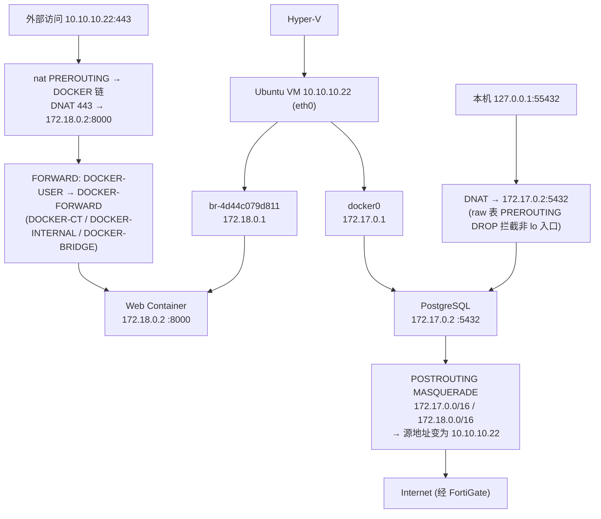

# 虚机中的 IPTABLES

## 架构图



## 摘要

- 通过 iptables-save 反向还原网络拓扑：Hyper-V → Ubuntu VM (10.10.10.22, eth0) → docker0 (172.17.0.1，挂 PostgreSQL 172.17.0.2:5432) + br-4d44c079d811 (172.18.0.1，挂 Web 容器 172.18.0.2:8000)。
- PostgreSQL 端口映射 `127.0.0.1:55432 → 172.17.0.2:5432` 只能本机访问：raw 表 `-A PREROUTING -d 127.0.0.1/32 ! -i lo -p tcp --dport 55432 -j DROP` 专门拦截外部尝试访问 10.10.10.22:55432。
- Web 容器 `10.10.10.22:443 → 172.18.0.2:8000`（等价 docker run -p 443:8000），整个 10.10.10.0/24 网络都可访问；若 FortiGate 做 VIP（110.x.x.x → 10.10.10.22:443），该容器即对公网发布。
- 容器上网靠 POSTROUTING 的 MASQUERADE：172.17.0.0/16 与 172.18.0.0/16 出网时源地址都变为 10.10.10.22，经 FortiGate 到 Internet。
- 容器互通性：未见 DOCKER-ISOLATION-STAGE-1/2 阻断，反而有 `-A DOCKER-FORWARD -i br-4d44c079d811 -j ACCEPT` 和 `-i docker0 -j ACCEPT`，Docker 允许两个桥产生转发流量，但真正互通需进容器 ping 验证。
- UFW 是否失效：INPUT 链仍生效（ufw-* 链正常处理主机入站）；FORWARD 链基本被 Docker 抢走——容器流量优先经过 DOCKER-USER、DOCKER-FORWARD，之后才轮到 ufw-before-forward，与计数器一致（ufw forward 链计数为 0）。
- 值得执行的命令：docker ps、docker network ls、docker network inspect bridge、docker network inspect $(docker network ls -q | grep 4d44c079d811)，把容器名称、容器 IP、所属网桥、对外端口全部对应起来。

## 技术要点

1. 由 `-A DOCKER -d 172.17.0.2/32` 可确定 docker0 下有一个容器（172.17.0.2）；由 `-A DOCKER -d 172.18.0.2/32` 确定 br-4d44c079d811 下有一个容器（172.18.0.2）。
2. PostgreSQL 端口映射实为 `docker run -p 127.0.0.1:55432:5432`；访问方式仅限本机 `psql -h localhost -p 55432`，外部机器不能访问 10.10.10.22:55432。
3. Web 容器端口映射等价 `docker run -p 443:8000`；访问路径：浏览器 → https://10.10.10.22 → Docker NAT → 172.18.0.2:8000。
4. 容器出网路径：Container 172.18.0.2 → br-4d44c079d811 (172.18.0.1) → Ubuntu (10.10.10.22) → FortiGate → Internet；源地址经 MASQUERADE 转换。
5. 当前实际暴露到网络的服务只有两个：PostgreSQL（仅本机）与 Web（10.10.10.0/24 全网可访问）。
6. FORWARD 链顺序：DOCKER-USER → DOCKER-FORWARD → ufw-before-forward 等，因此 Docker 容器流量不经过 UFW 的 forward 规则。
7. 若 FortiGate 已对 10.10.10.22:443 做 VIP，则 Web 容器已对公网发布，需评估暴露面。
8. 容器互通验证方法：`docker exec -it 容器 bash` 后分别 `ping 172.18.0.2` 与 `ping 172.17.0.2`。
9. raw 表中的三条 DROP（目的 172.17.0.2、127.0.0.1:55432、172.18.0.2 非本桥入口）保证容器 IP 与 loopback 映射端口不被外部直连绕过。

## 原文内容

这份 iptables-save 已经把你的 Docker 网络结构暴露得非常清楚了。我来反向还原整个网络拓扑和流量路径。

# 一、最终网络拓扑

```text
Hyper-V
   │
   ▼
Ubuntu VM
10.10.10.22 (eth0)
   │
   ├─────────────────────────┐
   │                         │
   ▼                         ▼

docker0                 br-4d44c079d811
172.17.0.1              172.18.0.1

   │                         │

172.17.0.2              172.18.0.2
PostgreSQL              Web Container
5432                    8000
```

# 二、容器数量分析

从配置来看：

## docker0

发现：172.17.0.2

对应规则：`-A DOCKER -d 172.17.0.2/32`

说明：docker0 └─ 一个容器 172.17.0.2

## br-4d44c079d811

发现：172.18.0.2

对应：`-A DOCKER -d 172.18.0.2/32`

说明：br-4d44c079d811 └─ 一个容器 172.18.0.2

# 三、容器端口映射

## PostgreSQL 容器

看到：

```text
DNAT
127.0.0.1:55432
   ↓
172.17.0.2:5432
```

实际含义：localhost:55432 ↓ PostgreSQL 172.17.0.2:5432

相当于：

```bash
docker run \
  -p 127.0.0.1:55432:5432
```

### 访问方式

只能本机 `psql -h localhost -p 55432` 访问。

外部机器 10.10.10.22:55432 不能访问。

因为你还有这条规则（专门限制了）：

```text
-A PREROUTING
-d 127.0.0.1
--dport 55432
-j DROP
```

# 四、Web 容器

规则：

```text
443 ↓ 172.18.0.2:8000
```

即：10.10.10.22:443 ↓ 172.18.0.2:8000

相当于：

```bash
docker run -p 443:8000
```

访问路径：

```text
浏览器
   |
https://10.10.10.22
   |
Docker NAT
   |
172.18.0.2:8000
```

# 五、容器上网如何实现

最关键规则：

```text
-A POSTROUTING
-s 172.17.0.0/16
-j MASQUERADE

-A POSTROUTING
-s 172.18.0.0/16
-j MASQUERADE
```

意思：容器访问外网，172.17.0.2 会变成 10.10.10.22 出去；同样 172.18.0.2 也会变成 10.10.10.22 出去。访问互联网：

```text
Container 172.18.0.2
   │
   ▼
br-4d44c079d811 172.18.0.1
   │
   ▼
Ubuntu 10.10.10.22
   │
   ▼
FortiGate
   │
   ▼
Internet
```

# 六、容器之间是否互通？

很关键。你这里没有看到 DOCKER-ISOLATION-STAGE-1 / DOCKER-ISOLATION-STAGE-2 规则。

反而看到：

```text
-A DOCKER-FORWARD -i br-4d44c079d811 -j ACCEPT

-A DOCKER-FORWARD -i docker0 -j ACCEPT
```

说明：Docker 允许这两个 Bridge 产生转发流量。但是是否真正互通还要验证。

直接测试：进入容器（`docker exec -it 容器 bash`），测试 `ping 172.18.0.2` 以及 `ping 172.17.0.2`。

# 七、UFW 是否失效

答案：

- ✅ INPUT 链生效
- ❌ FORWARD 链基本被 Docker 抢走

你这里 FORWARD 的顺序是：DOCKER-USER → DOCKER-FORWARD，然后才是 ufw-before-forward。

所以：Docker 容器流量优先经历 DOCKER-USER、DOCKER-FORWARD，之后才轮到 UFW。这和前面计数器一致（ufw forward 相关链计数为 0）。

# 八、当前暴露到网络的服务

实际上只有两个：

### PostgreSQL

仅本机可访问（127.0.0.1:55432 ↓ 172.17.0.2:5432）。

### Web

整个 10.10.10.0/24 网络都可以访问（10.10.10.22:443 ↓ 172.18.0.2:8000）。

如果 FortiGate 做 VIP（110.x.x.x ↓ 10.10.10.22:443 ↓ 172.18.0.2:8000），那么这个容器就已经对公网发布了。

# 当前最值得执行的命令

```bash
docker ps
docker network ls
docker network inspect bridge
docker network inspect $(docker network ls -q | grep 4d44c079d811)
```

这样可以直接把容器名称、容器 IP、所属网桥、对外端口全部对应起来。
