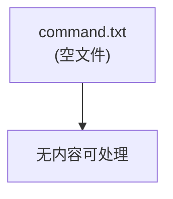

# command

## 架构图

## 摘要

- 源文件 `vm/vm/command.txt` 在文本提取结果中内容为空。
- 该文件不包含任何命令记录或说明文字。
- 保留同名 MD 文件以保证文档集完整性。

## 技术要点

1. 源文件 `command.txt` 提取后无任何正文内容。
2. 无法从空文件生成架构图或技术摘要。
3. 如后续补充了命令记录，可按标准结构（架构图 / 摘要 / 技术要点 / 原文内容）重新生成。
4. 建议将日常运维命令按主题归档，便于检索与复用。

## 原文内容

源文件 `vm/vm/command.txt` 为空文件，无原文内容。
