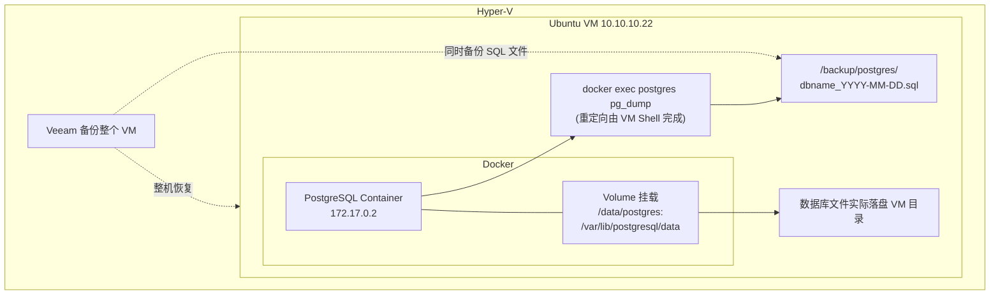

# 虚机中容器数据的备份

## 架构图



## 摘要

- pg_dump 备份文件落在哪里取决于执行位置：容器内执行会生成在容器内部（容器删除即丢失，不推荐）；宿主机执行时重定向由 Ubuntu Shell 负责，文件实际保存到 VM 目录（推荐做法）。
- 推荐命令：`docker exec postgres pg_dump -U postgres dbname > /backup/dbname_20260805.sql`——pg_dump 在容器内运行，但 `>` 重定向发生在 VM 上。
- 很多 PostgreSQL 容器通过 volume 挂载部署（`/data/postgres:/var/lib/postgresql/data`），数据库文件实际存放于 Ubuntu VM 目录，容器只是使用该目录；用 `docker inspect postgres` 查看 Mounts 部分即可确认。
- Hyper-V + Ubuntu VM + 容器环境的推荐双层保障：每天生成逻辑备份到 /backup/postgres/（数据库级恢复），Veeam 只备份 VM（整机恢复），两层互补。
- 拓扑：pg_dump 从容器导出 → VM /backup/dbname.sql → Veeam 备份 VM 时同时备份 SQL 文件。

## 技术要点

1. 场景1（容器内执行，不推荐）：`docker exec -it postgres bash` 后 `pg_dump -U postgres dbname > backup.sql`，backup.sql 保存在容器内部（Container └─ /root/backup.sql），删除容器后备份也没了。
2. 场景2（宿主机执行，推荐）：`docker exec postgres pg_dump -U postgres dbname > /backup/dbname_20260805.sql`，pg_dump 在容器内运行，但重定向由 Ubuntu Shell 完成，文件保存到 VM。
3. 场景3（Docker Volume）：compose 中 `volumes: - /data/postgres:/var/lib/postgresql/data` 时，数据实际在 Ubuntu VM 的 /data/postgres，`docker inspect postgres` 的 Mounts 显示 `"Source": "/data/postgres", "Destination": "/var/lib/postgresql/data"`。
4. 每日逻辑备份脚本：`mkdir -p /backup/postgres` + `docker exec postgres pg_dump -U postgres dbname > /backup/postgres/dbname_$(date +%F).sql`。
5. Veeam 备份 VM 的同时即备份了 /backup/postgres/*.sql，形成 VM 级恢复 + 数据库级恢复两层保障。
6. 确认数据实际存放位置：`docker inspect postgres | grep Source` 或直接 `docker inspect postgres` 查看 "Mounts"，判断数据库文件在容器内部还是映射到 VM 目录。

## 原文内容

这取决于你在哪里执行 pg_dump 命令。

## 场景1：在容器内执行

例如 PostgreSQL 容器名是 postgres，那么：

```bash
docker exec -it postgres bash

pg_dump -U postgres dbname > backup.sql
```

backup.sql 会生成在容器内部当前目录，例如：

```text
Container
└─ /root/backup.sql
```

风险：

```text
删除容器
   ↓
backup.sql 也没了
```

因此不推荐直接备份到容器内部。

## 场景2：在宿主机（Ubuntu VM）执行

推荐做法：

```bash
docker exec postgres \
  pg_dump -U postgres dbname \
  > /backup/dbname_20260805.sql
```

这里：pg_dump 在容器内运行，但是 `> /backup/dbname_20260805.sql` 是由 Ubuntu Shell 负责重定向。

所以文件实际保存到：

```text
Ubuntu VM
└─ /backup/dbname_20260805.sql
```

拓扑：

```text
PostgreSQL Container
172.17.0.2
      │
      │ pg_dump
      ▼
Ubuntu VM
10.10.10.22
      │
      ▼
/backup/dbname.sql
```

这种方式最适合：Veeam ↓ 备份 Ubuntu VM ↓ 同时备份 SQL 文件。

## 场景3：使用 Docker Volume

很多 PostgreSQL 容器会这样部署：

```yaml
volumes:
  - /data/postgres:/var/lib/postgresql/data
```

此时数据实际上存放在 Ubuntu VM（Ubuntu VM └─ /data/postgres），容器只是使用该目录。

查看命令：

```bash
docker inspect postgres
```

查找 "Mounts"，例如：

```json
{
  "Source": "/data/postgres",
  "Destination": "/var/lib/postgresql/data"
}
```

说明：数据库文件实际上已经在 VM 中。

## 你的环境推荐

对于：Hyper-V └─ Ubuntu VM └─ PostgreSQL Container

建议：

### 每天生成逻辑备份

```bash
mkdir -p /backup/postgres

docker exec postgres \
  pg_dump -U postgres dbname \
  > /backup/postgres/dbname_$(date +%F).sql
```

备份文件保存到：Ubuntu VM /backup/postgres/

### Veeam 只备份 VM

这样既有：

- VM 级恢复（整机恢复）
- 数据库级恢复（恢复单个库）

两层保障。

### 查看 PostgreSQL 数据实际存放位置

执行：

```bash
docker inspect postgres | grep Source
```

或者：

```bash
docker inspect postgres
```

查看 "Mounts" 部分，就能确定数据库数据是在容器内部，还是已经映射到 Ubuntu VM 的目录。
