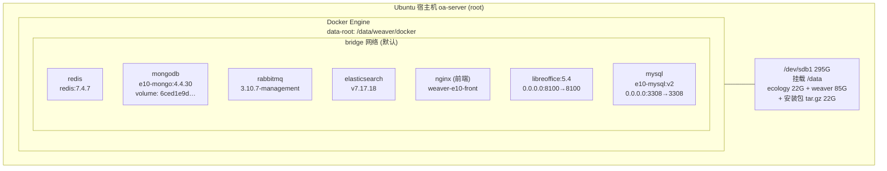

# docker ps —— OA 服务器容器清单

## 架构图



## 摘要

- 记录了一台 OA 服务器（oa-server）上 7 个长期运行的 Docker 容器：redis、mongodb、rabbitmq、elasticsearch、nginx 前端、libreoffice、mysql，均为 4 个月前创建、已持续运行 5 周。
- 仅两个容器对外发布端口：libreoffice（0.0.0.0:8100→8100/tcp）与 mysql（0.0.0.0:3308→3308/tcp），其余容器仅在内部 bridge 网络通信。
- Docker 网络只有默认三件套：bridge / host / none；镜像全部来自私有仓库 reg.e-cology.cn/e10/。
- 数据盘 /dev/sdb1（295G，已用 124G，45%）挂载在 /data，Docker 的 overlay2 存储与 Ecology OA 数据（/data/weaver 85G、/data/ecology 22G）均在该盘上。
- `docker system df` 显示镜像共 7.937GB，其中 2.499GB（31%）可回收（未被容器使用的 google-chrome、e10-base-new 镜像）。
- 唯一的命名卷 6ced1e9d… 被 mongodb 容器使用（`docker ps -a --filter volume=…` 可确认）。

## 技术要点

1. `docker ps` 列出运行中容器：CONTAINER ID / IMAGE / COMMAND / CREATED / STATUS / PORTS / NAMES。
2. `docker network ls` 查看网络：bridge（bridge 驱动）、host（host 驱动）、none（null 驱动），SCOPE 均为 local。
3. `docker ps -a --filter volume=<卷名>` 可反查某个卷被哪个容器使用。
4. `docker system df -v` 逐项列出镜像/容器/卷/构建缓存的空间占用，以及 SHARED SIZE / UNIQUE SIZE / CONTAINERS 关联数。
5. `df -h` 中 overlay 条目对应每个运行容器的 merged 层，实际都落在 /data/weaver/docker/overlay2/ 下。
6. `du -sh /data/weaver/docker`（14G）与 `docker system df` 的差异说明大量空间被容器数据（非镜像）占用：mysql 容器可写层即有 590MB。
7. `du -h --max-depth=1 /data | sort -hr` 用于快速定位大目录：/data/weaver 85G、/data/ecology 22G、安装包 tar.gz 22G。
8. 空间清理建议：未被任何容器使用的 reg.e-cology.cn/e10/google-chrome (2.32GB) 与 e10-base-new (843MB) 镜像可 `docker rmi` 回收约 2.5GB。
9. mysql 端口映射 0.0.0.0:3308→3308 表示数据库对外网/局域网开放，需配合防火墙控制访问来源。

## 原文内容

```bash
docker ps
CONTAINER ID   IMAGE                                              COMMAND                  CREATED        STATUS       PORTS                    NAMES
f898b67a04e8   reg.e-cology.cn/e10/redis:7.4.7                    "docker-entrypoint.s…"   4 months ago   Up 5 weeks                            redis
61923dff4b7d   reg.e-cology.cn/e10/e10-mongo:4.4.30               "docker-entrypoint.s…"   4 months ago   Up 5 weeks                            mongodb
6cfd89401b22   reg.e-cology.cn/e10/rabbitmq:3.10.7-management     "docker-entrypoint.s…"   4 months ago   Up 5 weeks                            rabbitmq
1a8eed99569d   reg.e-cology.cn/e10/elasticsearch:v7.17.18         "/opt/bitnami/script…"   4 months ago   Up 5 weeks                            elasticsearch
1383f817a181   reg.e-cology.cn/e10/weaver-e10-front:20240312_14   "/usr/bin/supervisor…"   4 months ago   Up 5 weeks                            nginx
38f53922b596   reg.e-cology.cn/e10/libreoffice:5.4                "bash"                   4 months ago   Up 5 weeks   0.0.0.0:8100->8100/tcp   libreoffice
f4bc7a2ab990   reg.e-cology.cn/e10/e10-mysql:v2                   "/bin/sh -c '/opt/my…"   4 months ago   Up 5 weeks   0.0.0.0:3308->3308/tcp   mysql
```

```bash
root@oa-server:~# docker network ls
NETWORK ID     NAME      DRIVER    SCOPE
feed72e799b1   bridge    bridge    local
26164ddfd5aa   host      host      local
02e59a6aa5bb   none      null      local
```

```bash
root@oa-server:~# df -h
Filesystem                         Size  Used Avail Use% Mounted on
tmpfs                              6.3G  2.3M  6.3G   1% /run
efivarfs                           128M   33K  128M   1% /sys/firmware/efi/efi_vars
/dev/mapper/ubuntu--vg-ubuntu--lv   38G   19G   18G  52% /
tmpfs                              32G     0   32G   0% /dev/shm
tmpfs                              5.0M     0  5.0M   0% /run/lock
/dev/sda2                          2.0G  214M  1.6G  12% /boot
/dev/sdb1                          295G  124G  157G  45% /data
/dev/sda1                          1.1G  6.2M  1.1G   1% /boot/efi
overlay                            295G  124G  157G  45% /data/weaver/docker/overlay2/<id>/merged
...（共 7 个 overlay 条目，对应每个运行中容器）
tmpfs                              6.3G   96K  6.3G   1% /run/user/126
tmpfs                              6.3G  84K  6.3G   1% /run/user/1005
```

```bash
root@oa-server:~# docker volume ls
DRIVER    VOLUME NAME
local     6ced1e9d7889bb4fc7d5b87474c906d7d5665f3a085eb0805cdb939bb85a1e7a

root@oa-server:~# docker ps -a --filter volume=6ced1e9d7889bb4fc7d5b87474c906d7d5665f3a085eb0805cdb939bb85a1e7a
CONTAINER ID   IMAGE                                  COMMAND                  CREATED        STATUS       PORTS     NAMES
61923dff4b7d   reg.e-cology.cn/e10/e10-mongo:4.4.30   "docker-entrypoint.s…"   4 months ago   Up 5 weeks             mongodb
```

```bash
root@oa-server:~# docker system df
TYPE            TOTAL     ACTIVE    SIZE      RECLAIMABLE
Images          9         7         7.937GB   2.499GB (31%)
Containers      7         7         595.7MB   0B (0%)
Local Volumes   1         1         0B        0B
Build Cache     0         0          0B        0B
```

```bash
root@oa-server:~# docker system df -v
Images space usage:

REPOSITORY                             TAG                    IMAGE ID       CREATED         SIZE      SHARED SIZE   UNIQUE SIZE   CONTAINERS
reg.e-cology.cn/e10/e10-mongo          4.4.30                 0010f63d2695   7 months ago    409.2MB   0B            409.2MB       1
reg.e-cology.cn/e10/redis              7.4.7                  07a03ad21d6a   8 months ago    117MB     0B            117MB         1
reg.e-cology.cn/e10/google-chrome      v79-240723             fc3f52d88821   15 months ago   2.32GB    843MB         1.477GB       0
reg.e-cology.cn/e10/e10-base-new       20240702_1050-squash   7fd7a959154c   2 years ago     843MB     843MB         0B            0
reg.e-cology.cn/e10/e10-mysql          v2                     05f42e9517be   2 years ago     983.5MB   0B            983.5MB       1
reg.e-cology.cn/e10/libreoffice        5.4                    d0d2baa78d0d   2 years ago     2.826GB   376.8MB       2.449GB       1
reg.e-cology.cn/e10/elasticsearch      v7.17.18               28cc28a7b456   2 years ago     783.8MB   0B            783.8MB       1
reg.e-cology.cn/e10/weaver-e10-front   20240312_14            f45ae7ef9127   2 years ago     810.4MB   376.8MB      433.6MB       1
reg.e-cology.cn/e10/rabbitmq           3.10.7-management      6b94498c1b2a   3 years ago     261.8MB   0B            261.8MB       1

Containers space usage:

CONTAINER ID   IMAGE                                              COMMAND                  LOCAL VOLUMES   SIZE      CREATED        STATUS       NAMES
f898b67a04e8   reg.e-cology.cn/e10/redis:7.4.7                    "docker-entrypoint.s…"   0               0B        4 months ago   Up 5 weeks   redis
61923dff4b7d   reg.e-cology.cn/e10/e10-mongo:4.4.30               "docker-entrypoint.s…"   1               0B        4 months ago   Up 5 weeks   mongodb
6cfd89401b22   reg.e-cology.cn/e10/rabbitmq:3.10.7-management     "docker-entrypoint.s…"   0               0B        4 months ago   Up 5 weeks   rabbitmq
1a8eed99569d   reg.e-cology.cn/e10/elasticsearch:v7.17.18         "/opt/bitnami/script…"   0               6.12MB    4 months ago   Up 5 weeks   elasticsearch
1383f817a181   reg.e-cology.cn/e10/weaver-e10-front:20240312_14   "/usr/bin/supervisor…"   0               66.3kB    4 months ago   Up 5 weeks   nginx
38f53922b596   reg.e-cology.cn/e10/libreoffice:5.4                "bash"                   0               0B        4 months ago   Up 5 weeks   libreoffice
f4bc7a2ab990   reg.e-cology.cn/e10/e10-mysql:v2                   "/bin/sh -c '/opt/my…"   0               590MB     4 months ago   Up 5 weeks   mysql

Local Volumes space usage:

VOLUME NAME                                                        LINKS     SIZE
6ced1e9d7889bb4fc7d5b87474c906d7d5665f3a085eb0805cdb939bb85a1e7a   1         0B

Build cache usage: 0B
```

```bash
root@oa-server:~# du -sh /data/weaver/docker
14G     /data/weaver/docker

root@oa-server:~# du -h --max-depth=1 /data | sort -hr
129G    /data
85G     /data/weaver
22G     /data/ecology
16K     /data/lost+found

root@oa-server:/data# ls -l
total 22828996
drwxr-xr-x  3 root root         4096 Mar 13 13:14 ecology
-rwxr-xr-x  1 root root 23376861578 Mar 27 14:20 Ecology10.0.2602.01_c02199791_forLinux_x86_64.tar.gz
drwxr-xr-x  2 chery chery       16384 Nov  7  2025 lost+found
drwxr-xr-x 18 root root         4096 Mar 31 13:00 weaver

root@oa-server:/data# du -sh *
22G     ecology
22G     Ecology10.0.2602.01_c02199791_forLinux_x86_64.tar.gz
16K     lost+found
85G     weaver
```
