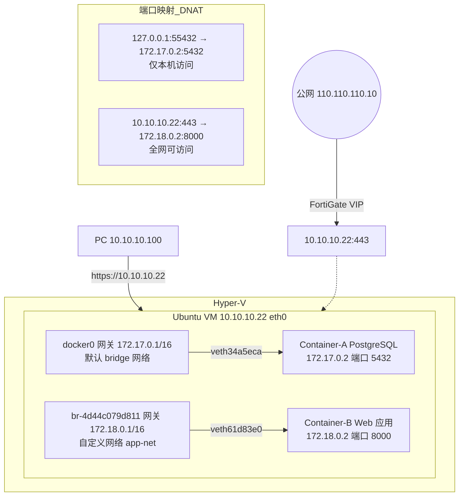

# 虚机-容器的地址规划

## 架构图



## 摘要

- 通过 `ip addr` 与 `iptables -t nat` 输出可还原完整网络结构：Ubuntu VM（10.10.10.22，Hyper-V 之上）运行 Docker，包含默认网络 docker0（172.17.0.1/16）与自定义网络 br-4d44c079d811（172.18.0.1/16）。
- docker0 是 Docker 自动创建的默认 Bridge；br-4d44c079d811 由 `docker network create app-net`（或 docker compose）产生，网络 ID 前缀 4d44c079d811 即 Linux 网桥名。
- veth 设备标识容器挂载位置：veth34a5eca master docker0 对应 Container A（172.17.0.2），veth61d83e0 master br-4d44c079d811 对应 Container B（172.18.0.2）。
- 端口映射：PostgreSQL `127.0.0.1:55432 → 172.17.0.2:5432`（仅本机可访问）；Web `443 → 172.18.0.2:8000`（10.10.10.22:443 可被局域网访问）。
- 完整访问路径（PC → 容器）：10.10.10.100 → Linux VM 10.10.10.22:443 → Docker DNAT → 172.18.0.2:8000；若 FortiGate 做公网 VIP（110.110.110.10:443 → 10.10.10.22:443），则形成 FortiGate（第一层 NAT）+ Docker（第二层 NAT）的双层地址转换架构。

## 技术要点

1. **组件识别**：eth0 10.10.10.22/24 说明 Linux VM 在 10.10.10.0/24 网络中，处于 `Hyper-V → Linux VM (10.10.10.22)` 结构。
2. **默认 Docker 网络**：docker0 网关 172.17.0.1/16，网段 172.17.0.0/16，未指定网络的容器默认挂载（172.17.0.2、172.17.0.3...）。
3. **自定义网络**：`docker network create app-net` 生成 br-4d44c079d811（172.18.0.1/16），网段 172.18.0.0/16；网桥名 br-<网络ID前12位>。
4. **veth 判断容器归属**：`veth34a5eca@if2 master docker0` → Container A 挂 docker0；`veth61d83e0@if2 master br-4d44c079d811` → Container B 挂自定义网桥。
5. **iptables 确认端口映射**：`55432 → 172.17.0.2:5432` 与 `443 → 172.18.0.2:8000` 的 DNAT 规则可反推容器 IP：Container-A=172.17.0.2、Container-B=172.18.0.2。
6. **PostgreSQL 访问方式**：绑定 127.0.0.1，只能本机 `psql -h localhost -p 55432` 访问；外部机器（10.10.10.22:55432）不能访问，因为有 PREROUTING 阶段对 `-d 127.0.0.1 --dport 55432` 的 DROP 规则。
7. **Web 容器访问路径**：浏览器 → https://10.10.10.22 → Docker NAT → 172.18.0.2:8000，实际服务是 Container-B。
8. **双层 NAT 架构**：公网 110.110.110.10:443 →（FortiGate VIP）→ 10.10.10.22:443 →（Docker DNAT）→ 172.18.0.2:8000；第一层 NAT 在 FortiGate，第二层 NAT 在 Docker。
9. **容器对应关系确认命令**：`docker ps` + `docker inspect <容器ID>`；或批量 `docker container ls -q | xargs docker inspect --format '{{.Name}} {{range.NetworkSettings.Networks}}{{.IPAddress}}{{end}}'` 直接得到 `/postgres 172.17.0.2`、`/webapp 172.18.0.2`。

## 原文内容

从这个 ip addr 和前面贴出的 iptables -t nat 输出，我基本可以还原出你的网络结构。

## 一、先识别每个网络组件

### 1. Linux 虚机自身

```text
eth0
IP: 10.10.10.22/24
```

说明这台 Linux VM 在：

```text
10.10.10.0/24
```

网络中。

可以理解为：

```text
Hyper-V
  └── Linux VM
        10.10.10.22
```

### 2. Docker 默认网络

这是 Docker 自动创建的 Bridge。

```text
docker0
172.17.0.1/16
```

网络：

```text
172.17.0.0/16
```

网关：

```text
172.17.0.1
```

容器：

```text
172.17.0.2
172.17.0.3
...
```

都挂在这个桥上。

### 3. 自定义 Docker 网络

这是 Docker Compose 或 Docker Network 创建的网络。

例如：

```bash
docker network create app-net
```

生成：

```text
br-4d44c079d811
172.18.0.1/16
```

网络：

```text
172.18.0.0/16
```

### 4. veth设备

代表：

```text
veth34a5eca@if2
master docker0
```

代表：

```text
docker0
    |
    +---- Container A
           172.17.0.2
```

代表：

```text
veth61d83e0@if2
master br-4d44c079d811
```

代表：

```text
br-4d44c079d811
    |
    +---- Container B
           172.18.0.2
```

# 二、结合你的iptables规则

之前你贴过：

```text
55432
↓
172.17.0.2:5432
```

以及：

```text
443
↓
172.18.0.2:8000
```

因此容器IP基本可确定：

```text
Container-A
172.17.0.2

Container-B
172.18.0.2
```

# 三、完整网络拓扑

```text
                    Hyper-V
                        |
                        |
    ------------------------------------------------
                        |
                        |
                Linux VM
                10.10.10.22
                        |
    --------------------------------------------------
    |                                                |
    | docker0                                        | br-4d44c079d811
    | 172.17.0.1/16                                 | 172.18.0.1/16
    |                                                |
    ▼                                                ▼

+------------------+                      +------------------+
| Container-A      |                      | Container-B      |
| PostgreSQL       |                      | Web Application  |
| 172.17.0.2       |                      | 172.18.0.2       |
| Port 5432        |                      | Port 8000        |
+------------------+                      +------------------+
```

# 四、访问关系分析

## PostgreSQL容器

iptables：

```text
127.0.0.1:55432
↓
172.17.0.2:5432
```

拓扑：

```text
本机应用
    |
localhost:55432
    |
Docker DNAT
    |
172.17.0.2:5432
(PostgreSQL)
```

特点：

```text
只能本机访问
```

因为绑定：

```text
127.0.0.1
```

## Web容器

iptables：

```text
10.10.10.22:443
↓
172.18.0.2:8000
```

拓扑：

```text
浏览器
    |
https://10.10.10.22
    |
Docker NAT
    |
172.18.0.2:8000
```

实际访问的服务：

```text
Container-B
172.18.0.2:8000
```

# 五、从Hyper-V到容器的完整路径

假设：

```text
PC
10.10.10.100
```

访问：

```text
https://10.10.10.22
```

路径：

```text
10.10.10.100
          |
          ▼
Linux VM
10.10.10.22:443
          |
          ▼
Docker DNAT
          |
          ▼
172.18.0.2:8000
```

# 六、如果再增加FortiGate公网发布

例如：

```text
公网
110.110.110.10
```

VIP：

```text
110.110.110.10:443
      ↓
10.10.10.22:443
```

此时路径变成：

```text
Internet
    |
110.110.110.10
    |
FortiGate VIP
    |
10.10.10.22:443
    |
Docker NAT
    |
172.18.0.2:8000
```

这就是典型的：

```text
第一层 NAT
FortiGate

第二层 NAT
Docker
```

即你环境目前属于：

```text
公网
   ↓
FortiGate NAT
   ↓
Linux VM
   ↓
Docker NAT
   ↓
Container
```

属于双层地址转换架构。

### 容器对应关系确认命令

可以直接确认容器与IP：

```bash
docker ps
```

然后：

```bash
docker inspect 172.17.0.2对应容器ID
```

或者：

```bash
docker container ls -q | xargs docker inspect \
  --format '{{.Name}} {{range.NetworkSettings.Networks}}{{.IPAddress}}{{end}}'
```

会直接得到类似：

```text
/postgres 172.17.0.2
/webapp   172.18.0.2
```

这样就能精确确认哪个容器对应哪个IP。
