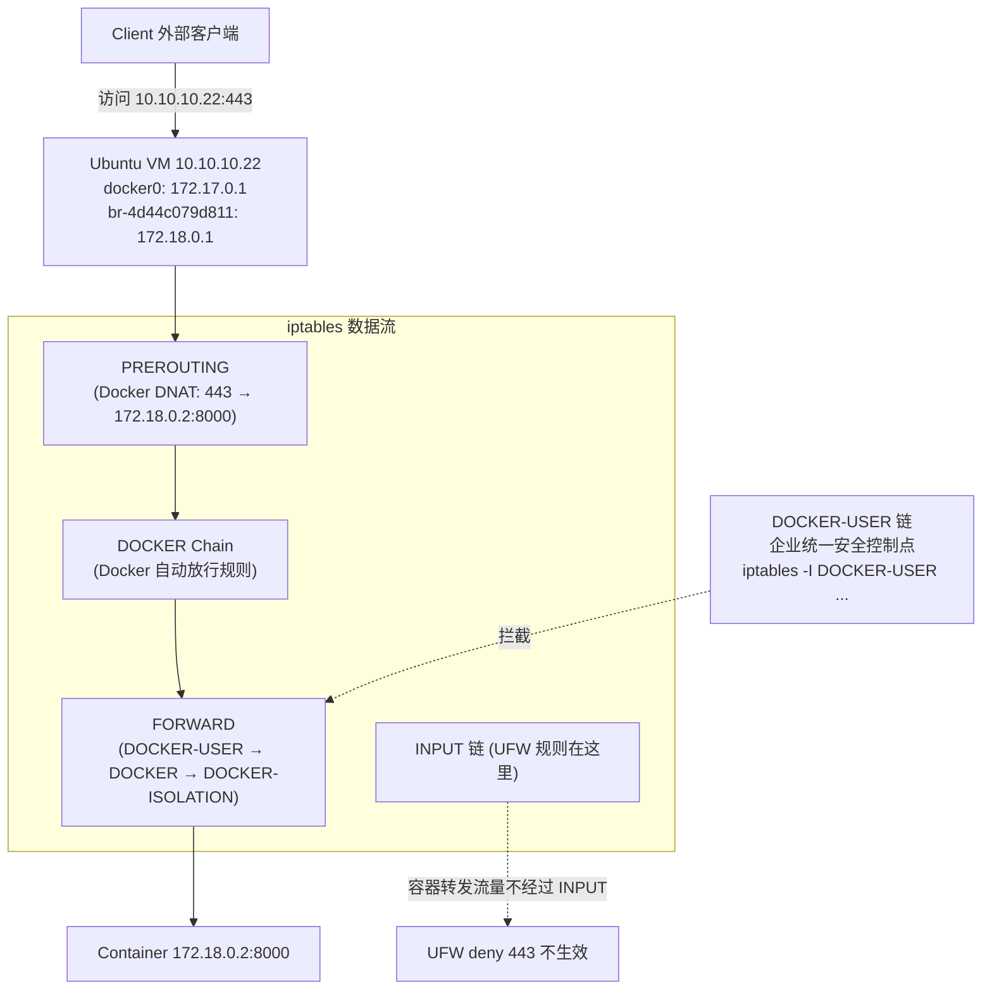

# 容器 iptables 与 UFW 的关系

## 架构图



## 摘要

- Docker 不会让 Ubuntu 防火墙（iptables/ufw）完全失效，而是会绕过部分你原本以为会生效的规则——这是 Docker 在 Ubuntu 上经常引起误解的地方。
- 环境背景：Ubuntu VM 10.10.10.22，docker0 (172.17.0.1) 与 br-4d44c079d811 (172.18.0.1)，且存在 443 → 172.18.0.2:8000 的 DNAT 规则。
- 原因：外部访问 10.10.10.22:443 的流量先经 PREROUTING 的 Docker DNAT 直接转成 172.18.0.2:8000，再走 DOCKER Chain 和 FORWARD 链，根本不经过 INPUT 链，因此 `ufw deny 443` 拦不住 `docker run -p 443:8000` 发布的端口。
- Docker 直接修改 iptables，而 UFW 只是 iptables 的管理工具；Docker 插入规则的位置通常优先于 UFW。
- Docker 官方预留 DOCKER-USER 链作为用户控制点；推荐方案：保留 Docker 自动管理 iptables，统一在 DOCKER-USER 链做安全控制（如仅允许 10.10.10.0/24 访问、其余 DROP）。
- 备选方案一是关闭 Docker 自动管理 iptables（/etc/docker/daemon.json 设 `"iptables": false` 后自行管理规则），但配置复杂。

## 技术要点

1. 数据流路径：外部流量 → PREROUTING（Docker DNAT）→ DOCKER Chain → FORWARD → Container；而 INPUT 链（Ubuntu Firewall/UFW）不在路径上。
2. 典型踩坑：`ufw status` 显示 443 DENY，但 `docker run -p 443:8000` 后外部仍能访问——Docker 插入规则优先于 UFW。
3. 查看 Docker 创建的 NAT 规则：`iptables -t nat -L -n -v`，可看到 `DNAT tcp dpt:443 to:172.18.0.2:8000`。
4. 查看 FORWARD 链：`iptables -L FORWARD -n -v`，Docker 通常插入 DOCKER / DOCKER-USER / DOCKER-ISOLATION 三个子链。
5. 查看 DOCKER-USER 链默认内容：`iptables -L DOCKER-USER -n -v`，通常只有 `Chain DOCKER-USER / RETURN all`（即默认放行）。
6. 禁止外部访问容器 443：不要只依赖 UFW，用 `iptables -I DOCKER-USER -p tcp --dport 443 -j DROP` 在 Docker 转发前拦截。
7. 企业环境方案一（不推荐）：/etc/docker/daemon.json 设置 `{"iptables": false}` 关闭 Docker 自动管理 iptables，然后自己管理全部规则，配置复杂。
8. 企业环境方案二（推荐）：保留 Docker iptables = true，统一在 DOCKER-USER 链做安全控制，如 `iptables -I DOCKER-USER -s 10.10.10.0/24 -j ACCEPT` + `iptables -A DOCKER-USER -j DROP`。
9. 快速验证三段命令：`sudo iptables -L DOCKER-USER -n -v`、`sudo iptables -L FORWARD -n -v`、`sudo iptables -t nat -L DOCKER -n -v`，据此可判断 Docker 是否正在绕过 UFW、哪个容器开放了哪些端口、172.17.0.0/16 与 172.18.0.0/16 是否互通、防火墙真正生效路径。

## 原文内容

会，而且这是 Docker 在 Ubuntu 上经常引起误解的地方。

但准确地说：Docker 不会让 Ubuntu Firewall（iptables/ufw）完全失效，而是会绕过部分你原本以为会生效的规则。

# 你的环境

从前面看到：

- Ubuntu VM：10.10.10.22
- docker0：172.17.0.1
- br-4d44c079d811：172.18.0.1

并且存在 443 ↓ 172.18.0.2:8000 的 DNAT 规则。

# 为什么会感觉 Firewall 失效？

例如 UFW 规则：

```bash
ufw deny 443
```

你认为：任何人不能访问 443。

但是 Docker 创建 `docker run -p 443:8000` 后，很可能仍然能访问。

原因是：外部流量走的是 PREROUTING → DOCKER Chain → FORWARD → Container 路径，而不是 INPUT ↓ Ubuntu Firewall。

# 数据流示意

```text
外部流量
     ↓
PREROUTING
(Docker DNAT)
     ↓
DOCKER Chain
     ↓
FORWARD
     ↓
Container
```

访问 10.10.10.22:443 实际上变成：

```text
Client
   |
   ▼
10.10.10.22:443
   |
iptables NAT
   |
172.18.0.2:8000 (Container)
```

因此很多 INPUT 链规则根本没机会匹配。

# 查看 Docker 创建了什么规则

你已经看到：

```bash
iptables -t nat -L -n -v
```

```text
DNAT tcp dpt:443 to:172.18.0.2:8000
```

这就是 Docker 自动添加的。

# 查看 FORWARD

Docker 通常会插入 DOCKER、DOCKER-USER、DOCKER-ISOLATION，例如：

```text
FORWARD
 |
 +-- DOCKER-USER
 |
 +-- DOCKER
 |
 +-- DOCKER-ISOLATION
```

# Docker 官方推荐控制点

Docker 在设计时预留了 DOCKER-USER 链。

查看：

```bash
iptables -L DOCKER-USER -n -v
```

通常：

```text
Chain DOCKER-USER
RETURN all
```

# 如果想禁止访问容器 443

不要只依赖 UFW。可以：

```bash
iptables -I DOCKER-USER \
  -p tcp \
  --dport 443 \
  -j DROP
```

这样会在 Docker 转发前拦截。

# UFW 特别容易踩坑

例如：`ufw status` 显示 443 DENY，但 `docker run -p 443:8000` 后仍然能访问。

原因：Docker 直接修改 iptables，而 UFW 只是 iptables 管理工具；Docker 插入规则的位置通常优先于 UFW。

# 企业环境最佳实践

如果是服务器环境：

## 方案一

关闭 Docker 自动管理 iptables：

文件：/etc/docker/daemon.json

```json
{
  "iptables": false
}
```

然后自己管理规则。但配置复杂。

## 方案二（推荐）

保留 Docker iptables = true，然后统一在 DOCKER-USER 链做安全控制。

例如：

```bash
iptables -I DOCKER-USER -s 10.10.10.0/24 -j ACCEPT

iptables -A DOCKER-USER -j DROP
```

# 快速验证

执行：

```bash
sudo iptables -L DOCKER-USER -n -v

sudo iptables -L FORWARD -n -v

sudo iptables -t nat -L DOCKER -n -v
```

如果你把这三段输出贴出来，我可以直接告诉你：

- Docker 是否正在绕过 UFW
- 哪个容器开放了哪些端口
- 172.17.0.0/16 与 172.18.0.0/16 是否能互通
- 当前防火墙真正的生效路径是什么
