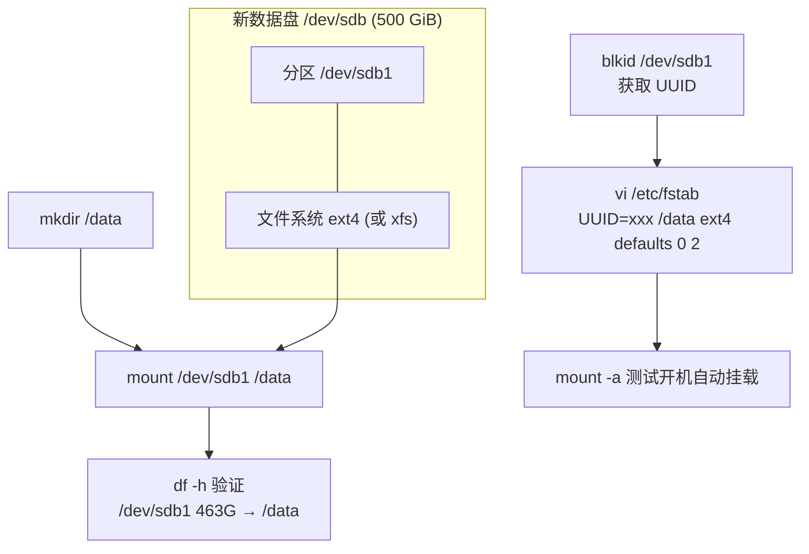

# Linux 创建分区挂载数据盘

## 架构图



## 摘要

- `/dev/sdb1 463G /data` 说明是一个独立的数据盘分区，与系统盘 /dev/sda（LVM + /boot + EFI 分区）分开。
- 标准创建流程：添加第二块磁盘 → fdisk 创建分区 → mkfs 格式化 → mkdir 挂载点 → mount 手动挂载 → 写入 /etc/fstab 实现开机自动挂载。
- 用 `lsblk -f` 查看真实结构：sda 含 /boot/efi、/boot、LVM(ubuntu-lv → /)；sdb1 ext4 挂载 /data。
- 用 `blkid /dev/sdb1` 获取分区 UUID，与 `cat /etc/fstab` 中的条目对应，即可确认挂载由谁创建。
- 463G 而非 500G 是正常现象：厂商标称 500 GB = 500,000,000,000 Bytes，换算成 GiB ≈ 465，再扣除文件系统开销后约 463G，实际就是一块标准 500GB 数据盘。

## 技术要点

1. 查看磁盘与分区结构：`lsblk -f` 可同时看到设备、文件系统类型和挂载点；`fdisk -l` 查看磁盘容量（Disk /dev/sdb: 500 GiB）。
2. fdisk 创建分区操作序列：`n`（新建分区）→ `p`（主分区）→ `1`（分区号 1）→ `w`（写入），生成 /dev/sdb1。
3. 格式化文件系统：`mkfs.ext4 /dev/sdb1`（或 `mkfs.xfs /dev/sdb1`，CentOS/RHEL 常用 xfs）。
4. 手动挂载：`mkdir /data` 后 `mount /dev/sdb1 /data`，用 `df -h` 验证出现 `/dev/sdb1 463G ... /data`。
5. 开机自动挂载：编辑 /etc/fstab，推荐使用 UUID 写法 `UUID=xxxxxxxx-xxxx-xxxx-xxxx-xxxxxxxxxxxx /data ext4 defaults 0 2`（也可用设备路径 `/dev/sdb1 /data ext4 defaults 0 2`）。
6. 修改 fstab 后务必执行 `mount -a` 测试无报错，避免重启后因配置错误进入紧急模式。
7. 确认挂载来源：`cat /etc/fstab` 查看 UUID 条目，`blkid /dev/sdb1` 查看实际 UUID，两者对应即知该挂载的创建方式。
8. 容量换算：500 GB（十进制）÷ 1024³ ≈ 465 GiB，扣除文件系统元数据开销后显示 463G 属正常。
9. `lsblk -f` + `cat /etc/fstab` 组合可直接判断 /data 是安装系统时创建、后期新增的数据盘，还是从旧服务器迁移过来的挂载。

## 原文内容

你这个 /data 挂载（`/dev/sdb1 /data 463G`）说明是一个独立的数据盘分区，与系统盘 /dev/sda 分开。

通常创建过程类似下面这样：

### 查看真实结构

先执行：

```bash
lsblk -f
```

你可能会看到类似：

```text
sda
├─sda1        vfat    /boot/efi
├─sda2        ext4    /boot
└─sda3        LVM2
   └─ubuntu-lv ext4   /

sdb
└─sdb1        ext4    /data
```

## 创建过程

### 1. 添加第二块磁盘

系统中新增加：/dev/sdb

例如一块 500GB 磁盘。

查看：

```bash
fdisk -l
```

结果：

```text
Disk /dev/sdb: 500 GiB
```

### 2. 创建分区

使用 fdisk：

```bash
fdisk /dev/sdb
```

操作：

```text
n   # new partition
p   # primary
1   # partition 1
w   # write
```

生成：/dev/sdb1

### 3. 格式化文件系统

例如：

```bash
mkfs.ext4 /dev/sdb1
```

或者：

```bash
mkfs.xfs /dev/sdb1
```

### 4. 创建挂载目录

```bash
mkdir /data
```

### 5. 手动挂载

```bash
mount /dev/sdb1 /data
```

验证：

```bash
df -h
```

出现：

```text
/dev/sdb1   463G   ...   /data
```

### 6. 设置开机自动挂载

编辑：

```bash
vi /etc/fstab
```

增加：

```text
UUID=xxxxxxxx-xxxx-xxxx-xxxx-xxxxxxxxxxxx /data ext4 defaults 0 2
```

或：

```text
/dev/sdb1  /data  ext4  defaults  0  2
```

之后：

```bash
mount -a
```

测试无报错即可。

## 如何确认是谁创建的

查看：

```bash
cat /etc/fstab
```

你会看到类似：

```text
UUID=xxxx /data ext4 defaults 0 2
```

再查看 UUID：

```bash
blkid /dev/sdb1
```

即可对应起来。

## 为什么容量是 463G，不是 500G

这是正常现象。

磁盘厂家：

```text
500 GB = 500,000,000,000 Bytes
```

Linux 显示：

```text
500,000,000,000 ÷ 1024³ ≈ 465 GiB
```

再扣除文件系统开销后：463G

所以你的 /dev/sdb1 463G 实际上就是一块标准的 500GB 数据盘。

建议再执行：

```bash
lsblk -f
cat /etc/fstab
```

我可以直接帮你看出 /data 是：

- 安装系统时创建的；
- 后期新增的数据盘；
- 还是从旧服务器迁移过来的挂载。
