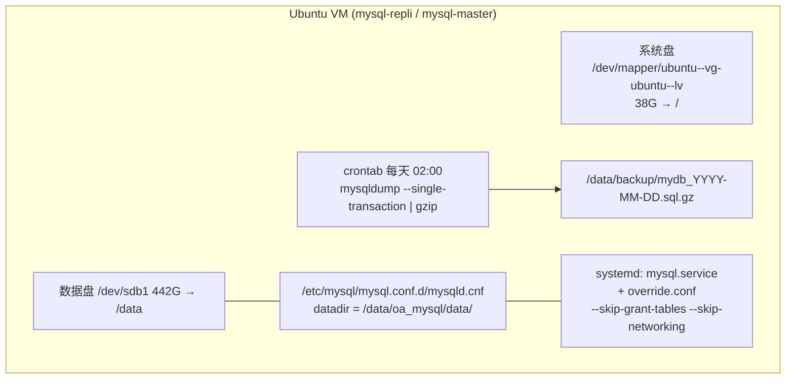

# MySQL 备份

## 架构图



## 摘要

- 汇总 mysqldump 常用 12 类备份命令：单库/多库/全库备份、备份并压缩、仅表结构/仅数据、单表备份、InnoDB 推荐热备参数、查看库大小、恢复、定时备份、MySQL 8.0 大库方案。
- InnoDB 生产环境推荐：`mysqldump --single-transaction --routines --triggers --events`，实现不锁表热备并包含存储过程、触发器和事件。
- 定时备份示例：crontab 每天 2 点执行 mysqldump + gzip 压缩，落盘 /data/backup/。
- 几十 GB 以上大库推荐改用 xtrabackup：速度更快、真正热备、支持增量备份、恢复速度更高。
- 实机记录（mysql-repli）：datadir 在 /data/oa_mysql/data/（/dev/sdb1 442G 数据盘，已用 31G）；systemd 存在 override.conf，以 `--skip-grant-tables --skip-networking` 启动（密码恢复用途，属临时状态）。

## 技术要点

1. 备份单库：`mysqldump -u root -p mydb > mydb.sql`；多库加 `--databases db1 db2 db3`；全库加 `--all-databases`。
2. 备份并压缩（推荐）：`mysqldump -u root -p mydb | gzip > mydb.sql.gz`；恢复用 `gunzip < mydb.sql.gz | mysql -u root -p mydb`。
3. 仅表结构 `--no-data`；仅数据 `--no-create-info`；单表 `mysqldump -u root -p mydb users > users.sql`。
4. InnoDB 热备参数：`--single-transaction`（热备份不锁表）、`--routines`（存储过程）、`--triggers`（触发器）、`--events`（事件）。
5. 查看数据库大小：查询 information_schema.tables，按 table_schema 汇总 data_length+index_length。
6. 恢复流程：先 `CREATE DATABASE mydb;` 再 `mysql -u root -p mydb < mydb.sql`。
7. 定时备份 crontab：`0 2 * * * mysqldump -u root -p'Password' --single-transaction mydb | gzip > /data/backup/mydb_$(date +\%F).sql.gz`。
8. MySQL 8.0 大型数据库（几十 GB 到上百 GB）推荐 xtrabackup 而非 mysqldump --single-transaction。
9. `systemctl cat mysql` 可查看 systemd 单元及 override 片段；`systemctl show -p FragmentPath mysql` 定位主配置文件路径。
10. 当前 mysql-repli 的 /etc/systemd/system/mysql.service.d/override.conf 将启动命令覆盖为 `mysqld --skip-grant-tables --skip-networking`，属于跳过授权表的维护模式，事后应移除。

## 原文内容

MySQL 常用备份命令如下。

## 1. 备份单个数据库

```bash
mysqldump -u root -p mydb > mydb.sql
```

执行后输入密码。

## 2. 备份多个数据库

```bash
mysqldump -u root -p --databases db1 db2 db3 > databases.sql
```

## 3. 备份所有数据库

```bash
mysqldump -u root -p --all-databases > all_databases.sql
```

## 4. 备份并压缩

推荐方式：

```bash
mysqldump -u root -p mydb | gzip > mydb.sql.gz
```

恢复时：

```bash
gunzip < mydb.sql.gz | mysql -u root -p mydb
```

## 5. 仅备份表结构

```bash
mysqldump -u root -p --no-data mydb > mydb_schema.sql
```

## 6. 仅备份数据

```bash
mysqldump -u root -p --no-create-info mydb > mydb_data.sql
```

## 7. 备份单个表

```bash
mysqldump -u root -p mydb users > users.sql
```

## 8. InnoDB 数据库推荐备份

生产环境常用：

```bash
mysqldump \
  -u root -p \
  --single-transaction \
  --routines \
  --triggers \
  --events \
  mydb > mydb.sql
```

参数说明：

```text
--single-transaction  热备份，不锁表(InnoDB)
--routines            存储过程
--triggers            触发器
--events              事件
```

## 9. 查看数据库大小

```sql
SELECT
  table_schema AS "Database",
  ROUND(SUM(data_length+index_length)/1024/1024,2) AS "Size(MB)"
FROM information_schema.tables
GROUP BY table_schema;
```

## 10. 恢复数据库

先创建数据库：

```sql
CREATE DATABASE mydb;
```

恢复：

```bash
mysql -u root -p mydb < mydb.sql
```

## 11. 定时备份示例

每天凌晨 2 点备份（crontab -e）：

```bash
0 2 * * * mysqldump -u root -p'Password' \
  --single-transaction \
  mydb | gzip > /data/backup/mydb_$(date +\%F).sql.gz
```

## 12. MySQL 8.0 大型数据库推荐

如果数据库已经几十 GB 或上百 GB，mysqldump --single-transaction 仍然可用，但更推荐：

```bash
xtrabackup
```

因为：

- 速度更快
- 真正热备
- 支持增量备份
- 恢复速度更高

如果你的服务器是 mysql-master（从你的提示符看是主库），我还可以根据数据库大小帮你推荐是用 mysqldump 还是 xtrabackup。

---

## 实机记录（mysql-repli）

```bash
systemctl cat mysql
root@mysql-repli:/var# grep datadir /etc/mysql/mysql.conf.d/mysqld.cnf
datadir = /data/oa_mysql/data/
```

```bash
root@mysql-repli:/var# df -h /data/oa_mysql/data/
Filesystem      Size  Used Avail Use% Mounted on
/dev/sdb1       442G   31G  390G   8% /data
```

```bash
df -h
Filesystem                         Size  Used Avail Use% Mounted on
tmpfs                              1.6G  976K  1.6G   1% /run
efivarfs                           128M   33K  128M   1% /sys/firmware/efi/efi_vars
/dev/mapper/ubuntu--vg-ubuntu--lv   38G  9.5G   27G  27% /
tmpfs                              7.9G     0  7.9G   0% /dev/shm
tmpfs                              5.0M     0  5.0M   0% /run/lock
/dev/sda2                          2.0G  201M  1.6G  11% /boot
/dev/sdb1                          442G   31G  390G   8% /data
/dev/sda1                          1.1G  6.2M  1.1G   1% /boot/efi
tmpfs                              1.6G   12K  1.6G   1% /run/user/1003
```

```bash
root@mysql-repli:/etc/mysql# systemctl cat mysql
# /usr/lib/systemd/system/mysql.service
# MySQL systemd service file
[Unit]
Description=MySQL Community Server
After=network.target
[Install]
WantedBy=multi-user.target
[Service]
Type=notify
User=mysql
Group=mysql
PermissionsStartOnly=true
ExecStartPre=/usr/share/mysql/mysql-systemd-start pre
ExecStart=/usr/sbin/mysqld
TimeoutSec=infinity
Restart=on-failure
RuntimeDirectory=mysqld
RuntimeDirectoryMode=755
LimitNOFILE=10000
# Set enviroment variable MYSQLD_PARENT_PID. This is required for restart.
Environment=MYSQLD_PARENT_PID=1
# /etc/systemd/system/mysql.service.d/override.conf
[Service]
ExecStart=
ExecStart=/usr/sbin/mysqld --skip-grant-tables --skip-networking
```

```bash
root@mysql-repli:/etc/mysql# cat /etc/systemd/system/mysql.service.d/override.conf
[Service]
ExecStart=
ExecStart=/usr/sbin/mysqld --skip-grant-tables --skip-networking
```

```bash
root@mysql-repli:/etc/mysql# systemctl show -p FragmentPath mysql
FragmentPath=/usr/lib/systemd/system/mysql.service
```

```bash
root@mysql-repli:/etc/systemd/system/mysql.service.d# cat *.conf
[Service]
ExecStart=
ExecStart=/usr/sbin/mysqld --skip-grant-tables --skip-networking
```
