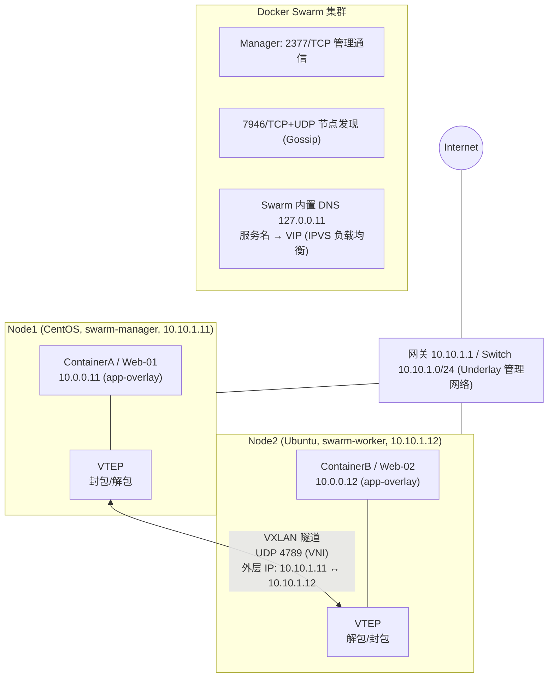

# 容器跨平台通讯的 OVERLAY 架构——VXLAN

## 架构图



## 摘要

- Overlay 网络解决"多台主机上的容器像在同一个二层网络一样通信"，适合微服务架构、Web 集群、中间件集群；不适合数据库高性能与大流量同步场景（存在封装开销）。
- 两台物理机部署实例：Node1 (CentOS, swarm-manager, 10.10.1.11) + Node2 (Ubuntu, swarm-worker, 10.10.1.12)，Overlay 网络 app-overlay 规划 10.0.0.0/24，Web-01 (10.0.0.11) 与 Web-02 (10.0.0.12) 跨机互通。
- 部署四步：`docker swarm init --advertise-addr 10.10.1.11` → Worker 用 token join → `docker network create -d overlay app-overlay` → `docker service create --name web --replicas 2 --network app-overlay nginx`。
- VXLAN 原理：将二层以太网帧封装在三层 UDP（目的端口 4789）中传输，VNI 用 24 位支持 1677 万隔离网络，突破 VLAN 4096 上限、隐藏虚拟 MAC、支持跨三层迁移。
- VTEP 靠映射表（Inner MAC/IP → Outer VTEP IP → VNI）寻址；映射表建立方式：数据平面 Flood & Learn、控制平面 MP-BGP EVPN、SDN/K8s 控制器下发、静态配置。
- 多 VXLAN 组网原则："同一 VXLAN 内靠二层交换，不同 VXLAN 之间靠三层路由"（分布式网关 / Symmetric IRB / EVPN / VNI Translation / Cilium ClusterMesh）。
- Swarm 对外发布三种方式：端口映射（Ingress Routing Mesh，任意节点 IP+端口经 IPVS 转发）、mode=host 直连、入口反向代理（生产标准做法，nginx.conf 用 `server web:80 resolve` 经 Swarm DNS 解析 VIP）。

## 技术要点

1. Swarm 关键端口：2377/TCP（集群管理 Control Plane）、7946/TCP+UDP（节点发现 Gossip）、4789/UDP（VXLAN 数据平面）；防火墙需用 firewall-cmd 逐一放通。
2. `docker swarm init --advertise-addr` 必须在多网卡主机上显式指定通告 IP，避免 Docker 无法确定集群通信地址而报错。
3. Swarm 三层抽象：Service（期望状态声明）→ Task（Manager 拆分的任务）→ Container（Worker 实际运行的容器副本）；提供声明式自愈、滚动更新、`--mode global`（类 DaemonSet）与 `--mode replicated`（默认副本模式）。
4. docker swarm init 只激活 Swarm 模式，不能切换 K8s/Nomad；K8s 需 kubeadm init 或 Docker Desktop 的 Enable Kubernetes。
5. VXLAN 封包流程：原始以太网帧 + VXLAN 报头（VNI）+ UDP 头（4789）+ 外层 IP 头（物理机 IP）；物理网络只按外层 IP 做普通 UDP 路由。
6. Swarm DNS：容器 /etc/resolv.conf 中 nameserver 127.0.0.11；`nslookup web` 返回 VIP，`nslookup tasks.web` 返回全部副本真实 IP；`docker service inspect --format '{{json .Endpoint.VirtualIPs}}' web` 查看 VIP。
7. 外部 DNS 转发：/etc/docker/daemon.json 配置 `"dns": ["8.8.8.8", "114.114.114.114"]` 后 systemctl restart docker。
8. Swarm 与 K8s 概念对应：Task/Container ↔ Pod、Service ↔ Deployment/StatefulSet、Manager ↔ Master、Overlay ↔ CNI 插件、Ingress Routing Mesh ↔ Ingress Controller、Docker Config/Secret ↔ ConfigMap/Secret。
9. K8s 部署要点（kubeadm）：所有节点关 swap、关防火墙/SELinux、加载 overlay + br_netfilter 模块并设置 bridge-nf-call-iptables=1、安装 containerd（SystemdCgroup=true）、kubeadm init --pod-network-cidr=10.244.0.0/16、部署 Calico、Worker 用 kubeadm join 加入、`kubectl get nodes` 全 Ready 即成功。
10. SSL/TLS 基础：SSL 是 TLS 前身，SSL2.0/3.0 与 TLS1.0/1.1 已废弃；三大作用（加密、认证、完整性）；证书分 DV/OV/EV；HTTPS 默认 443 端口并显示锁标志。

## 原文内容

下面给你一个比较典型的 Docker Overlay Network 跨物理机部署实例。这个案例是很多企业内部微服务、Web 集群、中间件集群的经典方案。

# 1. Overlay 适合什么业务

Overlay 网络主要解决：多台主机上的容器像在同一个二层网络一样通信。

适合：

## 场景1：微服务架构

例如：订单服务、用户服务、支付服务、库存服务部署在不同物理机（Node1: User-Service + Order-Service；Node2: Payment-Service + Inventory-Service），服务之间需要直接通信（Order -> Inventory、Order -> Payment），不希望关心机器 IP、容器 IP、迁移后 IP 变化。Overlay 最适合。

## 场景2：Web 集群

前端统一访问 web-service，Docker DNS 自动解析。

## 场景3：中间件集群

例如：Redis Cluster、Kafka、RabbitMQ、RocketMQ，节点分布 Node1/Node2/Node3，需要跨主机互联。

## 不适合

数据库高性能场景（Oracle、MySQL、PostgreSQL）、大流量数据同步。因为存在额外开销（Overlay ↓ VXLAN ↓ 封装解封装）。

# 2. 两台物理机跨平台部署

假设：物理机A：CentOS；物理机B：Ubuntu；Docker 版本一致。

## 服务器规划

### Node1

- 主机名：swarm-manager
- 管理IP：10.10.1.11

### Node2

- 主机名：swarm-worker
- 管理IP：10.10.1.12

## 部署架构

```text
                Docker Swarm
       ┌─────────────────────────┐
       │   Overlay Network       │
       │   app-overlay           │
       └─────────────────────────┘

   Node1(CentOS)            Node2(Ubuntu)
   10.10.1.11               10.10.1.12

   ┌───────────┐            ┌───────────┐
   │ Web-01    │            │ Web-02    │
   │ 10.0.0.11 │<=========> │ 10.0.0.12 │
   └───────────┘            └───────────┘

           VXLAN Tunnel
```

容器看起来像在同一个交换机下面（Web-01、Web-02 跨物理机互通），实际跨物理机。

# 3. 网络规划

## 物理网络

### 管理网络

- 用途：Swarm 管理、VXLAN 传输、节点通信
- 规划：10.10.1.0/24（Node1 10.10.1.11、Node2 10.10.1.12、Gateway 10.10.1.1）

## Overlay 网络

- 规划：10.0.0.0/24
- Docker 自动分配：Web-01 10.0.0.11、Web-02 10.0.0.12

# Overlay 网络架构图

```text
                Internet
                    │
                10.10.1.1
                    │
              ┌Switch┐
              │      │
    ┌─────────┘      └──────────┐
    │                           │
┌───────────────┐       ┌───────────────┐
│ Node1         │       │ Node2         │
│ 10.10.1.11    │       │ 10.10.1.12    │
│ Manager       │       │ Worker        │
└───────┬───────┘       └───────┬───────┘
        │ VXLAN UDP 4789         │
        │<======================>│
        │                       │
 ┌──────▼─────┐          ┌──────▼─────┐
 │ ContainerA │          │ ContainerB │
 │ 10.0.0.11  │          │ 10.0.0.12  │
 └────────────┘          └────────────┘
```

# 部署过程

## Step1 初始化 Swarm

Node1：

```bash
docker swarm init --advertise-addr 10.10.1.11
```

命令 `docker swarm init --advertise-addr 10.10.1.11` 用于初始化一个新的 Docker Swarm 集群，并将当前节点设置为该集群的管理节点（Manager Node）。

**各组成部分详解：**

- `docker swarm init`：初始化 Docker Swarm 集群模式。执行结果：将当前物理机/虚拟机转换为集群的第一个 Manager 节点；自动生成 Swarm 集群的安全证书（TLS/CA）；生成供其他节点加入集群的 Token（令牌）：包括 Worker 节点加入指令（docker swarm join --token ...）和 Manager 节点加入指令。
- `--advertise-addr 10.10.1.11`：指定当前 Manager 节点向 Swarm 集群中其他节点广播通告的 IP 地址及端口（默认端口为 2377）。为什么需要这个参数？如果宿主机存在多个网卡或 IP 地址（例如既有内网 IP 10.10.1.11，又有公网 IP 或 Docker 虚拟网卡 IP），Docker 无法确定应该用哪一个 IP 建立集群连接，此时会报错并要求手动指定。显式指定 10.10.1.11 可以确保集群中的其他 Worker 或 Manager 节点知道通过哪个 IP 地址来与当前 Manager 进行通信管理和控制平面交互。

**执行后发生的关键动作：**

- Overlay 网络支持：开启集群跨主机网络功能（底层也会用到类似 VXLAN 的隧道技术）。
- 端口监听：
  - 2377/TCP：集群管理通信（Control Plane）。
  - 7946/TCP&UDP：节点间节点发现与状态通信（Gossip 协议）。
  - 4789/UDP：Overlay 数据平面流量（VXLAN 隧道通信）。

**典型输出示例：**

```text
Swarm initialized: current node (abc123xyz...) is now a manager.
To add a worker to this swarm, run the following command:
    docker swarm join --token SWMTKN-1-xxxxxxxxxxxxxxxxxxxxxxx-yyyyyyyyyyyyyyyyyyyyyyy 10.10.1.11:2377
To add a manager to this swarm, run 'docker swarm join-token manager' and follow the instructions.
```

如果其他机器（如 10.10.1.12）想要作为 Worker 节点加入该集群，只需在另一台机器上运行输出中提示的 docker swarm join ... 命令即可。

## Step2 Worker 加入

Node2：

```bash
docker swarm join \
  --token SWMTKN-XXX \
  10.10.1.11:2377
```

查看：

```bash
docker node ls
```

结果：

```text
ID        HOSTNAME
xxxx      swarm-manager
yyyy      swarm-worker
```

## Step3 创建 Overlay

Manager 执行：

```bash
docker network create \
  -d overlay \
  --subnet 10.0.0.0/24 \
  app-overlay
```

查看：

```bash
docker network ls
```

得到：app-overlay / overlay

## Step4 部署业务

部署 Web 集群：

```bash
docker service create \
  --name web \
  --replicas 2 \
  --network app-overlay \
  nginx
```

查看：

```bash
docker service ps web
```

可能：web.1 -> Node1、web.2 -> Node2

在 Docker 的世界里，"Swarm 服务（Swarm Service）"是 Docker Swarm 集群管理的基本单位。如果说在单机 Docker 中，我们管理的核心是单个容器（Container）；那么在 Docker Swarm 集群中，我们管理的核心就是服务（Service）。简单来说，一个 Swarm 服务 = 镜像配置 + 运行策略（副本数、网络、端口等）+ 由 Swarm 自动维护的一组容器。

**1. "服务"与"普通容器"的核心区别：**

| 特性 | 单机容器 (docker run) | Swarm 服务 (docker service create) |
|------|----------------------|-----------------------------------|
| 运行范围 | 只能运行在当前单台机器上 | 自动调度并运行在整个 Swarm 集群的多个节点上 |
| 自愈能力 | 容器挂掉或物理机宕机，默认不会自动迁移 | 某个节点宕机或容器崩溃，集群会自动在其他可用节点重新拉起新容器 |
| 扩缩容 | 只能手动再启动一个新容器 | 执行一条命令（如 scale web=10）就能无缝平滑扩展容器数量 |
| 负载均衡 | 需要自己额外部署 Nginx 等反向代理 | Swarm 内置负载均衡（Ingress），自动将请求分发给底层多个副本 |

**2. Swarm 服务内部是怎么工作的？**

当执行 `docker service create --name web --replicas 2 nginx` 时，Swarm 内部会进行以下分层管理：

- Service（服务定义）：你提交的理想状态声明（"我要运行 2 个副本的 Nginx"）。
- Task（任务）：Swarm 管理节点（Manager）将你的服务拆分成 2 个独立的"任务"（Task）。每一个 Task 对应一个具体要运行的容器实例。
- Container（容器）：集群中的工作节点（Worker）接收到 Task 后，在本地拉取镜像并真正运行对应的 Docker 容器。

```text
[ Docker Service: web ]
│
├─► [ Task 1 ] ──► 在 Node 1 上运行 Container 1
│
└─► [ Task 2 ] ──► 在 Node 2 上运行 Container 2
```

**3. 为什么需要"服务"这种抽象？**

- 声明式管理（Desired State）：你只需要告诉 Swarm "我需要什么状态"（比如保持 5 个副本），之后不论出现网线被拔、节点宕机还是容器崩溃，Swarm 的 Control Plane 都会不断监控并自动调整，确保实际运行状态时刻符合你的声明。
- 滚动更新（Rolling Updates）：当你的业务要升级时，执行 docker service update，Swarm 会逐个替换旧容器，实现无中断服务更新（零停机时间）。

问：`docker swarm init --advertise-addr 10.10.1.11`，这个服务是默认 swarm 还是有其他形式的服务？

答：这个命令初始化的只有 Swarm 模式，并不支持其他（如 Kubernetes）调度模式。

1. 这是 Docker 原生专有的命令。docker swarm 是 Docker 内置的容器编排工具（Swarm Mode）。执行该命令时，Docker 引擎（dockerd）会自动切换或激活本地的集群管理逻辑，将当前节点变成一个 Swarm Manager。它无法通过这个命令直接启动或切换为 K8s、Nomad 等其他编排引擎。

2. Docker 中是否存在"其他形式的服务/集群"？

- Docker Compose（单机多容器服务）：命令 `docker compose up -d`。它不是集群管理工具，只能在单台物理机上管理多容器应用，不具备跨主机的自动自愈和调度能力。
- Kubernetes / k3s / minikube（云原生标准集群）：命令 `kubeadm init` 或 `minikube start`。如果你使用的是 Docker Desktop（桌面版），可以在设置中勾选 "Enable Kubernetes"，Docker Desktop 会在后台为你启动一个单节点的 K8s 集群。但这使用的是 K8s 控制平面，而不是 Swarm。
- Podman / Nomad 等其他工具：采用各自独立的 CLI 命令和控制平面进行组网与调度。

3. Swarm 模式下的服务模式（Service Modes）：

- Replicated 模式（副本模式，默认）：你指定运行多少个副本（如 --replicas 3），Swarm 会在集群中随机或按负载均衡挑选节点运行这 3 个容器。
- Global 模式（全局模式）：使用 --mode global 参数。Swarm 会在集群中的每一个可用节点上都强制运行且仅运行 1 个容器副本（类似于 K8s 中的 DaemonSet），常用于部署监控 Agent 或日志收集组件。

总结：docker swarm init 启动的就是标准的 Docker Swarm 模式。如果需要使用 K8s 等其他编排服务，需要借助专门的 K8s 初始化工具或 Docker Desktop 的 Kubernetes 功能。

`docker service create --name web --replicas 2 --network app-overlay nginx` 这段命令用于在 Docker Swarm 集群中创建一个名为 web 的容器服务，并指定了副本数、连接的 Overlay 网络和使用的镜像。逐行参数解析：

- 第 1 行 `docker service create \`：创建并运行一个新的 Swarm 服务（Service）。与传统的 docker run 不同，service create 是针对 Swarm 集群的，Docker 会自动在集群的合适节点上部署和管理容器任务。
- 第 2 行 `--name web \`：为这个服务指定名称为 web。在 Swarm 集群内部，其他容器可以直接通过 http://web 这个服务名（域名）对其进行访问，Swarm 会自动进行内部负载均衡。
- 第 3 行 `--replicas 2 \`：设置服务运行的副本数量为 2。Swarm 集群会在可用节点上自动启动 2 个相同的 Nginx 容器（Tasks）。如果其中某个容器挂掉或某个节点宕机，Swarm 会自动在其他节点上重新拉起一个新的副本，始终保持 2 个副本在线。
- 第 4 行 `--network app-overlay \`：将该服务连接到名为 app-overlay 的集群跨主机网络（Overlay Network）。前提条件：该网络必须提前创建（例如通过 docker network create --driver overlay app-overlay）。底层技术：属于同一个 Overlay 网络的容器即使跨物理节点（跨 Swarm 节点），也可以通过 VXLAN 隧道直接进行通信。
- 第 5 行 `nginx`：指定用于创建容器的基础镜像（Image）。节点会自动从 Docker Hub 拉取最新版（latest）的 official Nginx 镜像。

执行后的效果：Swarm Manager 会将服务分发给 Swarm 集群的节点；集群中将生成并运行 2 个 nginx 容器副本；这 2 个副本都挂载在 app-overlay 网络上，能够与该网络内的其他 Swarm 服务进行安全的二层互通。

# 容器通信过程

例如 ContainerA (10.0.0.11) 访问 10.0.0.12，流程：

```text
ContainerA
     │
     ▼
Overlay Driver
     │
VXLAN 封装
     │
UDP 4789
     │
10.10.1.11
     │
────网络────
     │
10.10.1.12
     │
VXLAN 解封装
     │
ContainerB
```

# Overlay 关键端口

需要放通：

```text
TCP 2377      Swarm 集群管理
TCP/UDP 7946  节点发现
UDP 4789      VXLAN
```

如果有防火墙：

```bash
firewall-cmd --permanent --add-port=2377/tcp
firewall-cmd --permanent --add-port=7946/tcp
firewall-cmd --permanent --add-port=7946/udp
firewall-cmd --permanent --add-port=4789/udp
firewall-cmd --reload
```

# 企业生产架构

实际生产一般是多个 Manager（Manager01/02/03）+ 多个 Worker（Worker01~05）。

Overlay 分层组网：

```text
frontend-overlay (10.0.1.0/24)
   Web1 ─── Web2 ─── Web3

backend-overlay (10.0.2.0/24)
   API1 ─── API2 ─── API3

middleware-overlay (10.0.3.0/24)
   Redis ─── MQ ─── ES
```

这样无论容器调度到哪台物理机，业务始终通过 Overlay 网络和服务名访问，底层由 VXLAN 自动完成跨主机通信。

# VXLAN 的相关技术

VXLAN（虚拟扩展局域网，Virtual Extensible LAN）是一种网络虚拟化技术。它的核心作用是将传统的二层（Layer 2）以太网数据包封装在三层（Layer 3）UDP 数据包中进行传输，从而在已有的三层网络之上构建出一个大范围的虚拟二层网络。

## 一、为什么需要 VXLAN？（解决三大痛点）

1. **突破 VLAN 数量限制（规模问题）**：传统 VLAN 采用 12 位的 VLAN ID，最多只支持 4,096 个网络隔离区域，对于大型云计算和多租户数据中心远远不够。VXLAN 采用 24 位的 VNI（VXLAN Network Identifier），可支持高达 1,677 万个隔离网络。
2. **解决物理网络 MAC 地址表溢出（硬件压力）**：在云计算环境下，一台物理机可能运行上百个虚拟机/容器，导致网络设备的 MAC 地址表迅速爆满。VXLAN 将虚拟机的 MAC 地址"隐蔽"在物理主机的 IP 后面，中间的三层路由器只需记录物理主机的 IP 地址，大幅减轻物理交换机的负担。
3. **实现虚拟机/容器跨三层大范围迁移（漫游问题）**：业务迁移通常要求虚拟机的 IP 地址保持不变。传统二层网络无法跨越路由器；而 VXLAN 通过隧道技术（Overlay），让虚拟机即使跨越了不同的三层物理网段（Underlay），依然感觉自己处在同一个二层局域网内。

## 二、核心概念：Underlay 与 Overlay

- **Underlay（底层网络）**：传统的物理网络，由实际的交换机、路由器组成，负责通过标准的 IP 路由协议（如 OSPF、BGP）快速转发 UDP 数据包。
- **Overlay（叠加网络）**：建立在 Underlay 之上的虚拟网络（即 VXLAN 网络），业务容器/虚拟机只在此网络中通信，感知不到底层物理路由器的存在。
- **VTEP（VXLAN 隧道终结点）**：负责 VXLAN 封包与解包的边缘设备，可以是物理交换机，也可以是服务器上的虚拟交换机（如 Open vSwitch、K8s 的 Flannel/Calico 插件）。

## 三、工作原理简述（打包与拆包）

假设容器 A（IP_A）想给容器 B（IP_B）发消息，但它们分布在不同的物理主机上：

- **封包（Ingress）**：容器 A 发出原始以太网帧。源主机上的 VTEP 拦截到该帧，在其外面依次加上：VXLAN 报头（包含 VNI）→ UDP 报头（目的端口 4789）→ 外层 IP 报头（源/目物理机 IP）。
- **传输**：数据包变成了一个普通的 UDP 数据包，底层物理路由器根据外层 IP 将其顺利路由到目标物理机。
- **解包（Egress）**：目标物理机的 VTEP 收到 UDP 数据包后，识别出端口 4789，剥离外层 IP、UDP 和 VXLAN 报头，提取出原始以太网帧，最后交付给容器 B。

VXLAN 解决这个问题的关键，在于外层 UDP 报文头的"特定端口号"以及 VTEP（VXLAN 隧道终结点）维护的映射表。外部的物理网络和路由器完全不需要理解内部的容器/虚机 IP，它们只负责将标准的 UDP 报文送达正确的物理主机（VTEP）。

**1. 外部网络如何知道这是 VXLAN 包？**

外部物理网络（交换机、路由器）并不需要检查内部的原始数据包，它们只看最外层的报文头。固定端口号（UDP Port 4789）：当源主机的 VTEP 对原始容器数据包进行封装时，会在最外层加上一个标准的 UDP 头部，并将目的端口号固定设置为 4789（IANA 规定的 VXLAN 标准端口）。物理网络的视脚：物理网络中的路由器和交换机看到这个数据包时，只认为它是一个普通的、发往目标物理机 IP 的 UDP 流量，因此沿着常规的 Layer 3 路由（Underlay 网络）进行转发即可。

**2. 外部 IP 如何知道转发给哪台目标主机？**

当容器 A 要发数据给容器 B 时，源主机的 VTEP 需要知道"容器 B 的 IP/MAC 对应哪台物理主机的 IP"。这一步通过隧道映射表（VTEP Table / Forwarding Table）来完成：

```text
Inner MAC (容器MAC) / Inner IP  --->  Outer IP (目标物理机VTEP IP)  --->  VNI (虚拟网络ID)
```

寻址与转发的全过程：

1. 查找映射关系：源主机上的 VTEP 拦截到容器 A 发出的数据包后，检查目的容器 B 的 IP/MAC，并在自己的映射表中查找。查到容器 B 运行在"物理主机 B（IP: 192.168.1.50）"上。
2. 添加外层封装（Outer Header）：
   - 外层源 IP：源物理机 A 的 IP（192.168.1.20）
   - 外层目的 IP：目标物理机 B 的 IP（192.168.1.50）
   - 外层 UDP 端口：4789
   - VXLAN Header：插入对应的 VNI（如 100），用于标识属于哪个容器网络。
3. 物理网卡发送：封装完成后，数据包通过源物理机的网卡发出。底层物理路由器根据外层目的 IP（192.168.1.50）将其路由转发到目标物理机 B。
4. 解封与交付：数据包到达物理机 B 后，物理机 B 的内核或虚拟交换机检查到 UDP 目的端口是 4789，就知道这是一个 VXLAN 包。接着：剥离外层 IP Header 和 UDP Header；读取 VXLAN Header 中的 VNI，确认属于哪个虚拟网络；剥离 VXLAN Header，取出原始数据包；根据原始数据包的目的 MAC/IP，将其交付给目标容器 B。

**3. 如果映射表中没有目标容器的 IP/MAC 怎么办？**

如果源 VTEP 还不知道目标容器在哪台物理机上，主要通过以下两种机制解决：

- 数据平面"泛洪与学习"（Flood and Learn）：源 VTEP 将数据包通过物理网络的组播（Multicast）发送给同域的所有 VTEP。目标容器所在的物理机响应后，源 VTEP 就会记录下"该容器 MAC/IP 对应那台物理机 IP"的映射关系，后续请求转为单播。
- 控制平面学习（EVPN / Overlay 控制器）：在 Kubernetes（如 Calico/Flannel 的 VXLAN 模式）或 Enterprise SD-WAN 中，通常有集中式的控制器（或基于 BGP EVPN 协议）。当容器 B 被创建时，管理平面会自动将"容器 B IP <-> 物理机 B IP"的对应关系直接下发更新到所有物理主机的 VTEP 映射表中，无需进行组播广播。

## 隧道映射表（VTEP Table / Forwarding Table）是如何建立的

VTEP 的隧道映射表（即 MAC/IP 到 Outer VTEP IP 的映射关系）建立方式主要分为两大类：数据平面自动学习（动态学习）和控制平面同步（静态配置/协议分发）。

**一、数据平面学习：Flood and Learn（泛洪与学习）**

这是最基础的动态建立机制，类似于传统以太网交换机通过监听数据包学习 MAC 地址的方式。核心流程（以广播/未知单播/组播 BUM 流量为例）：

1. 初始状态：主机 A（物理机 A 上的 VTEP A）想给主机 B 发包，但 VTEP A 的表中没有主机 B 的 MAC/IP 记录。
2. 泛洪（Flood）：VTEP A 将原始 ARP 请求帧加上 VXLAN 封装，通过底层物理网络的组播组（Multicast Group）或头端复制（Head-End Replication）发给同个 VNI 内的所有其他 VTEP。
3. 反向学习（Learn）：其他 VTEP 收到该数据包后，剥离外层头，并记录一条反向条目。
4. 单播响应：主机 B 收到 ARP 请求后做出单播响应，VTEP B 截获该响应。此时 VTEP B 已经学习到了 VTEP A 的 IP，于是直接封装成单播包发回 VTEP A。
5. 双向建立完成：VTEP A 收到响应包，学习到了主机 B 的映射关系。

缺点：会产生大量的网络广播/泛洪流量，在大规模数据中心中扩展性较差。

**二、控制平面学习：MP-BGP EVPN（主流企业级方案）**

在大型数据中心和 SD-WAN 中，采用 EVPN（Ethernet VPN）作为控制平面协议，通过 BGP 报文主动通告和同步映射表，无需物理组播或泛洪。核心流程：

1. 本地感知：当主机 B（或容器）上线并获取到 IP/MAC 时，连接它的 VTEP B（如 TOR 交换机）会在本地 ARP/ND 表中感知到主机 B。
2. BGP 通告：VTEP B 生成一条 EVPN Type-2 路由（MAC/IP Advertisement Route），通过 BGP 发送给网络中的其他 VTEP 或 Route Reflector（RR）。
3. 路由携带内容：主机 B 的 MAC、主机 B 的 IP、VNI、VTEP B 的 Outer IP。
4. 更新映射表：VTEP A 收到 BGP 路由更新后，直接在控制平面将该条目写入自己的 VXLAN 转发表中。
5. 即插即用：当主机 A 想要访问主机 B 时，VTEP A 查表即可直接进行单播封装，全程不需要发送任何广播泛洪数据包。

**三、云原生/容器环境：SDN 控制器与 Orchestrator 分发**

在 Kubernetes（如 Flannel VXLAN 模式、Calico）或 OpenStack/VMware NSX 等环境中，通常由集中式的 SDN 控制器统一下发表项：

1. 节点调度感知：当 Kubernetes 的 API Server 将一个新的 Pod（容器 B）调度并创建在 Node B（物理机 B）上时，Pod 的 IP 和 MAC 已经确定。
2. 网络 Agent 抓取：Node B 上的网络 Agent（如 flanneld）向 API Server 注册该 Pod 的信息：Pod B IP <-> Node B IP。
3. 全局下发：所有其他节点（Node A）上的 Agent 监听到 API Server 的配置变化，直接调用 Linux 内核接口（如 bridge / ip neighbor 命令），将新的映射规则写入 Node A 内核的 VTEP 映射表（FDB Table）中。

**四、静态配置（Manual Configuration）**

原理：由网络管理员手动在每台 VTEP 设备上静态配置每一条映射关系：

```text
vxlan 100 mac aa:bb:cc:dd:ee:ff remote-ip 192.168.1.50
```

适用场景：仅适用于设备极少、拓扑极为固定且不常变更的实验测试环境，生产环境中基本不使用。

**总结对比：**

| 建立方式 | 触发机制 | 流量开销 | 适用场景 |
|----------|----------|----------|----------|
| 数据平面 (Flood & Learn) | 首次数据包传输时按需学习 | 较高（依赖组播/泛洪） | 小型网络、早期 VXLAN 部署 |
| 控制平面 (MP-BGP EVPN) | 节点/VM/容器上线时主动通告 | 极低（仅协议控制报文） | 现代大型数据中心、硬交换机 |
| SDN / K8s 控制器 | 资源调度创建时由 API 集中下发 | 极低（集中式下发） | Kubernetes 容器网络、公有云 |

## 一个组网中有多个 VXLAN 该如何解决

在一个复杂的组网环境（如大型数据中心、公有云或多租户网络）中，存在多个 VXLAN（即多个 VNI）是非常普遍的现象。解决多 VXLAN 组网的核心思想是："同一个 VXLAN 内靠二层交换，不同 VXLAN 之间靠三层路由"，结合控制平面实现高效的管理与协同。

1. **跨 VXLAN（不同 VNI）通信：VXLAN 路由（Routing）**：如果属于不同 VXLAN（例如 VNI 100 和 VNI 200）的容器/虚拟机需要互相通信，必须通过分布式网关（Distributed Gateway）或集中式网关（Centralized Gateway）实现三层路由转发：
   - 分布式网关（推荐/主流）：在每台物理主机（VTEP）上都部署虚拟路由器（或通过交换机硬件配置）。同一个物理机上的不同 VXLAN 流量在本地直接进行三层路由和换标签，无需经过集中式路由器折返。优势：消除流量瓶颈，提供最佳的网络延迟和扩展性。
   - Symmetric IRB（对称操作路由）：在 MP-BGP EVPN 中，跨 VNI 传输时，源 VTEP 将包路由到全局唯一的 L3VNI（路由 VNI），传输到目标 VTEP 后，目标 VTEP 再将其路由到对应的目标 L2VNI。这种方式能极大节省 VTEP 的 MAC/IP 转发表空间。
2. **控制平面标准化：MP-BGP EVPN**：当网络中有数百甚至数万个 VXLAN（VNI）时，靠传统"数据平面泛洪学习（Flood and Learn）"会导致广播风暴严重，映射关系极难维护。解决方案：引入 MP-BGP EVPN 作为全局统一控制平面。机制：利用 BGP 报文在各 VTEP 之间动态分发所有 VNI 的 MAC/IP 路由；配合 Route Target (RT) 和 Route Distinguisher (RD) 属性，精确控制哪些 VNI 可以相互通信，哪些必须物理/逻辑隔离。
3. **跨数据中心/跨站点连接：VXLAN 隧道拼接（VXLAN Gateway / DCI）**：当存在多个独立的数据中心或公有云区域，且每个数据中心内都有各自的 VXLAN 网络时：核心问题：物理 Underlay 网络无法直接把二层组播或单播扩展到广域网（WAN）。解决方案（VXLAN Gateway / Seamless EVPN）：数据中心边界交换机（Border Gateway, BGW）：在数据中心出口部署专门的 BGW 交换机。隧道拼接（Hand-off）：内部 VTEP 与 BGW 建立内部 VXLAN 隧道，BGW 之间再建立跨数据中心的 DCI（Data Center Interconnect）VXLAN 隧道。内部 VNI 在 BGW 处进行映射或重标记后通过广域网传输。
4. **VNI 冲突与重叠：VNI 转换（VNI Translation / Mapping）**：如果两个收购合并的企业网络、或不同的云租户使用了相同的 VNI 编号（如双方都用了 VNI 100），但它们代表不同的业务或重叠的 IP 地址段：解决方案：在边界 VTEP / 交换机上配置 VNI Translation（类似 IP 的 NAT 映射）。机制：数据包从站点 A 进入边界时，边界设备将 VNI 100 替换为全局唯一的 VNI 9000 进行中转，到达站点 B 边界时再转换回站点 B 内部的 VNI。
5. **云原生/K8s 容器环境：K8s 网络插件（CNI）与 Overlay 管理**：在 Kubernetes 集群中，经常会出现每个集群自己有一套 VXLAN overlay 的情况：
   - 单集群内多 VXLAN/多租户：使用 Cilium 或 Calico 的 NetworkPolicy 配合 BGP/EVPN 实现容器间跨 VNI 的网络隔离与策略路由。
   - 多集群 Pod 互通（Multi-Cluster）：利用 Submariner、Cilium ClusterMesh 或 Flannel Multi-Cluster 机制，在集群的网关节点（Gateway Node）建立安全的 VXLAN / IPsec 隧道，将不同集群的 VNI 逻辑打通。

**总结选型建议：**

| 场景需求 | 最佳解决方案 |
|----------|-------------|
| 同一数据中心内，不同 VNI 间通信 | 分布式网关（Distributed Gateway）+ Symmetric IRB |
| 大型网络，需要动态管理上千个 VNI | MP-BGP EVPN 协议 |
| 跨数据中心 / 跨云环境互联 | Border Gateway（BGW）隧道拼接 / DCI |
| 不同网络间 VNI 编号冲突 | VNI 转换（VNI Translation） |
| Kubernetes 多集群容器互联 | Cilium ClusterMesh / Submariner |

# 外部访问集群服务的方式

## 1. Swarm 如何部署 3 个副本？

当你将副本数设置为 3（如 --replicas 3）时，Docker Swarm 会通过其内部的调度器（Scheduler）按照以下逻辑自动分配部署：

- 跨节点平衡分布（Spread Strategy）：Swarm 调度器默认采用平均分散策略。假设你有 3 个物理节点（Node A、Node B、Node C）：Swarm 会优先给每个节点分配 1 个容器副本（Task 1 → Node A，Task 2 → Node B，Task 3 → Node C）。如果只有 2 个节点，它会分配为（2 个在 Node A，1 个在 Node B）。
- 自动故障转移与自愈（Failover）：如果其中某个节点（如 Node B）宕机，Swarm 会立刻感知到，并在剩余的健康节点（Node A 或 Node C）上自动重新创建一个新副本，始终维持全局副本数为 3。
- 节点约束与标签（Node Constraints）：你还可以通过 --constraint 标签人工干预部署（例如指定"只部署在标签为 node.role==worker 的节点上"或"只部署在有 SSD 硬盘的节点上"）。

## 2. 外部如何访问这些 Swarm 服务？

内部通过 http://web（基于 DNS 和 Overlay 网络）可以实现容器间互通。如果想要从 Swarm 集群外部（比如用户电脑浏览器或公网）访问，主要有以下 3 种常见方式：

**方式一：端口映射（Ingress 网关模式，最常用）**

```bash
docker service create \
  --name web \
  --replicas 3 \
  --publish published=8080,target=80 \
  --network app-overlay \
  nginx
```

工作原理（Ingress Routing Mesh）：这里的 8080 是宿主机对外暴露的端口，80 是 Nginx 容器内部的端口。Swarm 启动了内置的 Mesh 网关（Mesh Network）。此时，访问集群中任意一台节点的 IP + 8080 端口（比如 http://<任意节点IP>:8080），都能成功访问服务。即使被访问的那台节点上正好没有运行 Nginx 副本，Swarm 内置的 IPVS 也会自动把请求转发给真正运行了副本的节点，并自动在 3 个副本之间做负载均衡。

**方式二：使用 NodePort 直连模式（Host 模式）**

```bash
docker service create \
  --name web \
  --replicas 3 \
  --publish published=8080,target=80,mode=host \
  nginx
```

特点：只有真正运行了该容器副本的节点，其 8080 端口才能被访问。由于绕过了 Swarm 的 Ingress 虚拟层，网络性能会略高一点，但失去了全局任意 IP 访问和内置负载均衡能力。

**方式三：结合外部/入口反向代理（生产环境标准做法）**

在实际生产环境中，我们通常不会把 8080 这种带有非标准端口的服务直接暴露给用户，而是结合反向代理（如 Traefik、Nginx 或 HAProxy）：

- 在 Swarm 中部署一个反向代理服务（如 Traefik 或 Nginx ingress），让它监听物理机的 80 和 443 标准 HTTP/HTTPS 端口。
- 外部所有域名请求（如 http://example.com）统一打到这个反向代理上。
- 反向代理挂载在 app-overlay 网络中，在集群内部直接通过 http://web:80（内部服务名）将流量分发给 web 服务。

---

在 Docker Swarm 生产环境中，通过外部/入口反向代理（如 Nginx）暴露服务的标准部署架构、部署流程与关键技术，以及完整的配置文件如下：

流量走向：

1. 外部用户访问 http://example.com。
2. 流量到达充当 Ingress 网关的 Nginx 容器。
3. Nginx 借助 Swarm 内置的 DNS 和 Overlay 网络（app-overlay），通过内部服务名 web 将流量代理给后端的 3 个容器副本，并做内部负载均衡。

## 二、部署过程与关键技术

关键技术点：

- **Overlay 网络**：创建跨主机的 Overlay 网络，将入口 Nginx 与后端业务服务隔离开，后端容器无需向外暴露任何端口。
- **配置挂载（Docker Config）**：将 Nginx 的 nginx.conf 配置文件制作成 Swarm 动态配置对象（Config），无需重新构建镜像即可更新配置。
- **Swarm 内置 DNS (VIP)**：在 app-overlay 网络中，域名 web 会直接解析为 Swarm 分配的虚拟 IP（VIP），集群内置的 IPVS 会自动在后端的 3 个副本间进行 L4 负载均衡。

部署步骤：

步骤 1：创建集群 Overlay 网络

```bash
docker network create --driver overlay app-overlay
```

步骤 2：部署后端业务服务 (web)——部署 3 个副本，仅加入 app-overlay 网络，不向宿主机映射任何端口（对外完全隐藏）：

```bash
docker service create \
  --name web \
  --replicas 3 \
  --network app-overlay \
  nginx:alpine
```

步骤 3：创建 Nginx 反向代理配置并导入 Swarm Config——准备本地文件 nginx.conf（具体内容见下一节），然后将其导入 Swarm：

```bash
docker config create nginx_config_v1 nginx.conf
```

步骤 4：部署入口 Nginx 服务——将 Nginx 部署到集群，并将其端口暴露在宿主机的 80 端口上：

```bash
docker service create \
  --name ingress-proxy \
  --replicas 2 \
  --publish published=80,target=80 \
  --network app-overlay \
  --config source=nginx_config_v1,target=/etc/nginx/conf.d/default.conf \
  nginx:alpine
```

## 三、Nginx 与容器的代理配置实例

### 1. nginx.conf 标准配置文件

```nginx
# 内部 upstream 定义
upstream backend_web {
    # 'web' 是后端 Swarm 服务的名字
    # Swarm 内置 DNS 会将 'web' 解析为集群虚拟 IP，并自动在各副本间做负载均衡
    server web:80 resolve;
    # 开启长连接以提高性能
    keepalive 32;
}

server {
    listen 80;
    server_name example.com;    # 替换为你的真实域名或 IP
    # 客户端最大请求体限制
    client_max_body_size 50M;

    location / {
        # 将流量代理至 upstream 定义的服务名
        proxy_pass http://backend_web;
        # 关键请求头设置：传递真实客户端信息
        proxy_set_header Host $host;
        proxy_set_header X-Real-IP $remote_addr;
        proxy_set_header X-Forwarded-For $proxy_add_x_forwarded_for;
        proxy_set_header X-Forwarded-Proto $scheme;
        # HTTP/1.1 长连接支持
        proxy_http_version 1.1;
        proxy_set_header Connection "";
        # 超时设置
        proxy_connect_timeout 60s;
        proxy_read_timeout 60s;
        proxy_send_timeout 60s;
    }
    # 健康检查或错误页面配置（可选）
    error_page 500 502 503 504 /5x.html;
    location = /5x.html {
        root /usr/share/nginx/html;
    }
}
```

### 2. 配置的三个核心细节解析

- **服务名直连 (server web:80)**：Nginx 内部无需填写具体的容器 IP，直接写 Swarm 的服务名 web 即可。Docker Swarm 的 DNS 服务会自动将其解析并路由。
- **正确透传客户端 IP**：必须设置 proxy_set_header X-Real-IP $remote_addr，否则后端业务容器记录日志时，获取到的 IP 都会是 Nginx 容器的内部 IP，而非真实访问用户的 IP。
- **零停机更新配置**：如果后续修改了 nginx.conf，无需删除服务，直接更新 Config 即可完成平滑滚动升级：

```bash
docker config create nginx_config_v2 new_nginx.conf
docker service update \
  --config-rm nginx_config_v1 \
  --config-add source=nginx_config_v2,target=/etc/nginx/conf.d/default.conf \
  ingress-proxy
```

# 集群自带 DNS 的信息

在 Docker Swarm 中，Swarm DNS（内部内置 DNS 服务）是 Swarm 集群实现服务发现（Service Discovery）和内部负载均衡（Load Balancing）的核心机制。

## 一、Swarm 的 DNS 是什么意思？

简单来说，Swarm DNS 就是一个内置在每一个 Swarm 节点 Docker 引擎（dockerd）内部的轻量级 DNS 服务器。它的核心作用有以下三点：

1. **服务名称解析（内部域名服务）**：在同一个 Overlay 网络中的容器，不需要记彼此的容器 IP 地址，只需直接使用服务名称（Service Name）进行通信。示例：部署了一个名为 web 的服务，其他容器访问 http://web 时，Swarm DNS 会自动解析出对应服务的 IP。
2. **自动负载均衡（Virtual IP / VIP）**：默认情况下，当 DNS 将服务名（如 web）解析为一个 IP 时，它返回的是一个集群虚拟 IP（Virtual IP，简称 VIP）。流量打到这个 VIP 后，Linux 内核的 IPVS 模块会自动把请求均匀分发给底层具体的 3 个（或多个）容器副本。
3. **直接解析具体副本（DNSRR / DNS Round Robin）**：如果服务配置为 --endpoint-mode dnsrr 模式，Swarm DNS 会绕过 VIP，直接将所有后端容器的真实 IP 列表通过轮询（Round Robin）方式返回给客户端。

## 二、在哪里能够看到 Swarm DNS 的配置与信息？

Swarm DNS 是 Docker 引擎原生内置且开箱即用的，它不需要也不提供独立的类似配置文件（如 dns.conf），但你可以通过以下方式查看它的运行机制、网络配置以及解析结果：

### 1. 在容器内部查看 DNS 服务器 IP 和解析文件

```bash
# 1. 查看容器内的 DNS 配置
cat /etc/resolv.conf
```

输出示例：

```text
nameserver 127.0.0.11
options ndots:0
```

解析：127.0.0.11 是 Docker 为每个容器绑定的本地嵌入式 DNS 监听地址。容器发出的所有 DNS 请求都会先经过这个地址，由 Docker 内部 DNS 拦截并处理。

### 2. 在容器内部测试/查看具体的服务域名解析结果

查看服务的虚拟 IP（VIP）：

```bash
nslookup web
```

输出：

```text
Name:      web
Address 1: 10.0.1.2    # 这是 Swarm 为 web 服务分配的 VIP (Virtual IP)
```

查看底层所有副本容器的真实 IP 地址（特殊域名解析）：Docker 提供了一个特殊的系统域名格式 tasks.<服务名>，可以用来查看所有副本的真实 IP 列表：

```bash
nslookup tasks.web
```

输出：

```text
Name:      tasks.web
Address 1: 10.0.1.3    # 副本容器 1 的真实 IP
Address 2: 10.0.1.4    # 副本容器 2 的真实 IP
Address 3: 10.0.1.5    # 副本容器 3 的真实 IP
```

### 3. 在 Swarm 管理节点查看服务的虚拟 IP（VIP）

```bash
docker service inspect --format '{{json .Endpoint.VirtualIPs}}' web
```

输出：

```json
[{"NetworkID":"x987abcdef...","Addr":"10.0.1.2/24"}]
```

### 4. 配置外部上游 DNS（Forwarding）

如果容器访问外部互联网（如 google.com），Swarm DNS 自己无法解析时，会自动转发给宿主机的 DNS 或自定义的外部 DNS。如果你想修改容器默认的外部 DNS 解析服务器，可以在宿主机的 /etc/docker/daemon.json 中配置：

```json
{
  "dns": ["8.8.8.8", "114.114.114.114"]
}
```

修改后重启 Docker 引擎（systemctl restart docker），Swarm DNS 在处理外部域名时就会优先调用配置的 8.8.8.8。

# docker service create 创建的 swarm 集群是一种容器集群吗，与 K8s 的集群关系

是的，docker service create 创建和管理的 Swarm 集群是标准的容器集群。

## 一、Swarm 集群与 Kubernetes (K8s) 的关系

Docker Swarm 和 Kubernetes 是容器编排领域的两个竞争/替代产品（尽管 K8s 目前已成为事实上的行业标准）。它们本质上都在解决同一个问题：如何将多台物理机/虚拟机组合成一个整体，自动分发、调度、扩缩容和管理成百上千个容器。

### 1. 核心概念对应表

| 概念/功能 | Docker Swarm | Kubernetes (K8s) |
|-----------|--------------|------------------|
| 集群最小部署单元 | Task / Container（基于 Service 定义） | Pod（一个 Pod 内可包含一个或多个容器） |
| 应用抽象定义 | Service (docker service create) | Deployment / StatefulSet |
| 集群控制节点 | Manager Node | Master / Control Plane Node |
| 集群工作节点 | Worker Node | Worker / Node |
| 网络隔离与跨主机 | Overlay Network (VXLAN) | CNI 插件 (Calico, Cilium, Flannel 等) |
| 入口流量与负载均衡 | Ingress Routing Mesh / Ingress Service | Ingress Controller / Service (NodePort/LoadBalancer) |
| 配置与密钥管理 | Docker Config / Docker Secret | ConfigMap / Secret |

### 2. Docker Swarm vs. Kubernetes 深度对比

**1. 架构复杂度与上手门槛**

- Docker Swarm（开箱即用，轻量级）：原生内置于 Docker Engine 中，不需要额外安装庞大的组件。使用 CLI 命令格式与普通的 docker run 极度相似，几乎零学习成本。非常适合中小型企业、轻量级业务场景、个人项目或团队技术栈以 Docker 为主的阶段。
- Kubernetes（功能强悍，复杂度高）：架构非常庞大（包含 kube-apiserver, etcd, kube-scheduler, kube-controller-manager, kubelet, kube-proxy 等众多独立组件）。学习曲线陡峭，对运维要求极高。适合大型企业、复杂微服务架构、多租户及高并发场景。

**2. 生态与扩展能力**

- Docker Swarm：生态相对单一，功能比较固定，扩展性有限。例如在大规模存储挂载、复杂 CI/CD 流水线集成、自定义资源定义（CRD）等方面不如 K8s 灵活。
- Kubernetes：拥有庞大的 CNCF 云原生生态系统（如 Helm 包管理、Prometheus 监控、Istio 服务网格、ArgoCD 持续交付等），支持极其丰富的插件和自定义扩充。

**3. 调度与自动化策略**

- Docker Swarm：调度机制相对简单直接（支持副本数控制、节点约束标签和全局模式等）。
- Kubernetes：拥有业界最强大的调度系统（支持节点亲和性/反亲和性 Affinity、污点与容忍 Taints/Tolerations、Pod 自动水平扩缩容 HPA、基于 CPU/内存/自定义指标的自动弹性伸缩等）。

### 总结选型建议

什么时候选 Swarm？

- 团队刚接触容器编排，没有专门的 K8s 运维人员。
- 业务规模较小（服务器节点在数十台以内），追求极致的部署速度和简单维护。

什么时候选 K8s？

- 业务体量大、微服务极其复杂，对自动化运维（弹性伸缩、灰度发布、复杂网络策略）要求极高。
- 需要使用公有云提供的托管集群服务（如 AWS EKS、阿里云 ACK、腾讯云 TKE 等）。

# 不使用 Swarm 而部署 K8S —— linux 部署 k8s

在 Linux 系统上部署 Kubernetes（K8s）集群，最推荐且标准的生产级工具是 kubeadm。以下是使用 kubeadm 在 Ubuntu/Debian 或 CentOS/RHEL 系统上部署单 Master + 多 Worker K8s 集群的完整流程：

## 一、部署前准备工作（所有节点执行）

### 1. 设置主机名与配置 IP 映射

```bash
# 在 master 节点执行
hostnamectl set-hostname k8s-master
# 在 worker1 节点执行
hostnamectl set-hostname k8s-worker1
# 在所有节点的 /etc/hosts 中添加映射（替换为你真实的物理机/虚拟机 IP）
cat <<EOF >> /etc/hosts
192.168.1.10 k8s-master
192.168.1.11 k8s-worker1
EOF
```

### 2. 关闭 Swap 交换分区（K8s 强要求）

```bash
swapoff -a
# 永久关闭：注释掉 /etc/fstab 中的 swap 行
sed -i '/swap/s/^\(.*\)$/#\1/g' /etc/fstab
```

### 3. 关闭防火墙与 SELinux

```bash
# Ubuntu 关闭 UFW
ufw disable
# CentOS/RHEL 关闭 SELinux
setenforce 0
sed -i 's/^SELINUX=enforcing$/SELINUX=disabled/' /etc/selinux/config
```

### 4. 加载内核模块与配置 iptables 转发

```bash
cat <<EOF | sudo tee /etc/modules-load.d/k8s.conf
overlay
br_netfilter
EOF
sudo modprobe overlay
sudo modprobe br_netfilter

# 设置所需的 sysctl 参数
cat <<EOF | sudo tee /etc/sysctl.d/k8s.conf
net.bridge.bridge-nf-call-iptables  = 1
net.bridge.bridge-nf-call-ip6tables = 1
net.ipv4.ip_forward                 = 1
EOF
# 应用 sysctl 参数而不重启
sudo sysctl --system
```

## 二、安装容器运行时 containerd（所有节点执行）

从 K8s 1.24 开始，默认移除了 DockerShim，强烈建议直接使用 containerd 作为容器运行时。

```bash
# 安装 containerd (以 Ubuntu 为例)
apt-get update && apt-get install -y containerd
# 生成默认配置文件并修改 SystemdCgroup 支持
mkdir -p /etc/containerd
containerd config default | sudo tee /etc/containerd/config.toml
# 将 SystemdCgroup 设置为 true (重要)
sed -i 's/SystemdCgroup = false/SystemdCgroup = true/g' /etc/containerd/config.toml
# 重启 containerd
systemctl restart containerd
systemctl enable containerd
```

## 三、安装 K8s 核心组件（所有节点执行）

安装 kubelet、kubeadm 和 kubectl（Ubuntu / Debian 系统）：

```bash
apt-get update && apt-get install -y apt-transport-https ca-certificates curl
# 引入 Kubernetes 官方 APT 密钥与软件源
curl -fsSL https://pkgs.k8s.io/core:/stable:/v1.28/deb/Release.key | sudo gpg --dearmor -o /etc/apt/keyrings/kubernetes-apt-keyring.gpg
echo 'deb [signed-by=/etc/apt/keyrings/kubernetes-apt-keyring.gpg] https://pkgs.k8s.io/core:/stable:/v1.28/deb/ /' | sudo tee /etc/apt/sources.list.d/kubernetes.list
apt-get update
apt-get install -y kubelet kubeadm kubectl
apt-mark hold kubelet kubeadm kubectl
```

## 四、初始化 Master 节点（仅 Master 节点执行）

在 k8s-master 节点上运行 kubeadm init：

```bash
kubeadm init \
  --apiserver-advertise-address=192.168.1.10 \   # 替换为 master 的真实 IP
  --pod-network-cidr=10.244.0.0/16 \             # Pod 虚拟网络网段 (Calico/Flannel 默认网段)
  --cri-socket=unix:///run/containerd/containerd.sock
```

初始化成功后，控制台会输出类似如下内容：

```text
Your Kubernetes control-plane has initialized successfully!
To start using your cluster, you need to run the following as a regular user:
  mkdir -p $HOME/.kube
  sudo cp -i /etc/kubernetes/admin.conf $HOME/.kube/config
  sudo chown $(id -u):$(id -g) $HOME/.kube/config
Then you can join any number of worker nodes by running the following on each as root:
kubeadm join 192.168.1.10:6443 --token <token> \
  --discovery-token-ca-cert-hash sha256:<hash>
```

根据提示，在 Master 节点配置 kubectl 权限：

```bash
mkdir -p $HOME/.kube
sudo cp -i /etc/kubernetes/admin.conf $HOME/.kube/config
sudo chown $(id -u):$(id -g) $HOME/.kube/config
```

## 五、安装 CNI 网络插件（仅 Master 节点执行）

新集群此时处于 NotReady 状态，必须部署网络插件（如 Calico 或 Flannel）来实现 Pod 间跨主机通信。部署 Calico 网络插件：

```bash
kubectl apply -f https://raw.githubusercontent.com/projectcalico/calico/v3.26.1/manifests/calico.yaml
```

## 六、将 Worker 节点加入集群（仅 Worker 节点执行）

在所有 Worker 节点上执行第四步中控制台生成的 kubeadm join 命令：

```bash
kubeadm join 192.168.1.10:6443 --token <你的token> \
  --discovery-token-ca-cert-hash sha256:<你的hash>
```

注意：如果 Token 过期，可以在 Master 节点重新生成：`kubeadm token create --print-join-command`

## 七、验证集群状态（仅 Master 节点执行）

稍等 1-2 分钟后，在 Master 节点运行：

```bash
kubectl get nodes
```

预期输出：

```text
NAME          STATUS   ROLES           AGE     VERSION
k8s-master    Ready    control-plane   5m      v1.28.2
k8s-worker1   Ready    <none>          2m      v1.28.2
```

当所有节点状态显示为 Ready 时，说明 Linux 上的 Kubernetes 集群已成功建立！

# SSL/TLS 的知识

SSL（Secure Sockets Layer，安全套接字层）是一种旨在为互联网通信提供安全保障的网络加密协议。它可以确保在客户端（如浏览器）与服务器（如网站）之间传输的数据保持私密性与完整性，防止数据被窃听、篡改或伪造。

## 一、SSL 与 TLS 的关系

- SSL 是 TLS 的前身：SSL 最早由网景公司（Netscape）于 1994 年开发（SSL 2.0/3.0）。
- 升级为 TLS：由于存在重大安全漏洞，网景将 SSL 转交给互联网工程任务组（IETF），IETF 在 SSL 3.0 的基础上发布了 TLS（Transport Layer Security，传输层安全性协议）。
- 现状：目前所有的 SSL 版本（SSL 2.0/3.0）以及早期 TLS（TLS 1.0/1.1）均已被废弃。现在实际应用和运行的全都是 TLS（如 TLS 1.2、TLS 1.3），但行业内仍习惯将 TLS 统称为"SSL/TLS"或直接沿用"SSL"。

## 二、SSL/TLS 的三大核心作用

1. 数据加密（Privacy）：对传输的数据进行高强度加密，即使数据包在中间路由被拦截，攻击者也只能看到乱码。
2. 身份认证（Authentication）：通过数字证书（SSL Certificate）验证服务器的真实身份，防止用户访问到假冒的钓鱼网站。
3. 数据完整性（Integrity）：引入消息认证码（MAC），确保数据在传输过程中没有被第三方偷偷篡改或注入恶意代码。

## 三、SSL/TLS 的工作原理（TLS 握手过程）

当浏览器访问 https:// 网站时，会触发 SSL/TLS 握手（Handshake）。这个过程结合了非对称加密与对称加密的优势：

1. Client Hello（客户端协商）：浏览器向服务器发送支持的 TLS 版本和加密套件列表。
2. Server Hello & 数字证书（服务器响应）：服务器选择加密算法，并将自己的数字证书（包含服务器公钥）发送给浏览器。
3. 身份验证与密钥交换：浏览器利用内置的受信任 CA 证书机构来验证该数字证书的合法性。验证通过后，双方利用非对称加密技术（如 RSA 或 ECDHE 算法）安全地协商出一组临时对称密钥（Session Key）。
4. 加密通信（应用数据传输）：握手完成后，后续所有的实际数据（HTTP 请求/响应）都改用对称加密快速传输。

## 四、SSL 数字证书的类型

在实际部署时，网站需要从受信任的证书颁发机构（CA，如 Let's Encrypt, DigiCert）申请 SSL 证书，按验证级别可分为：

- DV（Domain Validation，域名验证型）：仅验证域名所有权，签发最快（几分钟），适合个人博客、小型网站（Let's Encrypt 提供的免费证书即为此类）。
- OV（Organization Validation，组织验证型）：需验证申请公司的真实身份，适合企业官网、常规电商。
- EV（Extended Validation，扩展验证型）：极其严格的背景审查，过去常用于大型金融机构、银行网站。

## 五、HTTP 与 HTTPS 的区别

| 特性 | HTTP | HTTPS (HTTP over SSL/TLS) |
|------|------|---------------------------|
| 安全性 | 明文传输，易被窃听和篡改 | 高度加密传输，安全可信 |
| 默认端口 | 80 | 443 |
| 浏览器标识 | 提示"不安全"（Not Secure） | 显示"锁"型安全标志 |
| 性能 | 略快（无需加解密与握手） | 握手消耗微量 CPU，但配合 HTTP/2 / HTTP/3 性能往往优于 HTTP |
