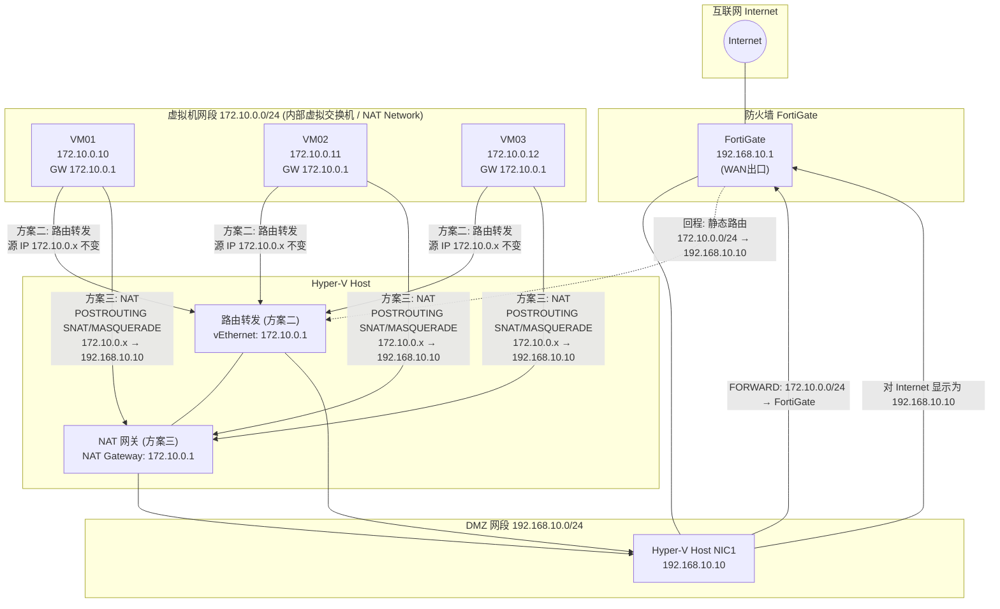

# 虚机网段的NAT和路由模式

## 架构图



## 摘要

- 文档对比了 Hyper-V 环境下虚机网段（172.10.0.0/24）接入网络的两种方案：**方案二 路由转发（不使用 NAT）** 与 **方案三 NAT 模式**。
- 路由模式下 Hyper-V Host 充当三层路由器，FortiGate 需增加静态路由（目的 172.10.0.0/24，下一跳 192.168.10.10），VM 真实 IP 在网络中可见，外部可主动访问 VM。
- NAT 模式下 Hyper-V Host 做 NAT（172.10.0.x 出站转换为 192.168.10.10），FortiGate 无需静态路由，配置简单，但外部无法主动访问 VM。
- 选型建议：正式服务器（Web、SQL、应用服务器）推荐路由模式；测试虚机、实验室环境、临时服务器推荐 NAT 模式。
- 文档还给出了 Hyper-V Host 上 `Get-NetIPInterface` 的实际输出，显示各接口（Internal、DMZ、External 虚拟交换机）的 IPv4 转发功能默认均为 Disabled，启用路由转发前需要开启。

## 技术要点

1. **虚拟机独立网段**：VM 统一使用私有网段 172.10.0.0/24，网关指向 Hyper-V Host 上的 vEthernet / NAT Gateway 地址 172.10.0.1。
2. **Hyper-V Host 双角色**：上行通过 NIC1（192.168.10.10）接入 DMZ 网段 192.168.10.0/24；下行连接内部虚拟交换机（Internal vSwitch）承载 VM 流量。
3. **路由模式回程路径**：Internet → FortiGate →（静态路由 172.10.0.0/24 → 192.168.10.10）→ Hyper-V Host → VM，要求 FortiGate 知道去往 VM 网段的下一跳。
4. **NAT 模式出站路径**：VM（172.10.0.10）→ Host NAT 转换为 192.168.10.10 → FortiGate → Internet；对 Internet 而言所有 VM（172.10.0.x）都显示为 192.168.10.10。
5. **NAT 模式的安全副作用**：由于外部无法主动访问 VM，天然隔离了入站流量，适合实验环境但不适合需要对外提供服务的服务器。
6. **接口转发状态检查**：`Get-NetIPInterface -AddressFamily IPv4 | Format-Table ifIndex,InterfaceAlias,Forwarding` 可查看各接口 IPv4 转发状态；示例输出中全部为 Disabled，做路由器前需启用转发。
7. **接口优先级（InterfaceMetric）**：Internal-vSwitch01 的 Metric 为 15，低于 DMZ/External 的 25，会影响同网段路由选择的优先顺序。
8. **两种方案可用性对比**：VM 上网两者均可；Internet 访问 VM、VM 真实 IP 可见仅路由模式支持；静态路由需求与配置复杂度上路由模式更高。
9. **环境选型原则**：生产环境（企业）推荐路由模式保证可管理、可被访问；实验/临时环境推荐 NAT 模式降低配置成本。

## 原文内容

下面是你提到的两种方案的拓扑图。

### 方案二：路由转发（不使用 NAT）

**特点：**
- VM 使用独立网段 172.10.0.0/24
- Hyper-V Host 充当三层路由器
- FortiGate 需要增加静态路由
- VM 在网络中是可见网段

**拓扑图：**

```
                    Internet
                        |
                        |
                +----------------+
                |   FortiGate    |
                | 192.168.10.1   |
                +----------------+
                        |
                DMZ:192.168.10.0/24
                        |
                        |
                +----------------+
                | Hyper-V Host   |
                |                |
                | NIC1           |
                | 192.168.10.10  |
                |                |
                | vEthernet      |
                | 172.10.0.1     |
                +----------------+
                        |
           Internal Virtual Switch
                        |
    -------------------------------------
    |                  |               |
    |                  |               |
+---------------+ +---------------+ +---------------+
| VM01          | | VM02          | | VM03          |
| 172.10.0.10   | | 172.10.0.11   | | 172.10.0.12   |
| GW 172.10.0.1 | | GW 172.10.0.1 | | GW 172.10.0.1 |
+---------------+ +---------------+ +---------------+
```

**FortiGate 中增加静态路由：**

```
Destination: 172.10.0.0/24
Next Hop:    192.168.10.10
```

**流量路径：**

```
VM 172.10.0.10
    ↓
Hyper-V Host 172.10.0.1
    ↓
FortiGate 192.168.10.1
    ↓
Internet
```

**回程：**

```
Internet
    ↓
FortiGate
    ↓
静态路由: 172.10.0.0/24 -> 192.168.10.10
    ↓
Hyper-V Host
    ↓
VM
```

### 方案三：NAT模式（推荐实验环境）

**特点：**
- VM 使用私有网段 172.10.0.0/24
- Hyper-V Host 做 NAT
- FortiGate 无需增加静态路由
- 配置简单
- 外部无法主动访问 VM

**拓扑图：**

```
                    Internet
                        |
                        |
                +----------------+
                |   FortiGate    |
                | 192.168.10.1   |
                +----------------+
                        |
                DMZ:192.168.10.0/24
                        |
                        |
                +----------------+
                | Hyper-V Host   |
                |                |
                | NIC1           |
                | 192.168.10.10  |
                |                |
                | NAT Gateway    |
                | 172.10.0.1     |
                +----------------+
                        |
                 NAT Network
                        |
    -------------------------------------
    |                  |               |
    |                  |               |
+---------------+ +---------------+ +---------------+
| VM01          | | VM02          | | VM03          |
| 172.10.0.10   | | 172.10.0.11   | | 172.10.0.12   |
| GW 172.10.0.1 | | GW 172.10.0.1 | | GW 172.10.0.1 |
+---------------+ +---------------+ +---------------+
```

**流量路径：**

```
VM 172.10.0.10
    ↓
Host NAT 转换为 192.168.10.10
    ↓
FortiGate
    ↓
Internet
```

**对于 Internet 来看：**

所有 VM `172.10.0.x` 都会显示成 `192.168.10.10`。

### 两种方案对比

| 对比项 | 路由模式 | NAT模式 |
| --- | --- | --- |
| VM上网 | √ | √ |
| Internet访问VM | √ | × |
| 需要静态路由 | √ | × |
| 配置复杂度 | 较高 | 较低 |
| 企业生产环境 | 推荐 | 不推荐 |
| 实验环境 | 可用 | 推荐 |
| VM真实IP可见 | √ | × |

对于你的 FortiGate + Hyper-V 环境，如果是正式服务器（例如 Web、SQL、应用服务器），推荐方案二（路由转发）；如果只是测试虚机、实验室环境、临时服务器，推荐方案三（Hyper-V NAT）。

### 附：Hyper-V Host 接口信息

```bash
PS C:\Users\auist> Get-NetIPInterface

ifIndex InterfaceAlias                  AddressFamily NlMtu(Bytes) InterfaceMetric Dhcp     ConnectionState PolicyStore
------- --------------                  ------------- ------------ --------------- ----     --------------- -----------
11      vEthernet (Internal-vSwitch01)  IPv6                  1500              15 Enabled  Connected       ActiveStore
10      vEthernet (DMZ-vSwitch01)       IPv6                  1500              25 Enabled  Connected       ActiveStore
5       vEthernet (External-vSwitch02)  IPv6                  1500              25 Enabled  Connected       ActiveStore
3       vEthernet (External-vSwitch01)  IPv6                  1500              25 Enabled  Connected       ActiveStore
13      Slot13 Port 3                   IPv6                  1500               5 Disabled Disconnected    ActiveStore
1       Loopback Pseudo-Interface 1     IPv6            4294967295              75 Disabled Connected       ActiveStore
11      vEthernet (Internal-vSwitch01)  IPv4                  1500              15 Enabled  Connected       ActiveStore
10      vEthernet (DMZ-vSwitch01)       IPv4                  1500              25 Disabled Connected       ActiveStore
5       vEthernet (External-vSwitch02)  IPv4                  1500              25 Disabled Connected       ActiveStore
3       vEthernet (External-vSwitch01)  IPv4                  1500              25 Disabled Connected       ActiveStore
13      Slot13 Port 3                   IPv4                  1500               5 Disabled Disconnected    ActiveStore
1       Loopback Pseudo-Interface 1     IPv4            4294967295              75 Disabled Connected       ActiveStore
```

```bash
PS C:\Users\auist> Get-NetIPInterface -AddressFamily IPv4 | Format-Table ifIndex,InterfaceAlias,Forwarding

ifIndex InterfaceAlias                 Forwarding
------- ---------------                ----------
11 vEthernet (Internal-vSwitch01)   Disabled
10 vEthernet (DMZ-vSwitch01)        Disabled
5  vEthernet (External-vSwitch02)   Disabled
3  vEthernet (External-vSwitch01)   Disabled
13 Slot13 Port 3                    Disabled
1  Loopback Pseudo-Interface 1      Disabled
```
